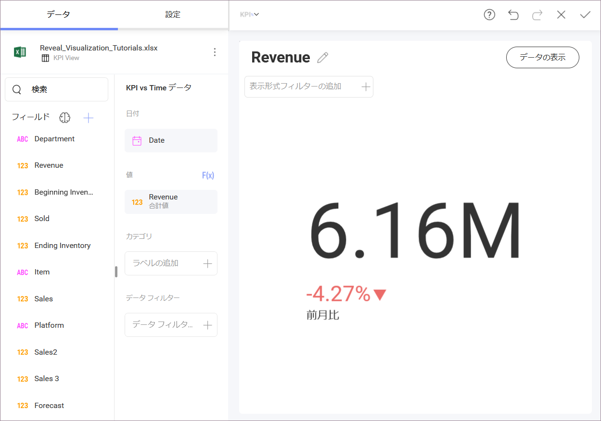
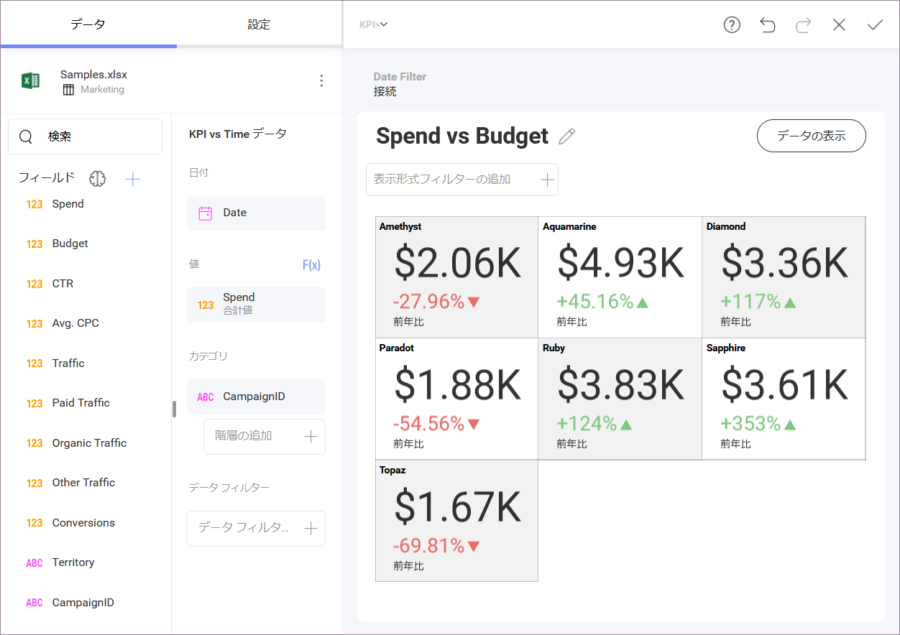

## KPI ゲージ

KPI (Key Performance Indicator: キー パフォーマンス インジケーター) とは、パフォーマンス管理の特定のタイプを表す用語です。KPI は個別のニーズによって変化し、目標に対する進捗や時間軸での傾向など、組織の重要なメトリックスに関する情報を提供します。

[テキスト ゲージ](gauge-charts.html#text-gauge) と同様に、KPI ゲージは値列を大きなフォントで表示します。ただし、KPI の値は、前の期間の同じ値に対しても評価されます。

カテゴリを追加すると、1 つの表示形式に複数の KPI を含めることもできます。

### インジケータ設定

KPI ゲージには[スパークライン](sparkline-charts.html)表示形式と同様の設定があり、それを使用して以下を構成できます:

  - **[期間]**: 両方の値を比較するために使用する期間。

  - **[差異の表示]**: 差異を [値]、[パーセンテージ]、または [値とパーセンテージ] の両方として表示するかどうか。

  - **[値の増加を表す色]**: 差異インジケータの色。

