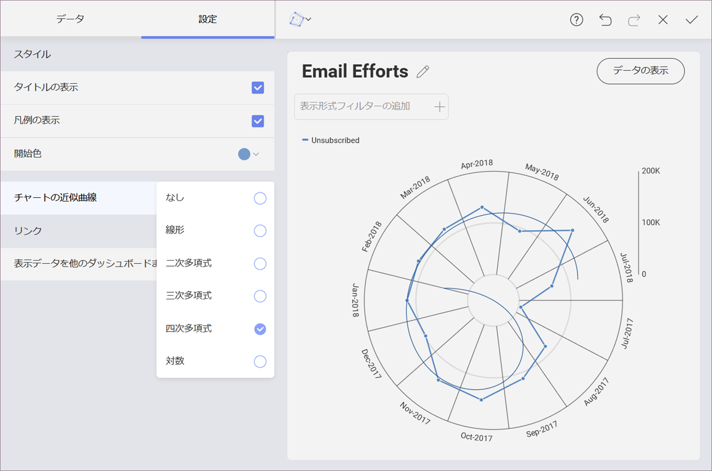

## ラジアル チャート

カテゴリ チャートと同様に、ラジアル チャートは情報を座標上に表現したものです。

### ラジアル チャートのチャート近似曲線

チャートの [設定] で [チャートの近似曲線] の表示を有効にできます。これは、アルゴリズムに基づいてチャートに表示されるラインです。近似曲線でデータセットの傾向を把握し、意思決定のためのしきい値を定義できます。サポートされる近似曲線は、[線形]、[二次多項式]、[三次多項式]、[四次多項式]、[対数]、[指数]、[べき乗]、[単純平均]、[指数平均]、[修正平均]、[累加平均]、[加重平均] です。

