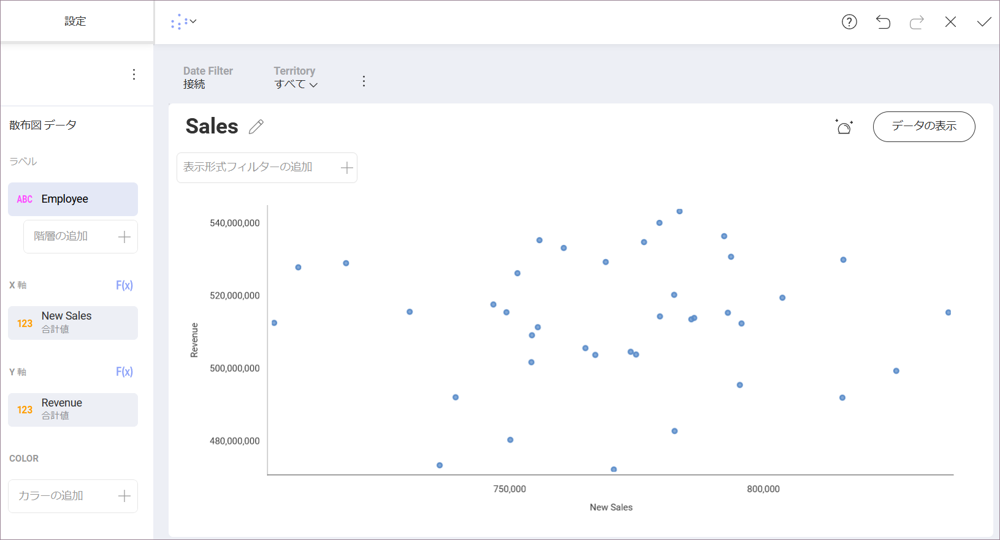
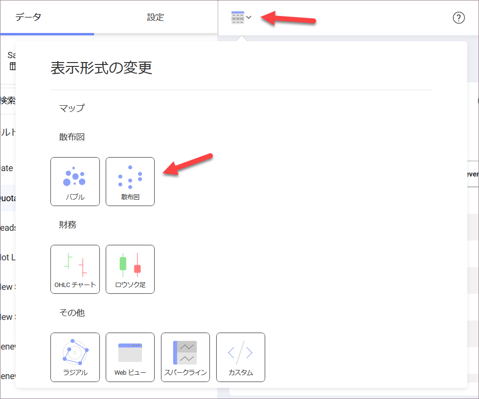
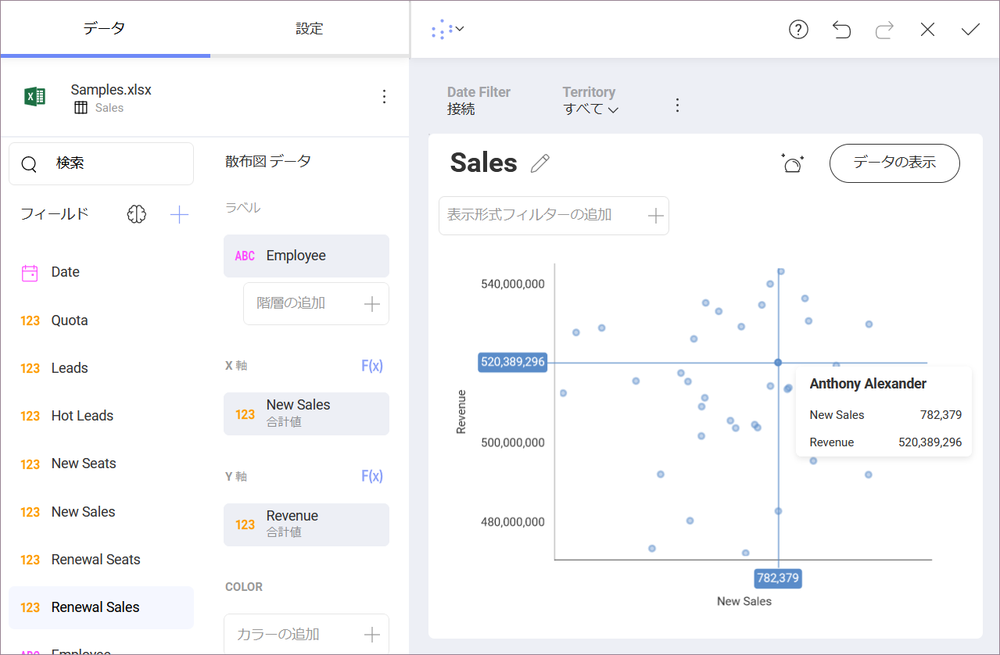
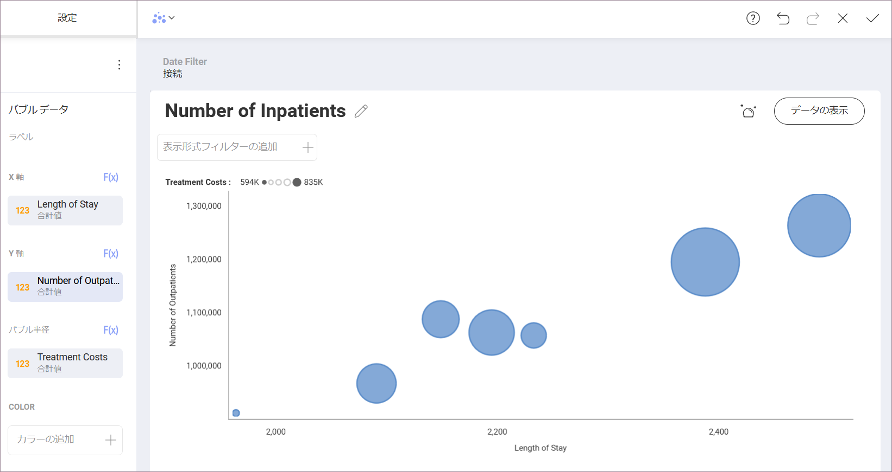
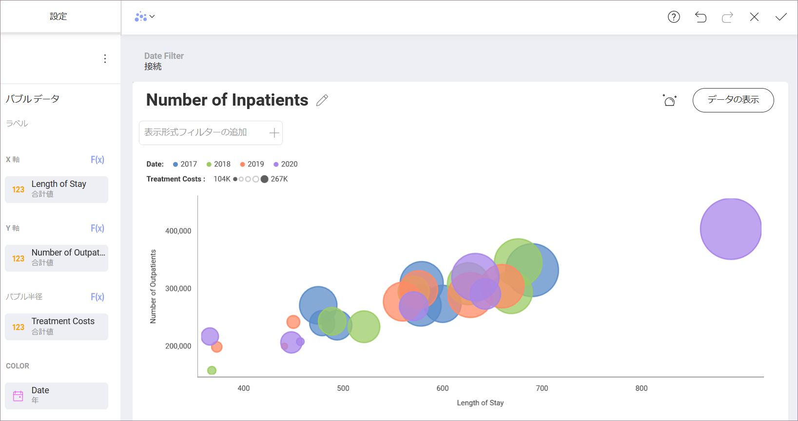
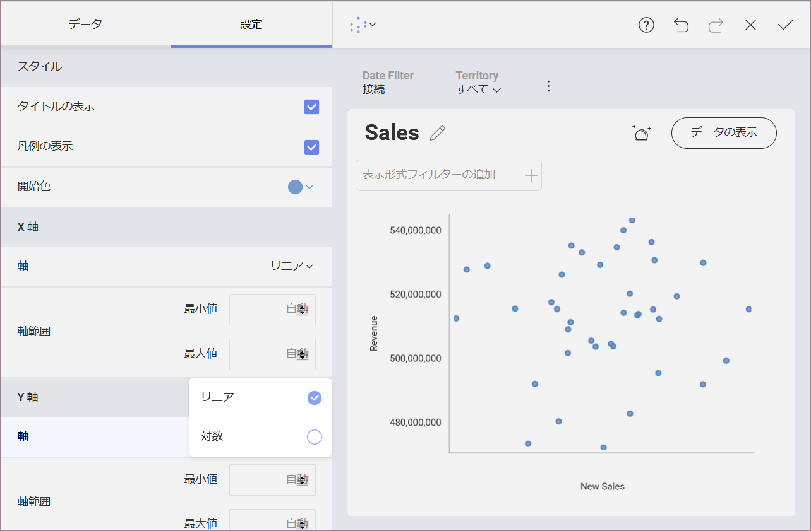

## 散布図・バブル チャート

### 散布図とは?

散布図は、X (水平) 軸と Y (垂直) 軸に沿ってデータ ポイントをプロットすることにより、2 つの定量的計測間の関係を表すために使用されます。データに大量の値のセットが含まれている場合に、パターンを示すのに特に役立ちます。

### バブル チャートとは?

バブル チャートは散布図のバリエーションで、データ ポイントがバブルに置き換えられます。散布図と同様に、バブル チャートは、2 つの定量的計測と、バブルのサイズで表される 3 番目の定量的計測間の関係を表します。 

### 散布図チャートを作成する方法

上記の例では、散布図の表示形式は、特定の各*従業員*によって産み出された*新規販売*の数量と*収益*の関係を示しています。

散布図を作成するには:

1.  *[表示形式の変更]* メニューで *散布図*の表示形式を選択します。

    

2.  *X 軸* と *Y 軸*の数値フィールドを選択して、データ ポイントの位置を決定します。

3.  *ラベル*のカテゴリ値を選択します。

すべてのデータ ポイントには独自の**ツールヒント**があり、クリックすると表示されます。

この例では、ツールヒントは、データ ポイントが表す特定の従業員に関する情報と、チャートに含まれるそれらの量的なデータを提供します。

### バブル チャートを作成する方法

1 つの色だけを使用して基本的なバブル チャートを作成するには、次の操作が必要です。

1.  *[表示形式の変更]* メニューで *バブル* チャートを選択します。

2.  *X 軸* と *Y 軸*の数値フィールドを選択します。

    上記の例では、バブルの位置は、*入院患者数*と*入院期間*の長さとの相関関係によって決定されます。

3.  *ラベル*のカテゴリ値を選択します。

    示されているチャートの各バブルは、神経科、心臓科、外科などの*部門*を表しています。

4.  *バブル半径*の数値フィールドを選択します。

    例から、各バブルのサイズは各*部門*の*治療コスト*の合計に依存することがわかります。チャート上部の凡例は、チャートの*バブル半径*フィールドの最小値と最大値を示しています。

バブルをクリックすると、各バブルの特定のデータを示す**ツールヒント**も表示されます。チャートで要素が重複している場合は、小さいバブルをクリックしてツールヒントを表示します。

### 散布図とバブル チャートへの色分類の追加

カテゴリ フィールドを散布図またはバブル チャートに追加できます。このフィールドの値に応じて、バブルまたは散布ポイントに異なる色が付けられます。

上記の例では、*日付*フィールドが*カラー*ボックスに適用されています。色分類を追加すると、部門の数値情報が *2017*、*2018*、*2019* のいずれを参照しているかに応じて、バブルに異なる色が割り当てられます。

これにより、バブル チャートの表示形式でより多くのバブルが表示されるようにもなりました。

### 散布図とバブル チャートの設定

*[設定]*:

  - **表示形式のスタイルを変更する**

    表示形式の*タイトル*または*凡例*を表示するかどうかを選択できます。*開始色*を選択すると、1 つの色を使用する場合はデータ スポット/バブルの色が定義されます。*色分類*を使用するために複数の色が必要な場合、開始色から順番に適用されます。

  - **X 軸と Y 軸の*線形*スケールと*対数*スケールのいずれかを選択します**。

    対数の場合、値のスケールは通常のリニア スケールを使用する代わりに大きさを使用するリニア スケール以外で計算されます。

    X 軸に対数スケールを使用する場合、散布図の水平軸は常に値軸であるため、一般的に、散布図は線形チャートよりも適切な選択です。

  - **チャートの最小値および最大値を設定できます。**

    デフォルトで最小は 0 に設定され、最大値は使用されるデータによって設定されます。
