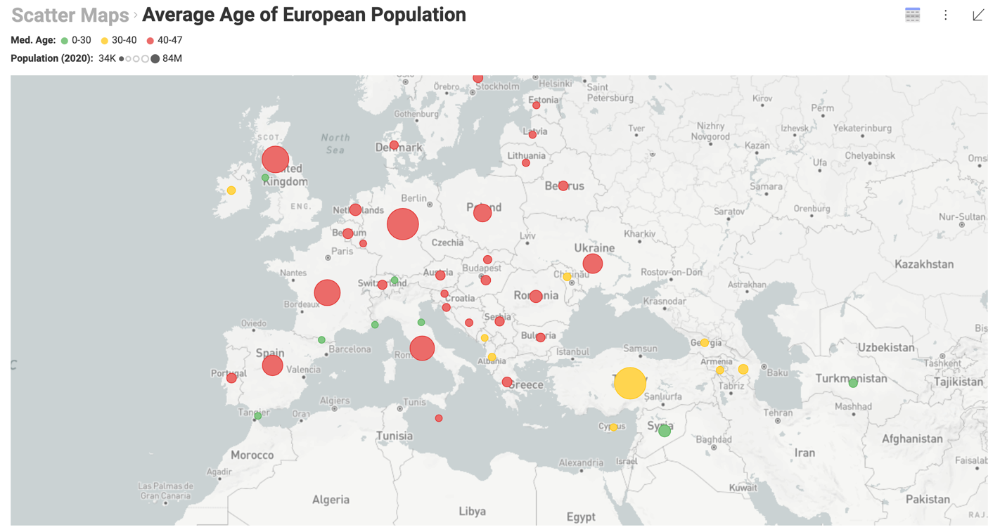
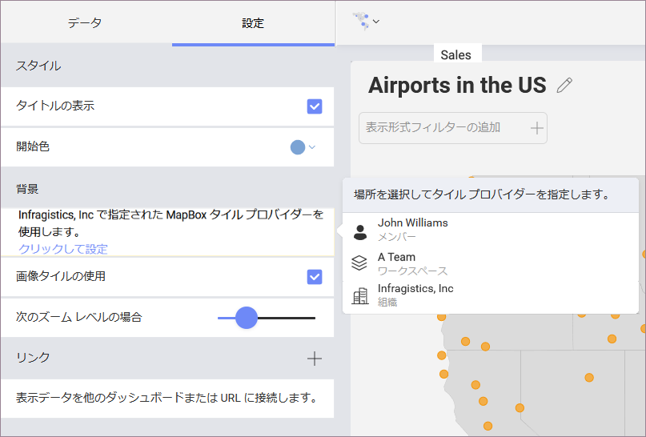
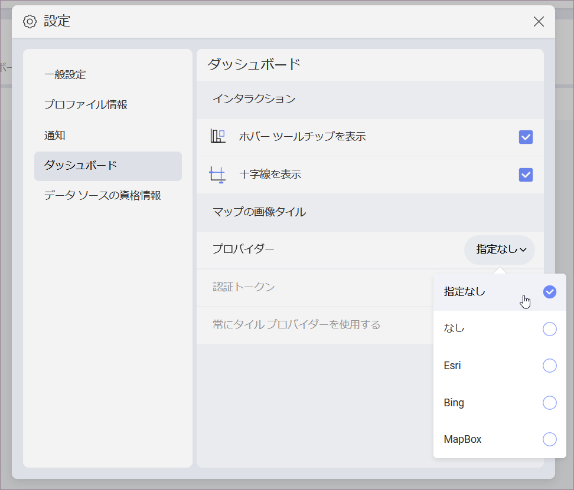

# 散布マップで画像タイルの使用

**画像タイル**機能を使用して、ズーム時に Reveal のクリア グレーの背景から別のマップ レイヤーに切り替えることができます。マップ サービス プロバイダーから提供される追加の詳細は、分析のコンテキストを提供します。

**表示形式エディターの設定**で提供される**スライダー**を使用して、画像タイルを使用するために移行するズーム レベルを指定できます。左から右へスライドすると、トランジションの瞬間が最小ズームから最大ズームに変更されます。
 

## マップに画像タイルを追加

画像タイルを使用するには:

1. 表示形式エディターの [設定] で [背景] に移動し、[画像タイルの使用] ボックスがチェックされていることを確認します。
2. タイル プロバイダーが構成されていない場合、表示されるバナーのボタンをクリックします (以下のスクリーンショットを参照)。

    
   
    ここには、タイル プロバイダーを構成するための 3 つのレベルがあります。

    * **メンバー**
    * **ワークスペース** - このオプションは、ワークスペース内でダッシュボードを作成する場合にのみ表示されます。
    * **組織** - このオプションは、組織ワークスペースのメンバーである場合、または組織のメンバーであるワークスペース内でダッシュボードを作成する場合にのみ表示されます。

3. タイル プロバイダーを設定するレベルを選択します。

    開いたダイアログは、すべてのレベルで同様です。このダイアログは、**個人設定**または**ワークスペース/組織の設定**でも確認できます。

    

    >[!NOTE]
    >組織/ワークスペース レベルでタイル プロバイダーを設定する: 組織/ワークスペースの*管理者*である場合のみ、組織またはワークスペース レベルでタイル プロバイダーを構成できます。これにより、このワークスペース/組織のすべてのメンバーが構成したタイル プロバイダーを使用できるようになります。

4. プロバイダーのドロップダウンで 1 つのオプションを選択します。

    * *Esri*
    * *Bing*
    * *MapBox*
    * [なし] オプションを選択すると、このレベルでタイル プロバイダーを無効にしますが、Reveal は他のユーザーに通知します (以下のスクリーンショットを参照)。

        
     
    * **[指定なし]** オプションは、選択したレベル (個人用、ワークスペース、または組織) でタイル プロバイダーの使用を無効にしますが、他のユーザーに通知しません。以下のバナーは、すべてのレベルで [指定なし] オプションを選択した場合にのみ表示されます。
    
        
    
    ただし、[指定なし] オプションを使用すると、使用するタイル プロバイダーを決定する際に Reveal はこのレベルを無視します。詳細については、[「Reveal は使用するタイル ソース プロバイダーをどのように決定しますか?」](#resolution-process)を参照してください。
 
5. 選択したプロバイダーの認証トークンを追加します。トークンはマップ サービス アカウントで確認できます。追加すると、Reveal に保存されます。設定でタイル プロバイダーを無効にした回数に関係なく、再度追加せずに使用できます。

6. **個人設定**の場合、ダイアログを閉じると変更が自動的に更新されます。**組織/ワークスペース設定**の場合、**[更新]** をクリック/タップしてダイアログを閉じます。

## Reveal は使用するファイル プロバイダーをどのように決定しますか？

**[画像タイルの使用]** が有効な散布マップを開くと、Reveal は使用するタイル プロバイダーを解決します。タイル プロバイダー (およびその認証トークン)は、個人用、ワークスペース、組織の 3 つのレベルで指定できます (上記の[画像タイルの追加](#adding-image-tiles)セクションを参照)。

**タイル プロバイダーが複数のレベルで指定されている**場合はどうなりますか？開いた散布マップにいずれかのタイル プロバイダーが使用されていることがわかります。Reveal はどのように選択しましたか?

ダッシュボードの管理者は、他の設定よりも優先される設定を決定する最も重要な要素です。ダッシュボードは、ユーザー、組織、またはワークスペースが管理できます。

### ダッシュボードがユーザーまたは組織によって管理されている場合

ダッシュボードがユーザー ([アイテム] スペースで作成) または組織 (組織ダッシュボードのスペースで作成) によって管理されている場合、Reveal は以下のようにタイル プロバイダーを確認します。

1. **組織**ワークスペースの設定で、ユーザーが組織の一部である場合。
2. ダッシュボードを開くユーザーの**個人**設定。

### ダッシュボードがワークスペースによって管理されている場合 

ワークスペースがダッシュボードを管理している場合、つまりワークスペース ダッシュボードのスペースで作成されている場合、Reveal は以下の設定でタイル プロバイダーを確認します。

1. この**ワークスペース**の設定
2. **組織**の設定で、管理ワークスペースが**組織の一部**である場合。
3. ダッシュボードを開くユーザーの**個人**設定。

>[!NOTE] 
> **常にタイル プロバイダーを使用する:**
> 個人設定でこのチェックボックスをオンにすると、複数レベルのタイル プロバイダーが構成されている場合、Reveal は常にタイル プロバイダーを選択します。これは上記のすべてのシナリオに当てはまります。

