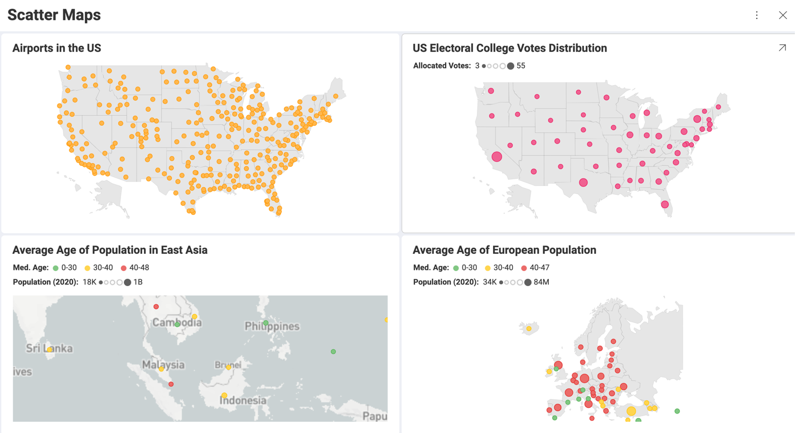
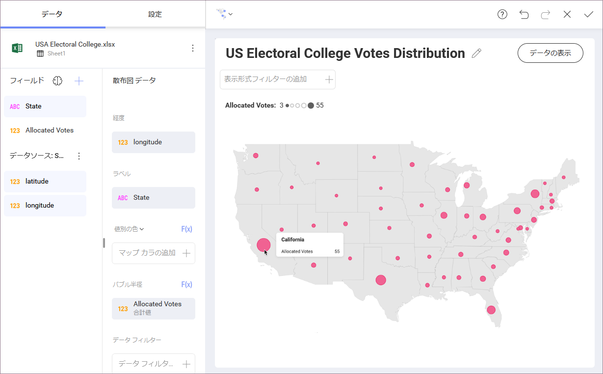

## 散布図

このマップは、地理座標を使用して地理領域に散布マーカーを表示します。マーカーの視覚的な分布は、データ内の密度および空間パターンを識別するのに役立ちます。マーカーにサイズや色を追加すると、他のポイントと比較してデータに関する詳細情報を表示できます。 

散布図を使用すると、複数のマップ サービスに接続して、マップの背景をよりリアルにするだけでなく、詳細を調べることもできます。不動産市場分析を表示する場合など、一部のシナリオでは、マップに近所や通りを表示する機能が追加されます。 

### 散布図の使用

以下の情報は、必要に応じて最適な散布図の表示形式を選択する際に役立ちます。

#### 基本ドット マップとは?

Reveal の最も基本的な散布図は、選択した領域に均一な色のドットをプロットしたものです。

ドット マップは、エンティティの地理的分布を可視化する優れた方法で、ドットがマップ上でクラスター化するときにパターンを明らかにできます。1 つのドットは 1 つのエンティティを表すため、各オブジェクトはデータセットの地理位置情報を使用してマップに表示されます。 

1 対多のドット マップは Reveal ではサポートされません。つまり、1 つのドットが複数のオブジェクトを表すことはできないため (1 ドット = 1000 人)、散布ドット マップを使用して人口密度マップなどを作成することはできません。  

#### バブル マップとは? 

基本散布図にサイズ カテゴリを追加すると、バブル マップが作成されます。異なる場所の定量データの比較に最適です。 
 

バブルのサイズは、比較される特定の変数の値を示します。比較効果を得るには、データセットに比較変数のさまざまな値が含まれていることが最適です。それ以外の場合、マップのバブルはサイズが同じように表示されます (以下の例を参照)。 

上記のスクリーンショットのように**外れ値**を特定してフォーカスしない限り、表示形式の選択を再検討する必要があります。

バブルは、緯度と経度のデータで定義された正確な場所にバインドされていません。それらの場所は概算ですが、バブルは情報を伝達する領域に表示される必要があります。たとえば、米国全土で最も危険な領域に関するレポートを作成する場合、ほとんどの場合、報告された各犯罪の正確な場所は必要ありません。集計された犯罪データに基づいてサイズ設定されたバブルを正しい領域にプロットする必要があります。

> [!NOTE]
> 考慮する必要がある潜在的な問題は、過度に大きいバブルが複数の領域に広がる可能性があることです。この場合、[バブル ツールヒント](#bubble-maps)のテキストに場所データを追加すると、オーバーサイズのバブルが属する領域をユーザーが識別しやすくなります。 

#### 色付き散布図とは?

色を使用すると、マップがわかりやすくなり、分析に変数を追加できます。 

カテゴリ別に色分けされたシンプルなドット マップは、オブジェクトの分布が多いクラスターや領域に注意を引くのに適しています。たとえば、異なる州の空港の色が異なる場合、最も多くの空港がある州をすばやく識別できます (以下を参照)。 

値で色分けされたドット マップは、大きなバブルが重なり合うリスクを回避しながらインサイトを提供します。たとえば、ヨーロッパの高齢人口の傾向を一目で確認したい場合は、人口の中年の色でドット マップを作成し、低、中、高の平均年齢を示す色を設定します。

ただし、個々の場所の 2 つの値の相関関係を表示する場合は、一方の値をサイズで、もう一方の値を色で表示します。前の例を使用すると、人口の年齢別にドットに色を付け、国の国内総生産に基づいてサイズを設定して、国の豊かさと平均余命の相関関係を示すことができます。 

### 散布図のズーム

散布図を使用すると、マーカーがより密にプロットされている領域、または [マップ] ドロップダウンの一部ではない領域 (バルカン半島など) にズームインしてフォーカスできます。  

ズーム領域を保存し、このビューをダッシュボードに保持することもできます。 

マップを[最大化する](~/en/dashboards/dashboards-interactions.html#maximized-view)と、*ダッシュボード ビュー モード*でズームインおよびズームアウトできます。**表示形式エディター**でズームを使用することもできます。

ズームを使用すると、Reveal がマップの背景として使用するクリアな図形を変更することもできます。選択したズームレベルで、グレーの領域を、以下のいずれかのマップ サービスで提供される*画像タイル*と呼ばれる詳細な実際のマップで置き換えることができます。 

* *Bing* 
* *Esri*
* *Mapbox*

Reveal でマップ サービス**認証トークン**を使用する方法、または画像タイルを使用して共有マップを表示する方法の詳細については、[「マップ画像タイルの使用」](map-image-tiles.md)トピックを参照してください。

### 散布図の作成 

Reveal の散布図は、表示するデータに基づいて地理分析のさまざまな機会を提供します。

#### Location Data Requirements

The ScatterMap visualization plots the data using geo-coordinates. Each data point requires a latitude and longitude value to be displayed. The accepted format by Reveal is:

* **two different columns** for latitude and longitude respectively.
* **Latitude/Longitude** in Decimal Degrees format, for example: -46.896388, 168.126111

    >[!NOTE] **Unaccepted formats**. 
    > Latitude/Longitude formats, containing minutes and seconds symbols, such as *46° 53.783333'*, and formats containing suffixes *- 46° 53' 47'' South, 168° 7' 34'' E*, are not accepted. 

The ***"There is no data to display."*** message may appear in the Visualization Editor, even if your latitude and longitude data is correct and is in the accepted format. This can happen if the geographic coordinates are plotted outside the bounds of the selected map. 
> 
#### Basic Dot Maps  

You can create dot maps by using only the *Latitude* and *Longitude* data from your data set. If your data source does not contain these fields, you can add them from another data source. See how to do this in [Combining Data Sources in One Visualization](~/en/datasources/data-blending.md).

You also need to choose one of the predefined maps from the *Map* dropdown in the _Scatter Map Data_ section.  

Additionally, the optional Label placeholder can be populated to replace the default tooltip text of latitude and longitude with the associated Label-field value in the data. In the screenshot above, the dots are located on the map based on the airports' addresses, but you can also use the airports' names for the tooltip text.

Because of the conceptual simplicity of this map, you can only choose whether to show *title* and set the *color* of the dots in the _Settings_ section.

#### Bubble Maps

You can also create a scatter map with variable-sized markers or bubbles.

Bubble maps are created by using the same data as simple dot maps. Plus, you need to drop a numeric field in the _Bubble Radius_ placeholder.

The tooltip of a bubble includes two parts: 

* A bolded title - uses data coming from the field in *Label*. 
* Content - consists of the name and value of the field in *Bubble Radius*. 

The **bubble tooltips** are used to help your audience read the map. It gives a better idea of what the bubble size stands for and provides the exact value. It can help avoiding the misinterpretation that the bubble is an actual area on the map.

#### Adding Color to Scatter Maps 

The scatter map allows you to visualize a third variable indicated by color. Adding color is an option for both dot and bubble maps.

Color on the map can be determined by: 

* *Value* - it's best to use a numeric data field. If you drop a text field, your data will be automatically aggregated and Reveal will take _Count of Rows_ to determine the color.    

* *Category* - a text field is expected. However, if you provide a numeric field, the values in it will be processed as text, i.e. no aggregation will be applied, and a separate color will be created for each individual value.  

#### Configuring Style Settings

Style settings for _Scatter Maps_ include showing/hiding visualizations' *Title* and *Legend* as well as configuring color and type of the markers on the map. 

Color settings depend on the scatter map type. 

For **basic dot and bubble maps** using uniform colored markers, you can select a color from the 10-color palette in _Start Color_. 

For **scatter maps colored by category** you can choose to _Use different markers_. If you enable this function, Reveal will automatically create a unique marker for each category by using combinations between colors and symbols such as squares, triangles, dots, stars, octagons, etc.

For **scatter maps colored by value** you can configure the coloring scheme. You will see three options in the _Color as_ dropdown: 

* _Single Color_ - styles all markers on the map with the same color.
* _Range of Values_ - styles the marker using one of seven colors, where colors progressing light to dark represent data values from low to high. You can also choose the _Start Color_, which will determine the color in the middle of the seven shades. 
* _Conditional Formatting_ - this scheme allows you to establish styling rules per ranges of data up to three ranges - upper, middle, and lower. Depending on the nature of the information, low values might be a good or bad signal, so you have the flexibility to configure the styling in a way that makes the most sense in your situation. 

