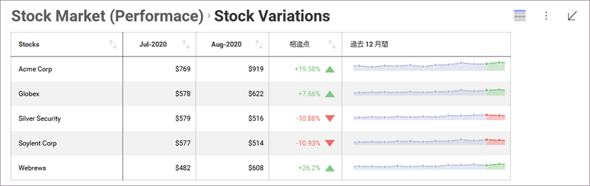
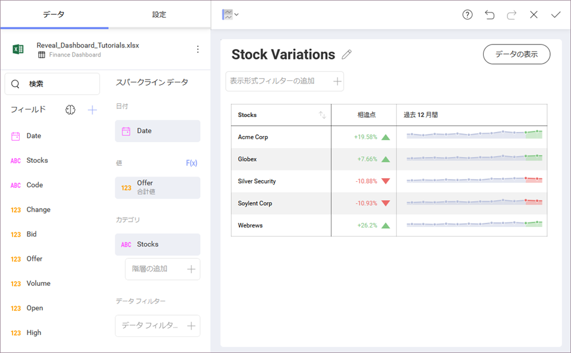
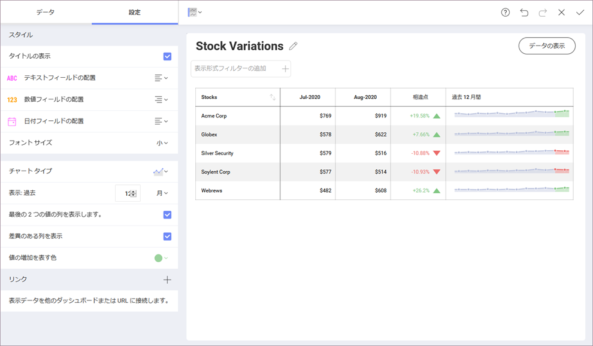

## スパークライン チャート

スパークライン チャートは、軸、ラベル、またはその他のチャート要素なしでグリッド ビュー内にプロットされる小さなチャートで、指定された日付範囲のトレンドとその進行を表します。

最初の列は表示形式エディターで固定されたままで、情報内の別の列をスクロールできます。

### スパークラインの詳細設定

表示形式エディターの **[設定]** セクションにアクセスすると、以下のいくつかの設定を変更できます。

  - テキスト、数値、および日付の**配置**。

  - グリッド要素の**フォント サイズ**。

  - スパークラインの**チャート タイプ**: 折れ線チャートまたはエリア チャート。

  - 日付の**集計**。

  - グリッド内のスパークライン チャートに含める**値の数**。

  - **スパークライン列に含める情報** (最後の 2 つの値やその差など)。さらに、**正の差異を緑または赤で表す**かどうかも選択できます。
