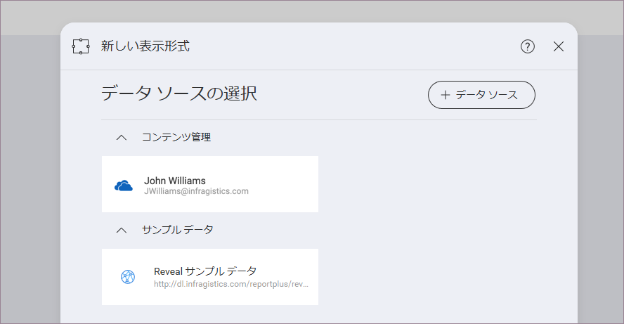
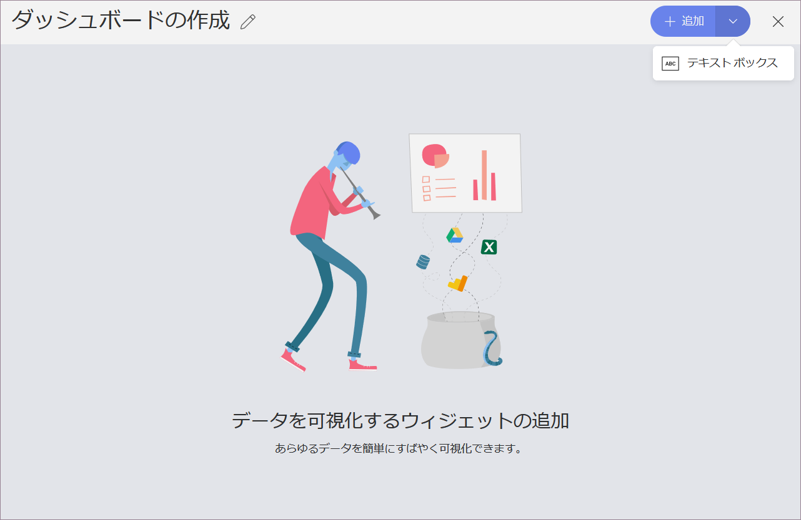
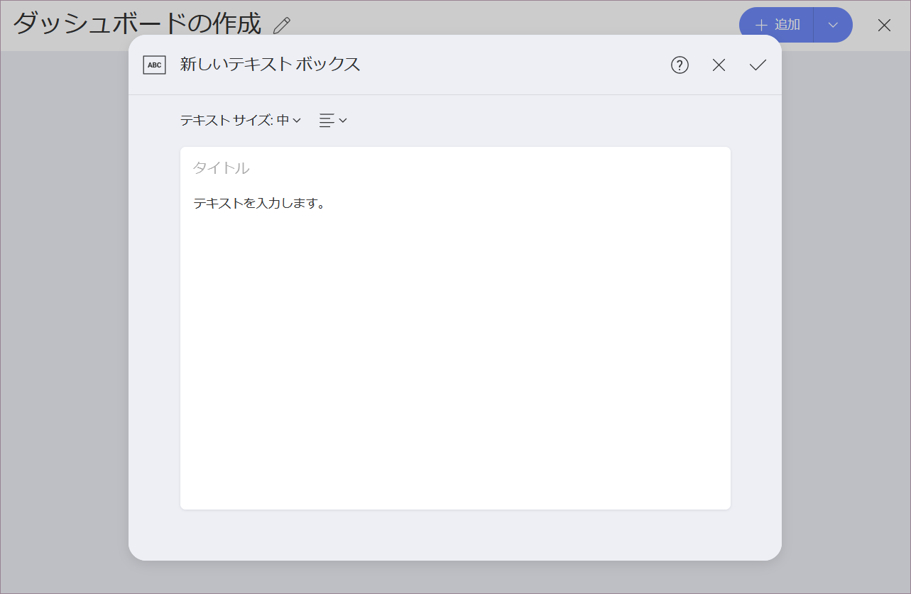

## テキスト ボックス表示形式

テキスト ボックスの表示形式は、その名前が示すように、テキスト本文とオプションのタイトルで構成されます。データソースに接続されていません。テキスト ボックスを使用する一般的なシナリオは、レポートにテキストの概要を追加することです。

### ダッシュボードにテキスト ボックスを追加

テキスト ボックスを既存のダッシュボードに追加する方法:

1.  ダッシュボードを*編集モード*で開きます。

2.  [+ 追加] の分割ボタンの右にある矢印をクリック/タップして ⇒ [テキスト ボックス] をクリック/タップします。

テキスト ボックス表示形式を既存のダッシュボードに追加すると、**ダッシュボードの下部**に表示されます。

### ダッシュボードで最初の表示形式としてテキスト ボックスを作成する方法

概要または簡単な紹介を表示するテキスト ボックス表示形式を作成してダッシュボードを開始することもできます。テキスト ボックスの作成メニューにアクセスするには、以下の手順を実行します。

1.  Reveal の初期画面の右上にある *[+ ダッシュボード]* の分割ボタンをクリック/タップします。

2.  *[新しい表示形式]* ダイアログが開き、データソースを選択するように求められます。

    

    *X* をクリック/タップしてダイアログを閉じます。

3.  [+ 追加] の分割ボタンにある*矢印*をクリック/タップして ⇒*テキスト ボックス*をクリック/タップします。

    

### テキスト ボックス可視化の作業

新しいテキスト ボックス表示形式を追加すると、以下の空のフォームが表示されます。

このダイアログでは:

  - **小**、**中**、**大**のテキスト サイズを選択できます。

  - テキストの配置 ([テキストサイズ] の隣) を選択できます。
  
  - **(オプション)** タイトルを追加できます。
  
  - テキスト本文 ([テキストの入力] ボックス) に独自のテキストを記述できます。

>[!NOTE]
>**書式の制限**
>本文の*テキスト サイズ*と配置のみ選択できます。タイトルがある場合、タイトルはデフォルトのサイズと左揃えになります。

*ティック アイコン*をクリックしてテキスト ボックスを保存します。
