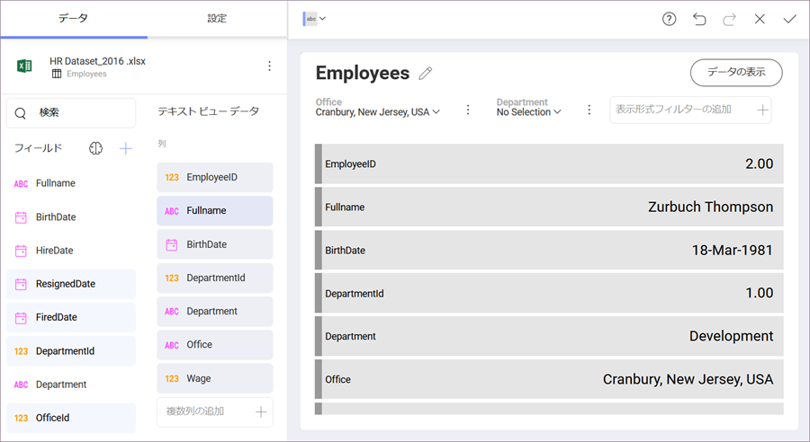

# テキスト ビュー

テキスト ビューは、以下に表示する従業員のレコード情報などのキー値のパターンに従った情報が表示されます。これは、列ラベルとペアになったデータの最初の行のみを表示します。
特定の行を表示するためには、フィルターを適用することが可能でテキスト ビューによって選択されます。閲覧者が簡単に単一エンティティの属性を簡単に理解したい場合に適しています。例として、製品の仕様や個人の連絡先情報などがあります。

[このセクション](~/jp/data-visualizations/fields/conditional-formatting.html)で説明されているように**テキスト ビューは条件付き書式をサポートします**。

