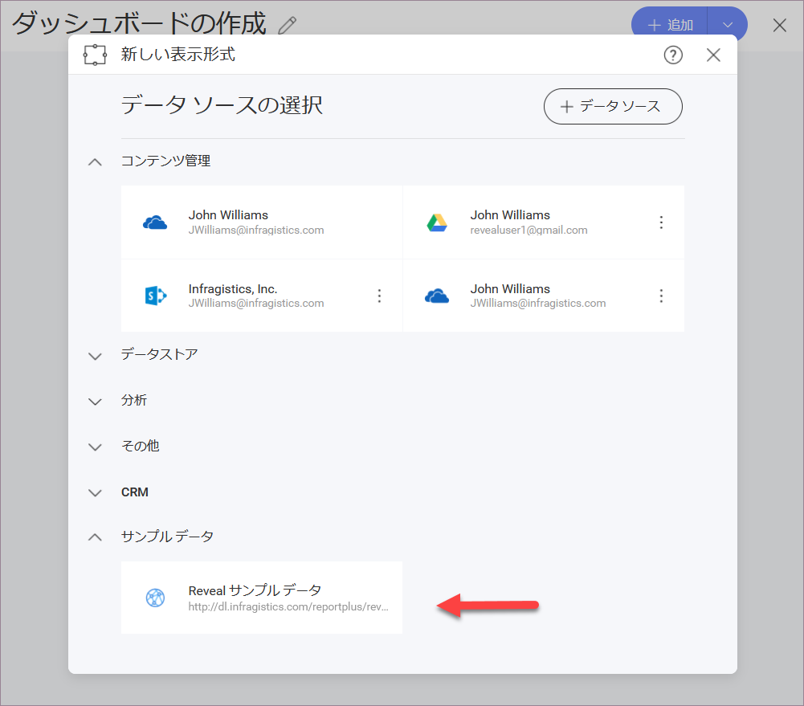
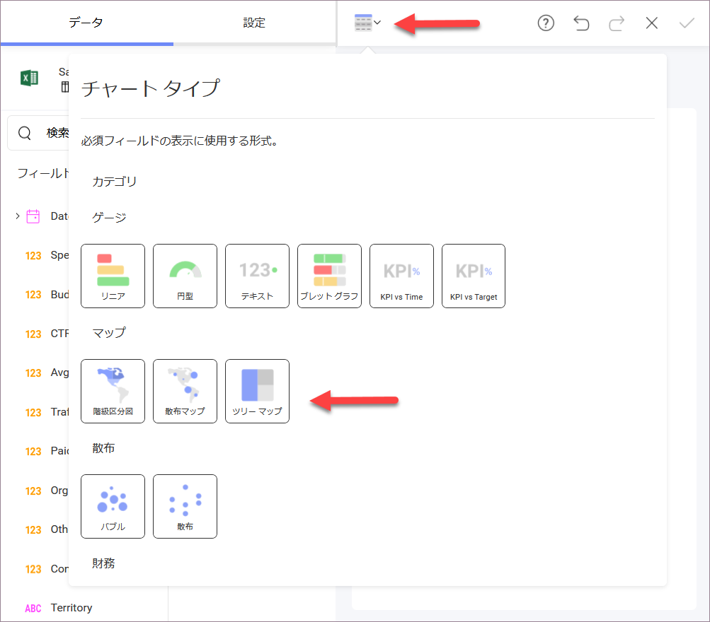
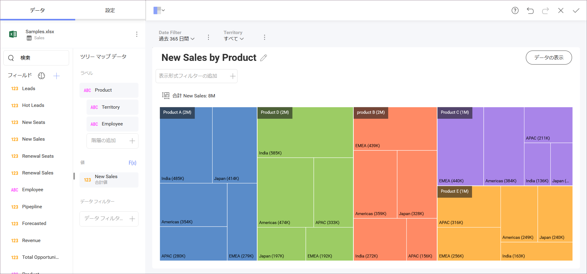
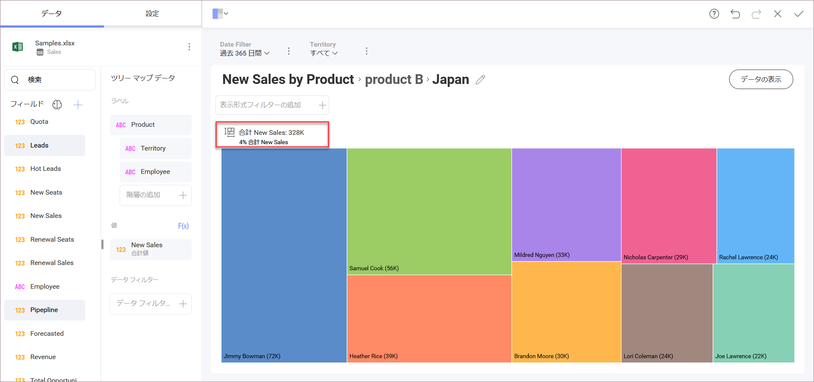

## Reveal のツリーマップ

ツリーマップ表示形式は、階層データをネストされた四角形のセットとして表示するために使用されます。各レベルの四角形は、サイズと色が異なります。

タイル (四角形) の各特性は、データ分析で役割を果たします:

  * **色** - ツリーマップ表示形式で分割されるカテゴリを示します。この特性を定義するために使用されるフィールド データは、数値 (_123_)、文字列 (_ABC_)、または日付です。
  * **サイズ** - 各カテゴリの値を示します。サイズを決定するために使用されるフィールド データは、数値 (_123_) のみです。
  * **ラベル** - 表示形式の各四角形のカテゴリと値を表示します (フラット ツリーマップの場合、つまり、階層データがない場合)。階層データを含むツリーマップがある場合、現在のレベルのカテゴリと値を示す追加のラベルがあります。

### 階層データなしのツリーマップ表示形式

以下に示すような**階層データなしの表示形式**を作成できます:

階層のないツリーマップを使用して、パターンおよび一部と全体の関係を魅力的で明確な方法で表示できます。

上記の表示形式は、_Product_ ごとの _New Sales_ を表示します。この表示形式を構成するには、次のことを行う必要があります:

1. *データソースの選択*ダイアログで、*Reveal のサンプル データ*を選択します。

    

2. *表示形式エディター*で、**ツリーマップ表示形式**を選択します。

    

3. *ツリーマップ データ セクション*で、*ラベル*に _Product_ を、*値*に _New Sales_ をドロップします。

*ラベル* (_Product_) にドロップされたデータは**色**を決定し、5 つの異なる四角形に表示形式を並べます。

最大のタイルは、最大の _New Sales_ 値を示します。四角形は、*左上 (最大) から右下にサイズで配置されます*。

各四角形の*左下のラベル*には、各製品の概算値が丸めて表示されています。正確な値を表示するには、タイルをクリックしてツールチップを表示します (スクリーンショットの例を参照)。

### 階層データのツリーマップ表示形式

階層データの処理は、ツリーマップの当初の目的です。階層に構成できる値のメトリックは 1 つだけですが、カテゴリは無制限です。

上記の例では、ツリーマップは、_Product_ カテゴリによって決定される 5 つの大きな四角形 (ツリーマップのブランチ) に分割されています。各ブランチには、次のカテゴリ レベル - _Territory_ によって決定された*小さな四角形が含まれています*。下位レベルは表示されません。

上記の例では、*2 種類のラベル*があることに気づくかもしれません。

- 左上の大きな四角形の場合 - 各製品の合計新規販売に関する情報を示します。
- 左下の小さな四角形の場合 - 特定の国で販売されている各製品の量を示します。

タイルの色とサイズの特性に関する情報は、[階層なしのツリーマップ](#flat-treemap.html)について述べたものと同様です。

#### 階層レベルのドリルアップとドリルダウン

ツリーマップ表示形式をドリルアップおよびドリルダウンして、異なる階層レベル間を移動できます。これを行うには、*大きな四角形の領域をクリックします* (含まれるタイルに関係なく)。ツールチップで、*ドリルダウン/アップ*を選択します。

#### ツリーマップ レベルの詳細

階層の最下部 (*ラベル*にドロップされた最後のフィールド) に到達すると、表示形式は[フラット ツリーマップ](#flat-treemap.html)のようになります。

ツリーマップ表示形式の上部 (左側) にある*合計ラベル*は、すべてのレベルで変化します。_Totals_ は、*ラベル*の各階層レベルの*値*フィールドの変更を反映しています (前の例の合計を比較してください)。上の例の合計ラベルには、日本での製品 B のすべての新規販売が表示されます。

*タイトルのパンくずリスト*を使用して、表示されている現在のレベルを識別します。それらをクリックして移動することもできます (ドリルアップの代わりに)。

### 表示形式エディター設定の操作

ツリーマップ表示形式の*設定*セクションでは、以下を設定できます:

- **タイトルを表示** - 表示形式のタイトルを表示するかどうかを選択します。
- **値の表示** - カテゴリに関する情報を表示する**ラベル**とさまざまなレベルの四角形の値を表示するかどうかを選択します。
- **開始色** - 10 色のパレットから開始色を選択します。Reveal は選択に基づいて配色を調整します。
- **リンク** - 表示形式をダッシュボードまたは URL に接続します。詳細は、[ダッシュボード リンク](~/jp/dashboards/dashboard-linking)をご覧ください。
