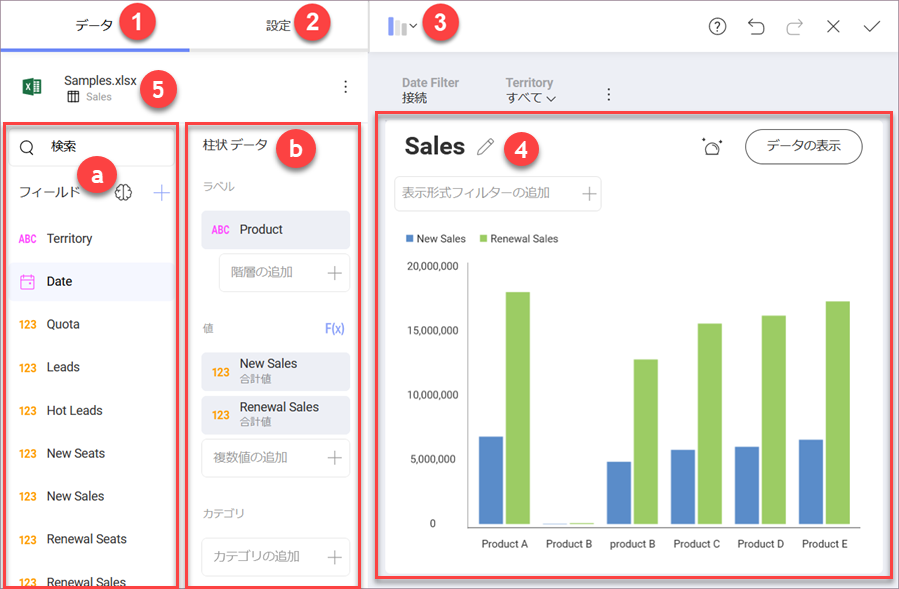

## 表示形式エディター

表示形式エディターは、表示形式を作成および編集する場所です。これにより、データを操作して最も適切なビューを表示できます。

### 表示形式エディターにアクセスする

表示形式エディターには、次の 2 つの方法でアクセスできます。

***1. 表示形式作成プロセスで***

データソースを選択して設定すると、表示形式エディターが自動的に開きます。

***2. ダッシュボード編集プロセスで***

選択したダッシュボードを開き、[ダッシュボードの編集モード](~/jp/dashboards/index.html#view-edit-mode)に入ると、表示形式のオーバーフロー ボタンから *[編集]* を選択して、**表示形式エディターにアクセス**できます。

### 表示形式エディターの概要

表示形式 エディターには、主に 3 つのエリアがあります。

  1. **データ セクション**選択したデータセットとデータ エディターで使用可能なフィールドのリストが表示されます。このツールは、データを必要に応じてスライスアンドダイスする際に役立ちます。

  2. **設定セクション**使用している特定の表示形式の設定と、表示形式の一般設定にアクセスできます。

  3. **表示形式 セレクター**表示形式を選択し、最終結果をプレビューできます。

特に、次のことが可能になります。

  - データの**並べ替え**と**フィルター**。

  - **表示形式のデータをダッシュボード ページの選択へバインド**。

  - データ エディターの**集計データ**。

  - データの **表示形式**と**書式設定**。

表示形式の設定と適切な表示形式の選択後、*戻る矢印*を選択してダッシュボード エディターに戻ります。ダッシュボード エディターでは、表示形式をドラッグしてレイアウト、サイズ、配置を操作できます。
