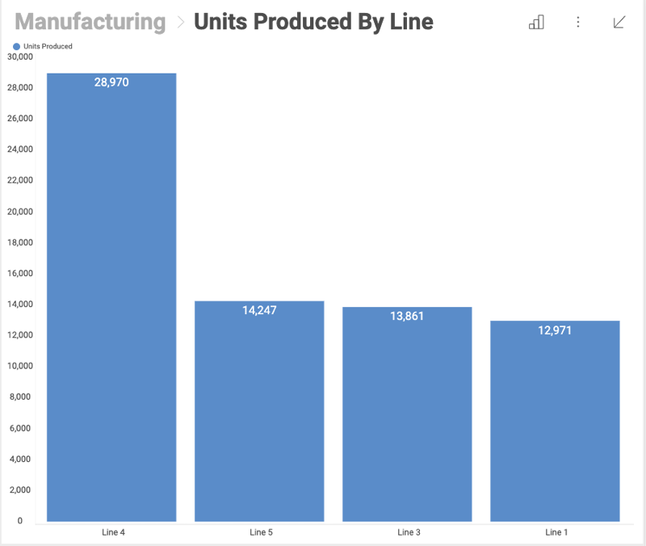

## 表示形式の概要

表示形式は、個々の情報です。すべてのダッシュボードは 1 つ以上の表示形式で構成されます。以下の画像は、[柱状チャート](category-charts.md) による表示形式でさまざまな線によって生成される単位量を示しています。

### 表示形式はどのように表示されますか？

ビジネス データを理解するために Reveal は情報の表示形式をカスタマイズする複数のオプションを提供します。これらは「表示形式」といいます。

上記のダッシュボードでは、以下の表示形式タイプが表示されます。

  - **Productivity**: [テキスト ゲージ](Gauge-Views.md#text-gauge)

  - **Units Lost**: [テキスト ゲージ](Gauge-Views.md#text-gauge)

  - **Cost of Labor vs Revenue**: [折れ線チャート](category-charts.md)

  - **Units Produced by Line**: [柱状チャート](category-charts.md)

  - **Operators Available**: [ドーナツ型チャート](category-charts.md)

  - **Line 1 Efficiency**: [円形ゲージ](gauge-views.md)

  - **Line 2 Efficiency**: [円形ゲージ](gauge-views.md)

### 表示形式の作成方法

[+] 記号を選択して新しいダッシュボードを追加すると、新しい[データソース](~/jp/datasources/data-sources.md)または既存のデータソースを入力するよう求められます。表示形式の作成にはじめに行う必要のある手順です。

データソースを選択すると、表示形式が作成されます。[表示形式エディター](visualizations-editor.md)を使用して編集できます。

### 表示形式の編集

ダッシュボードのデータセットを選択すると、**表示形式エディター**が自動的に表示されます。これにより、データを操作して最も適切なビューを表示できます。

表示形式エディターでの作業方法とアクセス方法については、[このトピック](visualizations-editor.md)をご覧ください。
