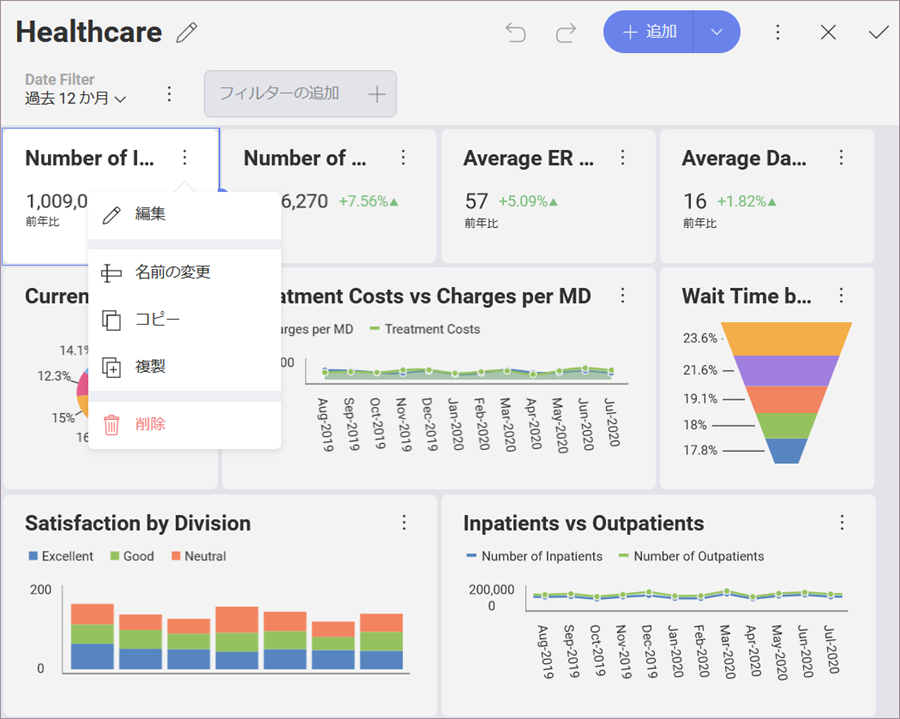
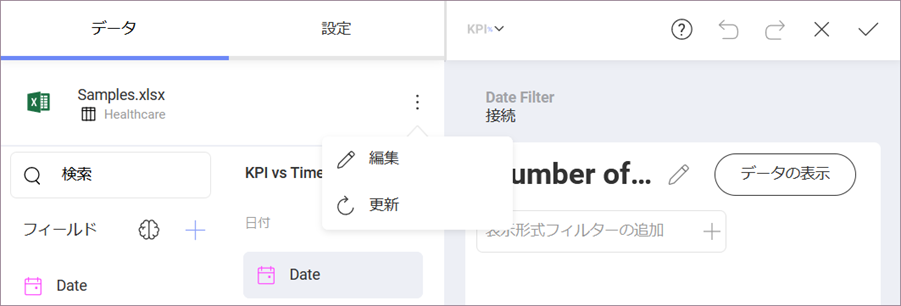
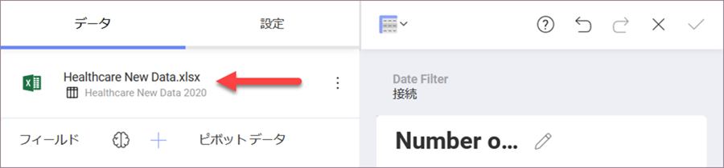

## 表示形式に使用するデータソースの変更

表示形式を作成した後もリンク データ ソースを変更できます。

1. 右上隅のオーバーフロー メニューから [編集] を選択して、*ダッシュボード編集モード*にアクセスします。
2. 選択した表示形式のオーバーフロー メニューで [編集] をクリック/タップします。

現在のデータソースが [データ] セクションに表示されます。変更するには、データソース名の横にあるオーバーフロー ボタンを選択します。

[表示データ] が表示され、現在のデータソースを示します。データソース名の横にあるスワップボタンを選択し、リストでサポートされているものの 1 つから必要なデータソースを選択します。

これにより、*データソースの選択*ダイアログが開きます。
ここで、新しいデータソースを選択できます。エディターに既に存在するデータは、新しいデータソースのデータに完全に置き換えられます。

データソース名が表示形式エディターの [データ] セクションに表示されます。

