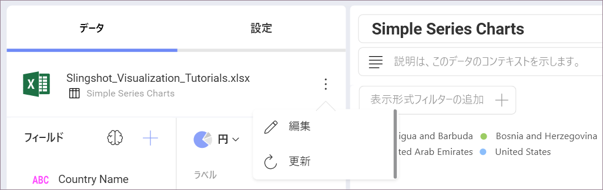
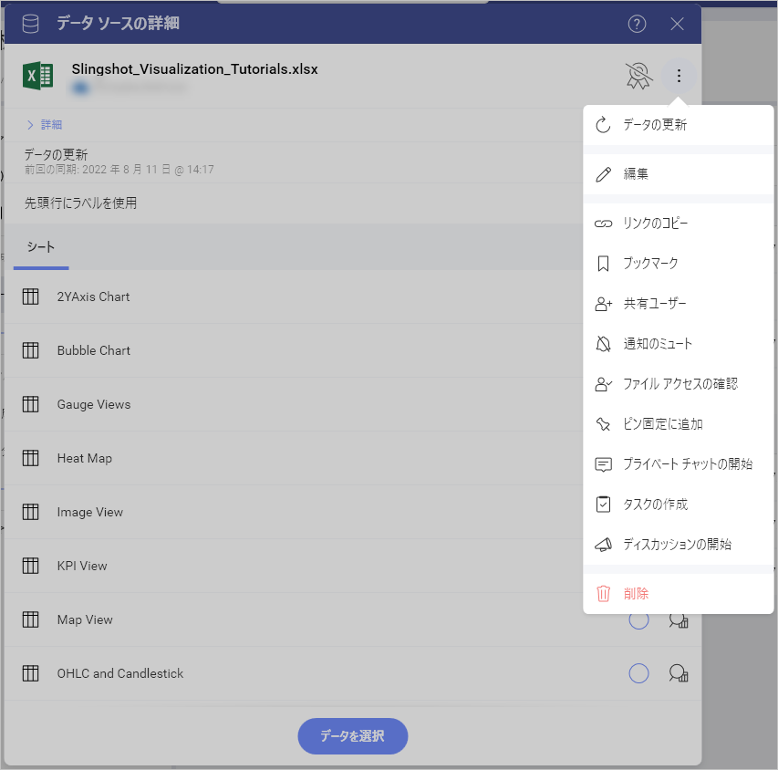
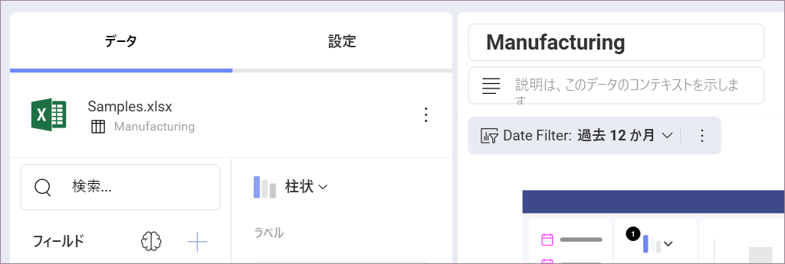

# 表示形式に使用するデータ ソースの変更

表示形式を作成した後もリンク データ ソースを変更できます。

1. 右上隅のオーバーフロー メニューから **[編集]** を選択して、ダッシュボード編集モードにアクセスします。
2. 選択した表示形式のオーバーフロー メニューで **[編集]** をクリック/タップします。

 

3. 現在のデータ ソースが **[データ]** セクションに表示されます。変更するには、データ ソース名の横にあるオーバーフロー ボタンを選択し、**[編集]** をクリックまたはタップします。

 

4. **[表示データ]** が表示され、現在のデータ ソースを示します。同じデータ ソースから別のデータ コレクションを選択するか、データ ソースの名前の横にある **[データ ソースの変更]** をクリックまたはタップし、リストでサポートされているものから必要なデータ ソースを選択します。

  

5. データ ソースを選択すると、**[データ ソースの詳細]** ダイアログが開きます。ここで、 表示形式エディターに使用する情報を選択できます。エディターに既に存在するデータは、新しいデータソースのデータに完全に置き換えられます。

6. 表示形式エディターの **[データ]** セクションで、更新されたデータ ソースの名前が表示されます。

 
