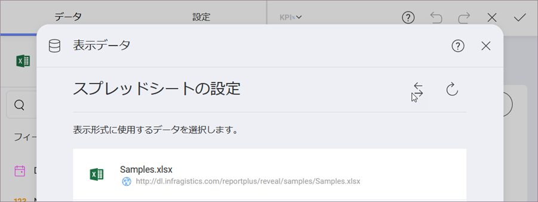

## 表示形式に使用するデータソースの変更

表示形式を作成した後もリンク データ ソースを変更できます。

1. Access **Dashboard Edit mode** by selecting *Edit* from the overflow menu in the top right hand corner.
2. Click/tap on **Edit** in the overflow menu of a chosen visualization:

現在のデータソースが [データ] セクションに表示されます。変更するには、データソース名の横にあるオーバーフロー ボタンを選択します。

[表示データ] が表示され、現在のデータソースを示します。データソース名の横にあるスワップボタンを選択し、リストでサポートされているものの 1 つから必要なデータソースを選択します。

This will open the _Select a Data Source_ dialog.
Here you can choose a new data source. The data already present in the editor will be completely replaced by the data in your new data source.

データソース名が表示形式エディターの [データ] セクションに表示されます。

