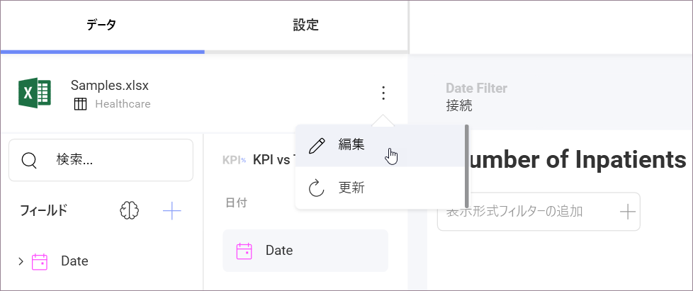

# 表示形式に使用するデータ ソースの変更

表示形式を作成した後もリンク データ ソースを変更できます。

1. 右上隅のオーバーフロー メニューから **[編集]** を選択して、ダッシュボード編集モードにアクセスします。
2. 選択した表示形式のオーバーフロー メニューで **[編集]** をクリック/タップします。

3. You will see your current data source listed in the *Data* section. In order to change it, select the overflow button next to the data source name and click/tap on **Edit**.
 

4. This will display the **Visualization Data**, where you will see your current data source. Click/tap on **Change data source** next to your data source's name, and choose the data source you want from one of the supported in the list.
 

5. Once you have chosen the data source, a **Data Source Details** dialog will open up. Here you can select the information you want to use for the visualization editor. The data already present in the editor will be completely replaced by the data in your new data source.

6. You will see the name of the data source updated in the *Data* section of the Visualization editor.

