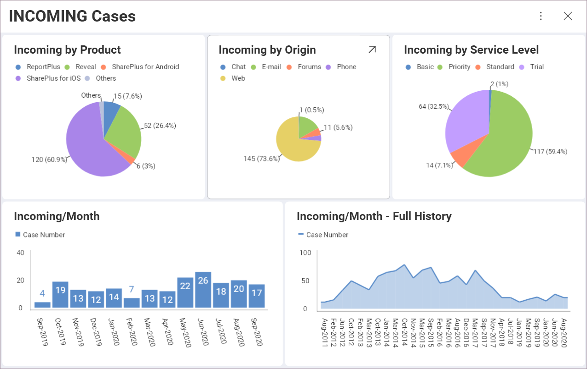
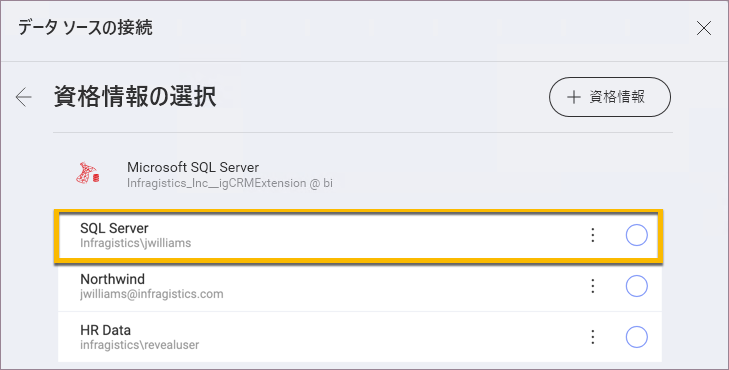

## ダッシュボードをデータソースに接続

Reveal では、ダッシュボードの作成[前](overview.html)または作成後にデータソースに接続できます。データソースへの接続は、ダッシュボード作成プロセスの一部です。ただし、すでに作成されているが、まだデータソースに接続されていないダッシュボードを持つ場合があります。これが発生する可能性のあるシナリオは 2 つあります - [共有しているダッシュボード](~/jp/dashboards/sharing-dashboards/share-a-dashboard.html)の場合と自分で Reveal に[アプロードしたダッシュボード](uploading-dashboards.html)の場合です。 

アプリケーションにまだ追加していないデータソースを使用して作成されたダッシュボードは、初めて開いたときに次のようになります: 

各表示形式にはログイン ボタンがあり、使用する**データソースに接続**できます。そのためには次の手順を実行します:

1. **ログイン** ボタンをクリック/タップします。
2. データ ソースの接続ダイアログで、右上隅にある **[+ 資格情報]** ボタンをクリック/タップします。
3. アカウントの資格情報 - *ユーザー名*、*パスワード*、*ドメイン* (オプション) を入力します。 
4. **作成して使用**を選択します。

完全なダッシュボードが*ダッシュボードのビュー* モードで表示されます。

>[!NOTE]
> [データソースの接続] ダイアログに、データソースの資格情報のリストがある場合があります (下のスクリーンショットを参照)。これらは、他のソース アカウントへのログインに使用した資格情報、または [[Reveal 資格情報の管理]](~/jp/datasources/managing-data-source-credentials.html) メニューで事前に追加した資格情報です。

別のデータソースで作成された表示形式がダッシュボードにある場合でも、それらを表示するには、そのデータソースに接続する必要があります。

### 関連トピック 

* **ダッシュボードの編集**。ダッシュボードをデータソースに接続して表示できるようになると、ダッシュボードを編集することもできます。これを行うには、オーバーフロー メニューからダッシュボード編集モードにアクセスします。詳細については、[ダッシュボードを操作する](~/jp/dashboards/dashboards-interactions.html)トピックをご覧ください。

* **共有ダッシュボードへのアクセス許可**。たった今データソースに接続したダッシュボードは、おそらく Reveal で共有されていました。ダッシュボードで実行できる操作を決定する  3種類のアクセス許可があることをご存知でしたか? [ダッシュボードの共有](~/jp/dashboards/sharing-dashboards/share-a-dashboard.html)トピックで、これとその他の詳細について学びます。
