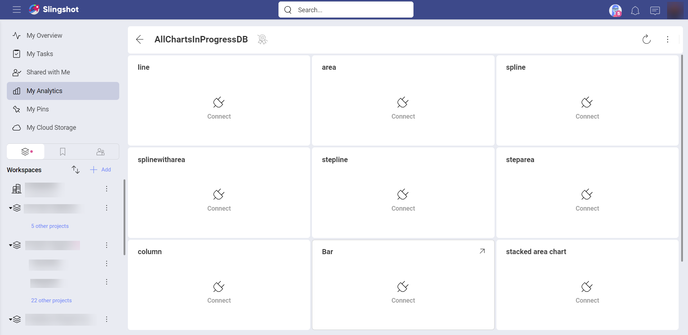

# ダッシュボードをデータ ソースに接続

Reveal では、ダッシュボードの作成[前](overview.html)または作成後にデータ ソースに接続できます。データ ソースへの接続は、ダッシュボード作成プロセスの一部です。ただし、すでに作成されているが、まだデータ ソースに接続されていないダッシュボードを持つ場合があります。これが発生する可能性のあるシナリオは 2 つあります - [共有しているダッシュボード](~/jp/dashboards/sharing-dashboards/share-a-dashboard.html)の場合と自分で Reveal に[アプロードしたダッシュボード](~/jp/dashboards/uploading-dashboards.html)の場合です。

アプリケーションにまだ追加していないデータ ソースを使用して作成されたダッシュボードは、初めて開いたときに次のようになります: 

各表示形式には **[<データ ソース名> にログイン]** ボタン (**[接続] をクリックまたはタップするとアクセスできます**) があり、使用する**データ ソースに接続**できます。そのためには次の手順を実行します:

1. **[<データ ソース名> にログイン]** ボタンをクリック/タップします。
2. データ ソースの接続ダイアログで、右上隅にある **[+ 資格情報]** ボタンをクリック/タップします。
3. アカウントの資格情報 - **ユーザー名**、**パスワード**、**エイリアス**、および**ドメイン** (オプション) を入力します。
4. **[追加]** を選択します。

完全なダッシュボードが*ダッシュボードのビュー* モードで表示されます。

>[!NOTE]
> **[データ ソースの接続]** ダイアログに、データ ソースの資格情報のリストがある場合があります (下のスクリーンショットを参照)。これらは、他のソース アカウントへのログインに使用した資格情報、または [[Reveal 資格情報の管理]](~/jp/datasources/managing-data-source-credentials.html) メニューで事前に追加した資格情報です。

別のデータ ソースで作成された表示形式がダッシュボードにある場合でも、それらを表示するには、そのデータ ソースに接続する必要があります。

## 関連トピック 

* **ダッシュボードの編集**。ダッシュボードをデータ ソースに接続して表示できるようになると、ダッシュボードを編集することもできます。これを行うには、オーバーフロー メニューからダッシュボード編集モードにアクセスします。詳細については、[ダッシュボードを操作する](~/jp/dashboards/dashboards-interactions.html)トピックをご覧ください。

* **共有ダッシュボードへのアクセス許可**。たった今データ ソースに接続したダッシュボードは、おそらく Reveal で共有されていました。ダッシュボードで実行できる操作を決定する 3 種類のアクセス許可があることをご存知でしたか? [ダッシュボードの共有](~/jp/dashboards/sharing-dashboards/share-a-dashboard.html)トピックで、これとその他の詳細について学びます。
