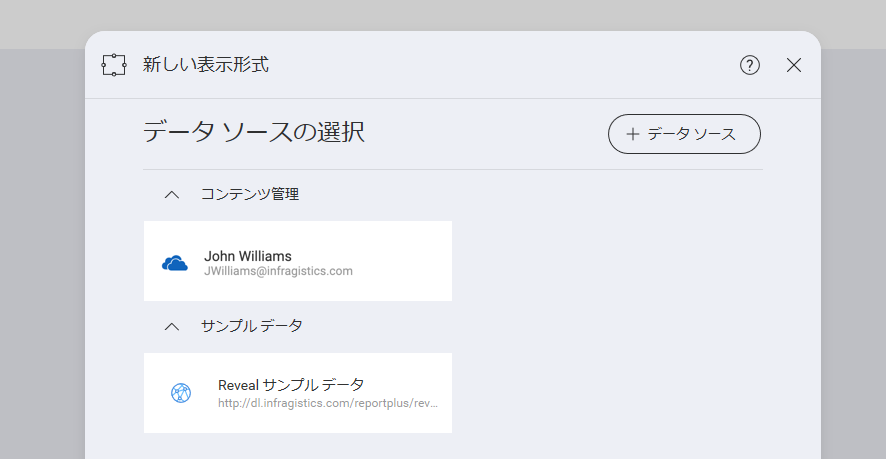

## 新規データ ソース接続を追加

ホーム画面で **[+ ダッシュボード]** の分割ボタンをクリック/タップし、*[新しい表示形式]* ダイアログを開きます。

すでに設定されたデータ ソースがある場合、それらは [データ ソースの選択] ダイアログに表示されます。(上記参照)

[Google ドライブ](google-drive.md) アカウントなどの新しいデータソース接続を作成するには、**[+ データソース] ボタン**、*[Google ドライブ]* の順に選択します。次に、Google アカウントでログインします。

設定の必要がある特定のログインまたは詳細は、**ウェブベースのデータソース**によって異なりますすべての必要な情報を入力し、**[次へ]** をクリックします。

[SharePoint に接続した](sharepoint.md)場合は、サイト、サブサイト、リストの階層を移動できます。ダッシュボードの作成時にドキュメント ライブラリでホストされた Excel スプレッドシートなどのファイルを選択して使用できます。

データソースを選択すると、簡単に新しいデータセットをダッシュボードに追加できます。使用する情報を選択すると自動的にキャンバスに追加されます。

その他の例として、**ウェブベースではないデータソース**への接続の設定があります。たとえば、[SQL Server](microsoft-sql-server.md) データベースを選択した場合、接続の詳細を入力し、アカウントの資格情報を入力するよう求めるダイアログが表示されます。

接続を保存した後、SQL サーバー インスタンスのすべてのデータ ベースの一覧およびデータベース内のすべてのテーブル、ビューおよびストアド ロシージャを参照できます。

