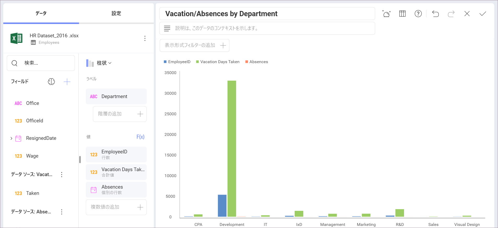
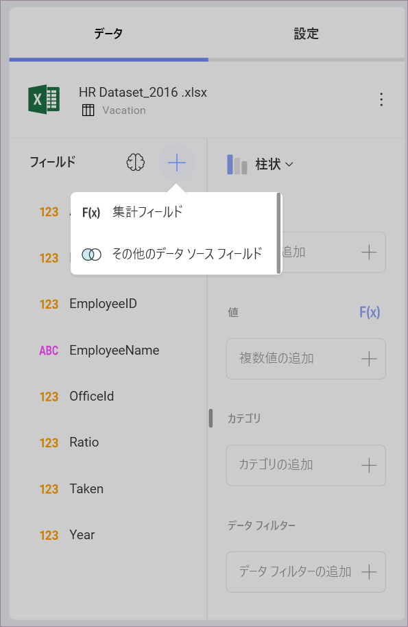
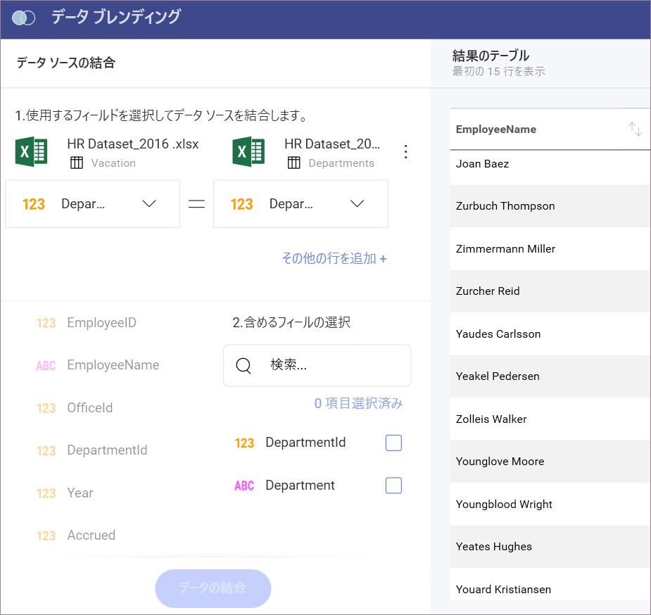
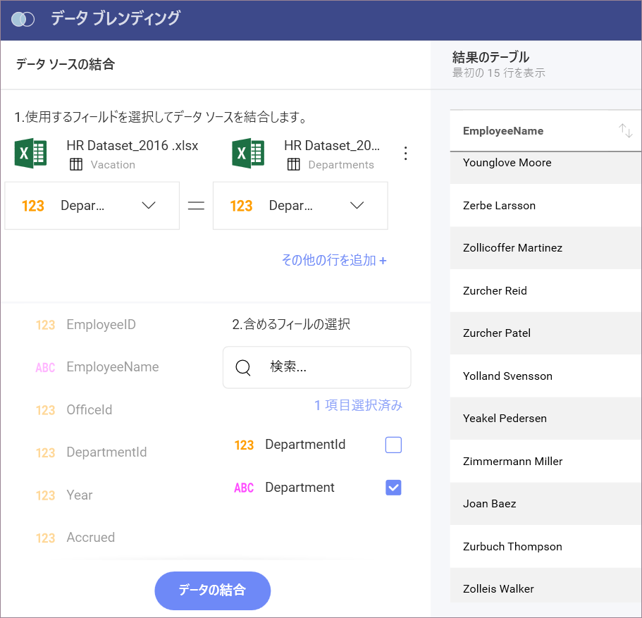
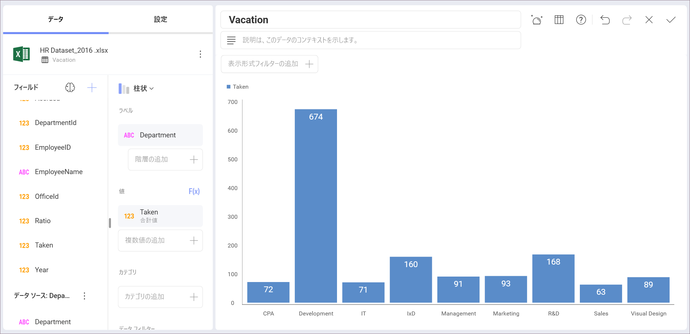

# データ ソースを 1 つの表示形式に統合

同じ Reveal 表示形式の**複数のデータ ソースから値を抽出する**ために、**データ ブレンティング**が必要な場合があります。

たとえば、休暇日数を部署ごとに他の従業員不就業と比較して、それらの変数の相関関係についてインサイトを得ることができます。

２つの データ ソースを 1 つの表示形式に統合ため、以下の手順を実行します:

1.  **データ ブレンティングのダイヤログを開く**。

    **[フィールド]** セクションの **[+]** ボタンをクリックもしくはタップし、**[その他のデータ ソース フィールド]** を選択します。

     

2.  **新しいデータ ソースを選択する**。

    統合するデータ ソースに接続します。

3.  **JOIN 条件を指定する**。

    2 つのデータ セットを統合するために一致する必要がある等価条件を設定します。

     

4.  **必要なフィールドを選択する**。

    結合するフィールドを指定して、表示形式でアクセスできるようにします。

     

5.  **[データの結合] を選択する**。

    2 つ のデータセットをマージすると、**[フィールド]** セクションの下部に新しいフィールドを確認できます。

     

    上記画像に表示されように、部署 ID を使用する代わりに、部署名で休暇日を表示できるようになりました。

## 結合条件

他のデータ ソースからフィールドを追加する場合、実際には 2 つの異なるデータ セットを結合します。Reveal が使用する結合操作は LEFT (OUTER) JOIN です。

以下に、両方のテーブルの DepartmentID (部署 ID) フィールドを使用して、**休暇 (左のテーブル)** と**事業部 (右のテーブル)** のデータセットがどのように結合しているかを示します (平等条件: DepartmentId = DepartmentId)。

**結合操作の前:**

<table>
<colgroup>
<col style="width: 50%" />
<col style="width: 50%" />
</colgroup>
<tbody>
<tr class="odd">
<td><h4 id="_vacation" style="text-align: center">休暇</h4></td>
<td><h4 id="_departments" style="text-align: center">事業部</h4></td>
</tr>
<tr class="even">
<td>
<table>
<colgroup>
<col style="width: 50%" />
<col style="width: 50%" />
</colgroup>
<thead>
<tr class="header">
<th>休暇日数</th>
<th>部署 ID</th>
</tr>
</thead>
<tbody>
<tr class="odd">
<td>
40
</td>
<td>
1
</td>
</tr>
<tr class="even">
<td>
92
</td>
<td>
10
</td>
</tr>
</tbody>
</table></td>
<td><table>
<colgroup>
<col style="width: 50%" />
<col style="width: 50%" />
</colgroup>
<thead>
<tr class="header">
<th>部署 ID</th>
<th>部署名</th>
</tr>
</thead>
<tbody>
<tr class="odd">
<td>
1
</td>
<td>
CPA
</td>
</tr>
<tr class="even">
<td>
100
</td>
<td>
人事
</td>
</tr>
</tbody>
</table></td>
</tr>
</tbody>
</table>

**結合操作後:**

| **休暇日数** | **部署 ID** | **部署 ID** | **部署名** |
| ---------------- | ---------------- | ---------------- | --------------------- |
| 40               | 1                | 1                | CPA                   |
| 92               | 10               |                  |                       |

**注**: LEFT JOIN 操作は、左側のテーブルからすべてのレコードを返し、右側のテーブルから一致するレコードのみを保持します。
