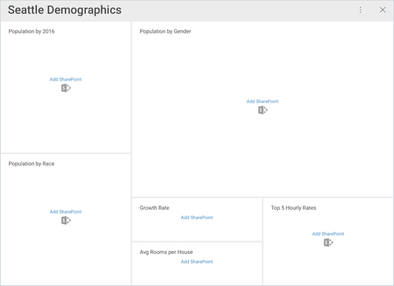
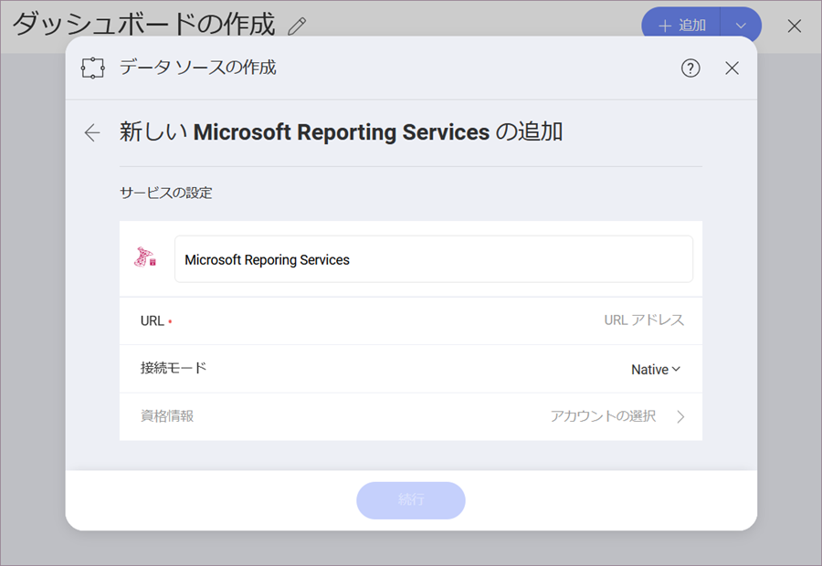
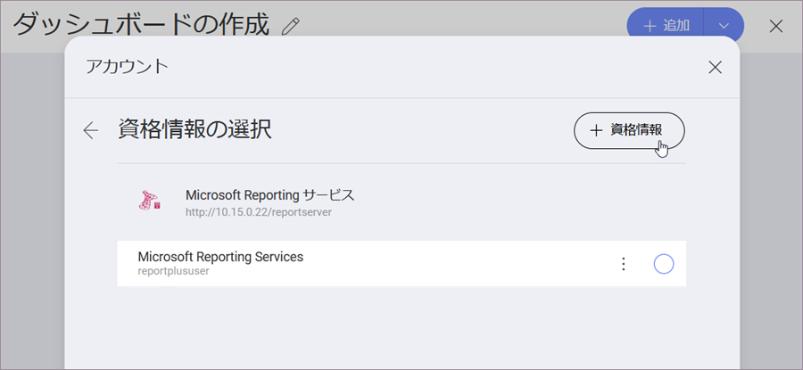

## データ ソース

[機能](Feature-Matrix.md)のクションにリストされているように、Reveal がさまざまなエンタープライズ データ ソースに接続できることを説明しました。サーバー側に変更がない場合、Reveal 内でデータにアクセスするためのデータ ソースを構成する必要があります。以下のオプションを選択できます。

  - **分析ツール**: [Google アナリティクス](google-analytics.md)、[Google BigQery](google-bigquery.md)、[MS Azure Synapse Analytics](microsoft-azure-synapse-analytics.md)。
  - **コンテンツ マネージャー**と**クラウド サービス**: [Box](box.md)、[Dropbox](dropbox.md)、[Google Drive](google-drive.md)、[OneDrive](onedrive.md)、および [SharePoint Online](sharepoint.md)。

  - **カスタマー リレーションシップ マネージャ-**: [Microsoft Dynamics CRM](microsoft-dynamics-crm.md) (オンプレミスおよびオンライン)。

  - **データベース**: [Microsoft SQL Server](microsoft-sql-server.md)、[Microsoft Analysis Services サーバー](microsoft-analysis-services.md)、[MS Azure SQL](azure-sql.md)、[MySQL](mysql.md)、[PostgreSQL](postgresql.md)、[Oracle](oracle.md)、[Sybase](sybase.md).[\*](feature-matrix.md#databases-web)。

  - **その他データ ソース**: [OData Feed](odata-feed.md)、[Web リソース](web-resource.md)、[JSON ファイル](working-with-json-files.md)、[Salesforce](salesforce.md)。

>[!NOTE]
>現在の Reveal リリースでは、コンテンツ マネージャーのデータ ソース*のみ*を作成できます。分析ツール、カスタマー リレーションシップ マネージャー、データベースは、これらのデータ ソースとともにインポートされたダッシュボードでサポートされています。

### 資格情報を入力

既存のダッシュボードを開いた際にデータソース資格情報に追加していない場合、以下のようなメッセージが表示されます。

いずれかのデータ ソースを選択すると、新しいダイアログがポップ アップしてデータ ソースの詳細の入力を促されます。以下の画面のいずれかが表示されます:

1.  ウェブベースのクラウドを使用している場合は、**ウェブ ログイン** ダイアログが表示されます。

2.  他のプロバイダーを使用している場合は、[**アカウントの追加**](#adding-account)を促されます。

### アカウントの追加

ウェブベースではないデータ ソースを追加すると、次のダイアログが表示されます:

_資格情報_ ボックスは、データ ソースへの接続に必要な情報を追加すると有効になります。次に、**[アカウントの選択]** をクリック/タップして、次のダイアログが開きます:

データ ソースに適用できる**既存の資格情報を選択する**か、[+ 資格情報] ボタンをクリック/タップして新しい資格情報を入力できます。データソースによっては、_アカウントなし_オプション、つまり、無料/パブリック アクセスのあるデータ ソース、を提供しています。

**新しい資格情報を追加する**ときは、次の詳細を提供する必要があります:

以下の情報を提供する必要があります。

  - *(オプション)* **ドメイン**: ドメイン名 (適用可能な場合)。

  - **ユーザー名**: データ ソースのユーザー アカウント。

  - **パスワード**: データ ソース用のパスワード。

データ ソースの資格情報を追加および編集するには、一般設定の **[Reveal 資格情報の管理]** メニューを使用することもできます。詳細については、[「データ ソース資格情報の管理」](managing-data-source-credentials.md)トピックを参照してください。

準備ができたら、**[作成と使用]** を選択します。Reveal にダッシュボードが表示されます。

