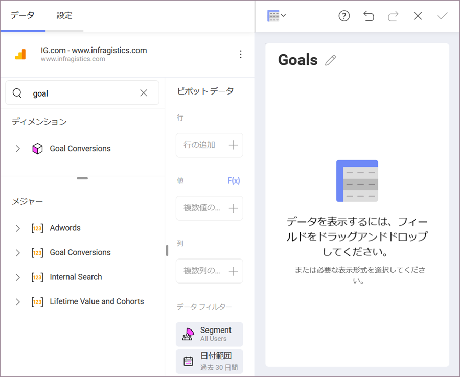

## Google アナリティクス

Google アナリティクスは、ウェブで最も使用されているウェブ分析サービスの 1 つであり、ウェブサイトのトラフィックを追跡して報告します。さらに、Google は、iOS および Android アプリから使用状況データを収集するための SDK も提供しています。

### Google アナリティクス データソースの構成

1.  **ログイン**

    1.  データ ソースとして Google アナリティクスを選択すると、Google のログイン画面が表示されます。

    2.  ログイン情報を入力して [サインイン] をクリック/タップします。承認プロンプトが表示されます。[許可] をクリック/タップします。

2.  **アカウントを選択**

    複数の Google アナリティクス アカウントがある場合は、使用するアカウントを選択します。

    

    ログインすると、データ ソースを削除しない限り、他の表示形式の作成時に同じアカウントを使用できます。

3.  **プロパティを選択**

    使用する Google アナリティクス プロパティを選択します。

    

    Google アナリティクスでは、**プロパティ**はウェブサイト、モバイル アプリ、ブログなどです。

4.  **データベース キューブを選択**

    使用するデータ キューブを選択します。

    

    このダイアログでは、データの更新間隔を次のように設定できます:

      - 常に

      - 1 時間に 1 回

      - 1 日に 1 回

      - 週に １ 回

資格情報が確認されると、Reveal はディメンションとメジャーを表示する表示形式エディターに移動します。

### データ キューブの概要

データ キューブは、多次元データを保存および表現するために使用されます。データの表示、分析、計算に 2 つのディメンションが使用される (行と列の形式で配置される) 2 ディメンション データ モデルとは異なり、データ キューブには 3 つ以上のディメンションがあります。

データ キューブの概念は、ユーザーが利用できるデータのディメンションを表すために使用されます。たとえば、「販売」 は、製品カテゴリ、地理、日付、顧客などの**ディメンション**で測定できます。この場合、「販売」はデータ キューブの**測定**属性です。

### 表示形式エディターでの作業

Google アナリティクスから取得した情報でダッシュボードを作成する場合、以下のスクリーンショットのようにフィールドが異なって体系化されます。

以下のように 「フィールド」 見出しがありません。代わりにクエリ フィールドに 2 つのセクションがあります。

1.  **ディメンション** (ピンク色の側面の立方体アイコンで表示): ディメンションは、測定可能なデータを分類するために使用される構造です。ディメンションの要素は属性で編成されます。属性は要素は単一レベルの階層を持つ要素です (「性別」、「婚姻状況」 などの要素のグループを含む 「人口統計」 属性など)。

2.  **メジャー** (*[123]* アイコンで表示): メジャーは数値データで構成されます。

Google アナリティクス データソースのデフォルトの表示形式 は、ピボット テーブルです。*行列*については、**ディメンション** データと*値* - **メジャー** データを使用する必要があります。

ディメンションとメジャーの詳細については、この [Technet article (英語)](https://docs.microsoft.com/en-us/previous-versions/sql/sql-server-2012/ms174527\(v=sql.110\)) の記事をご覧ください。

#### Google アナリティクスの目標を使用する

Google アナリティクスで定義された*目標*を*表示形式エディター*で使用できます。*目標*は、**ディメンション**と**メジャー**の両方のデータ型のメトリックの一部としてリストされます。

上記の例でわかるように、Reveal での Google アナリティクスの*目標*のタイトルには、次の 1 つ以上が含まれています:

  - 1 から 20 までの**数値 ID**。

  - 最初の**ラベル** - これは、特定の目標に設定した目標の名前です。例えば、*目標 19* の*ダウンロード完了*。

  - 最後の目標**タイプ** - 例えば、*完了*、*放棄されたファネル*など。

目標の詳細については、Google アナリティクスの[ヘルプ ページ](https://support.google.com/analytics/answer/1012040?hl=en)をご覧ください。
