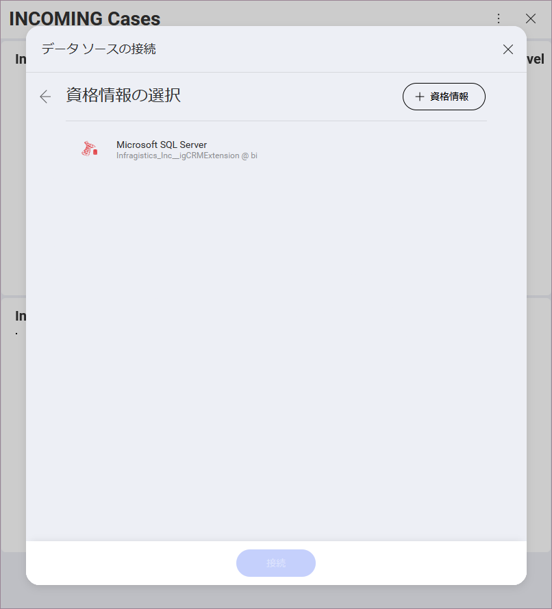
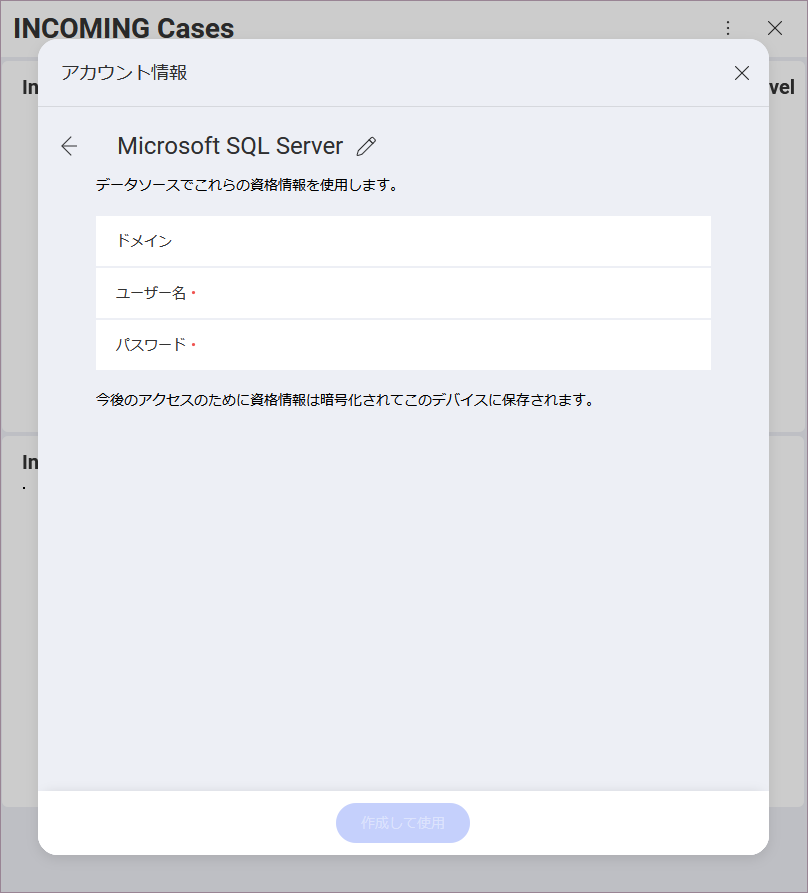

## データソースを含むダッシュボードの管理

Reveal を使用すると、まだアプリに追加していないデータ ソースを含むダッシュボードが表示される場合があります。たとえば、以下のダッシュボードを見てみましょう。

接続の詳細 (サーバー、ポートなど) は自動的にインポートされます。ダッシュボード内のデータにアクセスするために、まだ追加されていない場合にのみ、データ ソースのアカウント詳細を入力する必要があります。これを行うには、画面の右上角にある + 記号を選択します。

これにより、新しいアカウントのプロンプトが表示され、データ ソースの資格情報を入力できます。

準備が完了すると、完全なダッシュボードが表示モードで表示されます。データを編集する必要がある場合は、オーバーフロー メニューから**ダッシュボードの編集**モードにアクセスします。

