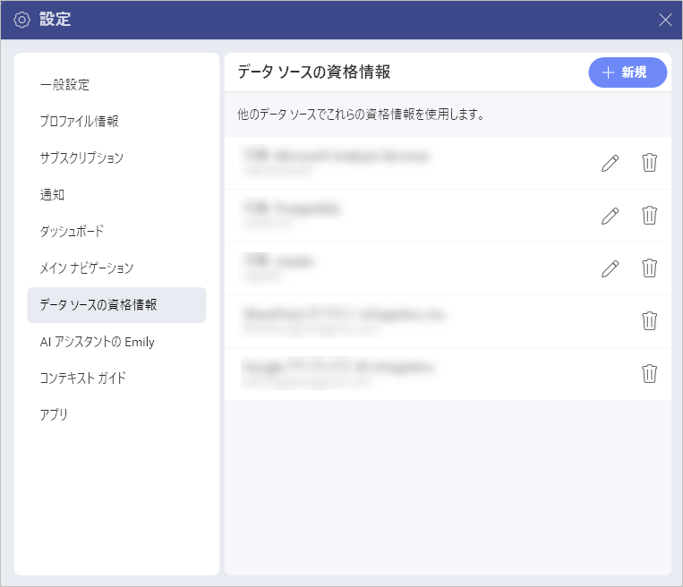
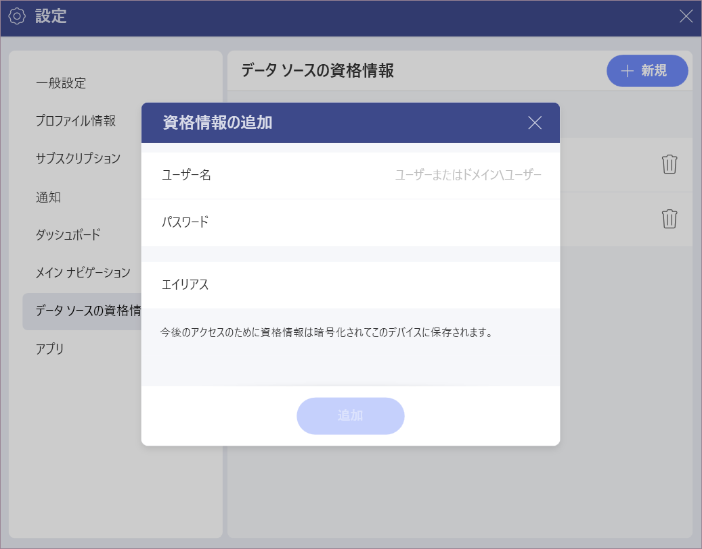

# データ ソース資格情報の管理

Reveal で特定のデータ ソースを設定するとき、これらのサービスが情報にアクセスするためのアカウント資格情報を提供する必要があります。今後のアクセスのために、資格情報は暗号化されて Reveal に**自動的に保存されます**。

すべての資格情報にアクセスして管理するには、**プロフィール写真** (右上隅) ⇒ **[設定]** ⇒ **[データ ソースの資格情報]** セクションを選択します。

## 新しいアカウント資格情報の追加

**[データ ソースの資格情報]** セクションでは、すべてのデータ ソース アカウントの資格情報を追加および削除できます。新しいアカウント資格情報を追加するには、次の手順に従ってください。

1. **[データ ソースの資格情報]** で、**[+ 新規]** 青いボタン (右上隅) をクリックまたはタップします。 
2. **[資格情報の追加]** メニューが開きます。

  

  - **ユーザー名 / ドメイン**: サービスのユーザー名またはドメイン名。

  - **[パスワード]**: サービスにアクセスするためのパスワード。

  - **エイリアス**: これらの資格情報を使用してアクセスするデータ ソースを示すエイリアスを選択します。データ ソースに接続すると、アカウントの一覧に表示されます。

3. 完了するには、**[追加]** をクリック / タップします。**[データ ソースの資格情報]** のリストの一番下に、新しく保存した資格情報が表示されます。

## 保存された資格情報の使用

それらを削除しない限り、資格情報を必要とするデータ ソースを構成するときに、Reveal に保存されているアカウントの資格情報が常にアカウントの一覧に表示されます。

> [!NOTE] 
>役立つヒント! 複数のデータ ソースで使用する予定のすべての資格情報をここに追加して整理するために時間をかけてください。

