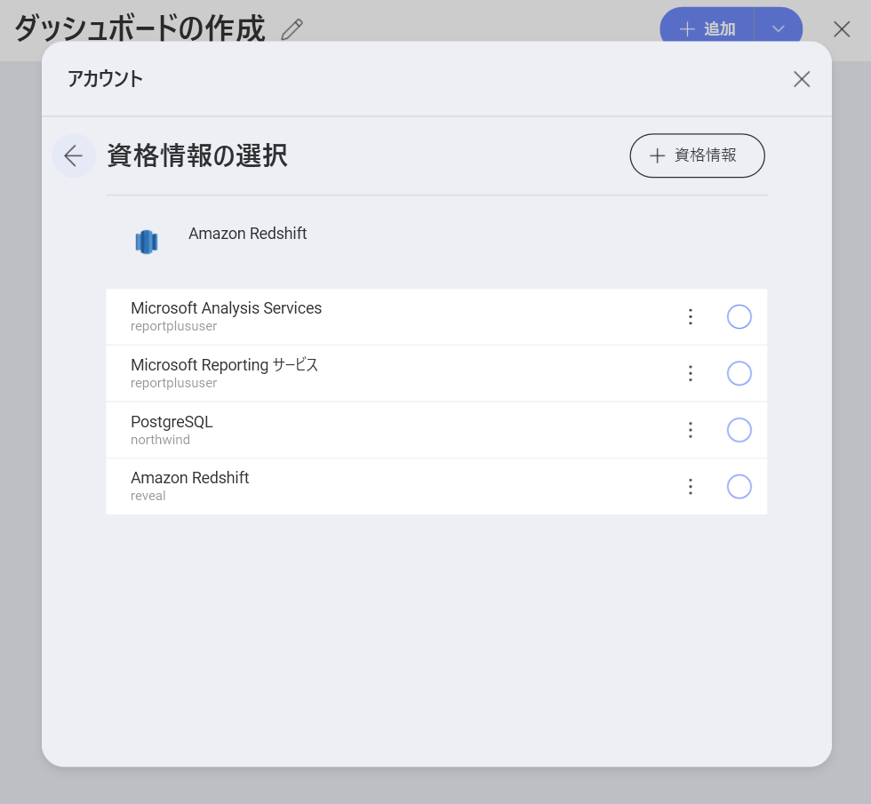

## データ ソース資格情報の管理

Reveal で特定のデータ ソースを設定するとき、これらのサービスが情報にアクセスするためのアカウント資格情報を提供する必要があります。今後のアクセスのために、資格情報は暗号化されて Reveal に**自動的に保存されます**。

すべての資格情報にアクセスして管理するには、ホーム画面で**プロフィール写真** (右上隅) > **[設定]** > **[Reveal の資格情報の管理]** セクションを選択します。

このセクションでは、すべてのデータ ソース アカウントの資格情報を作成、編集および削除できます。

### 新しいアカウント資格情報の追加

_Reveal 資格情報の管理_ セクションでは、すべてのデータ ソース アカウントの資格情報を作成、編集および削除できます。新しいアカウント資格情報を追加するには、次の手順に従ってください。

1. _Reveal 資格情報の管理_で、**[+ 新規]** の青いボタン (右上隅) をクリック/タップします。
2. *アカウント情報*メニューが開きます:

ここでは、次の情報を入力する必要があります:

  -  **名前**: これらの資格情報を使用してアクセスするデータソースを示す名前を選択します。データソースに接続すると、*資格情報の選択*ダイアログに表示されます。
  - *(オプション)* **ドメイン**: ドメイン名 (適用可能な場合)。

  - **ユーザー名**: サービスのユーザー アカウント。

  - **パスワード**: サービスにアクセスするためのパスワード。

3. 完了するには、 **[作成]**をクリック/タップします。新しく保存した資格情報は、リストの下部にある _Reveal 資格情報の管理_にあります。
### 保存された資格情報の使用

それらを削除しない限り、Reveal に保存されているアカウントの資格情報は資格情報を必要とするデータ ソースを構成するときに*資格情報の選択*画面に常に表示されます。

> [!NOTE] **役立つヒント!** 複数のデータソースで使用する予定のすべての資格情報をここに追加して整理するために時間をかけてください。

