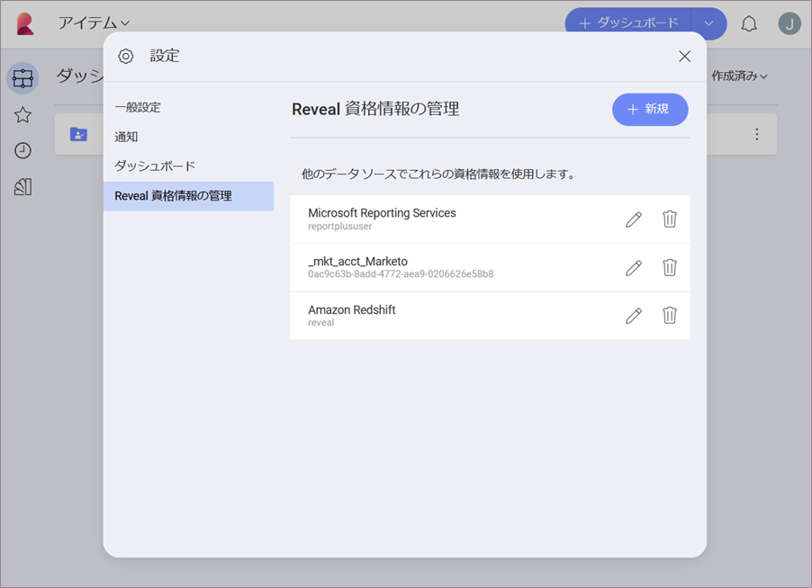
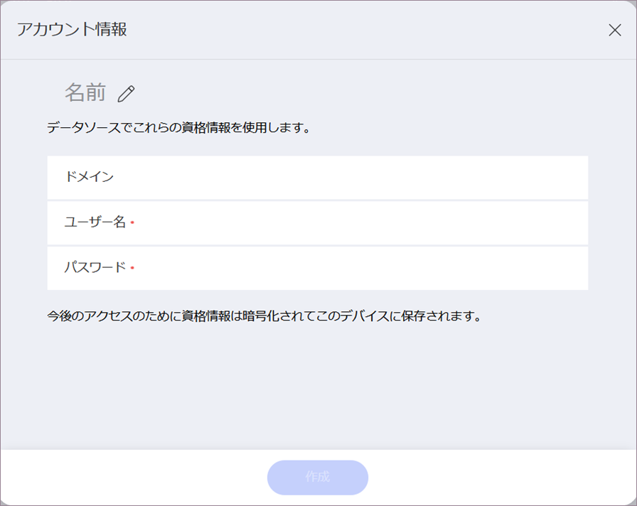
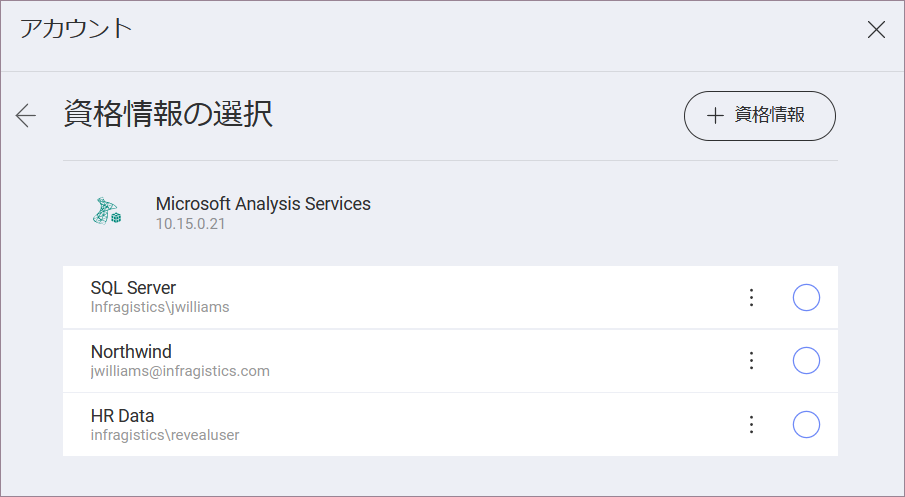

## データ ソース資格情報の管理

Reveal で特定のデータ ソースを設定するとき、これらのサービスが情報にアクセスするためのアカウント資格情報を提供する必要がある場合があります。今後のアクセスのために、資格情報は暗号化されて Reveal に保存されます。

すべての資格情報にアクセスして管理するには、ホーム画面で**プロフィール写真** (右上角) -> **[設定]** -> **[Reveal の資格情報の管理]** セクションをクリック/タップします。

このセクションでは、すべてのデータ ソース アカウントの資格情報を作成、編集および削除できます。

### 新しいアカウント資格情報の追加

リストに新しいアカウント資格情報を追加するには、上記のダイアログの *[+ 新規]* ボタンをクリック/タップします。*[アカウントの詳細]* メニューが開きます。

次の情報を入力する必要があります:

  - **名前**: データソース アカウントの名前。資格情報を必要とするすべてのデータ ソースの [資格情報] ダイアログのアカウント リストに表示されます。

  - *(オプション)* **ドメイン**: ドメイン名 (適用可能な場合)。

  - **ユーザー名**: サービスのユーザー アカウント。

  - **パスワード**: サービスにアクセスするためのパスワード。

アカウントの詳細の追加を完了するには、*[作成]*をクリック/タップします。

>[!NOTE] **保存された資格情報の使用**。
>それらを削除しない限り、Reveal に保存されているアカウントの資格情報は資格情報を必要とするデータ ソースを構成するときに *[資格情報の選択]* 画面に常に表示されます。
>
