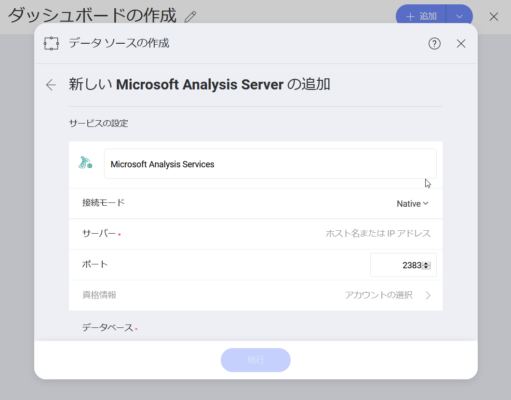
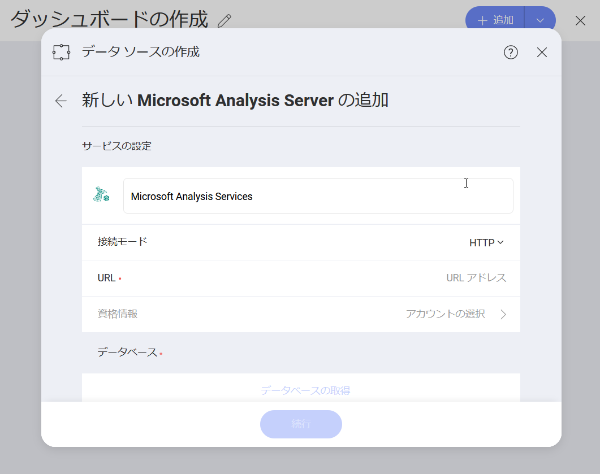
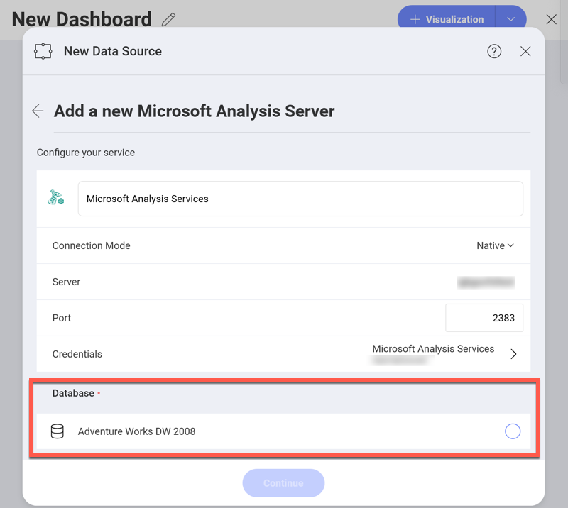
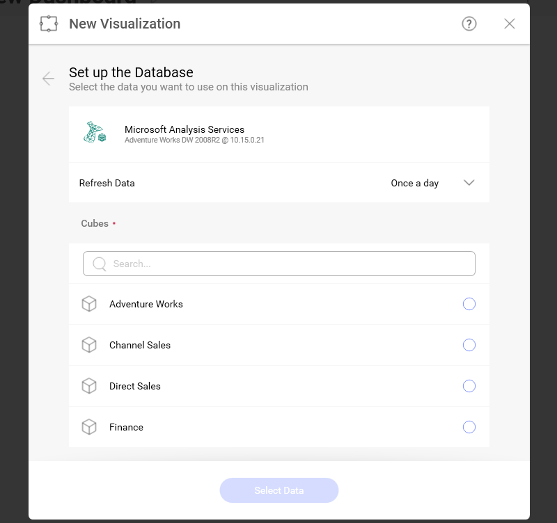

## Microsoft Analysis Services

Microsoft SQL Analysis Services (SSAS) は、Microsoft SQL Server の OLAP (同時に複数のデータベース システムからの情報のオンライン分析処理) およびデータ マイニング ツールです。

### Microsoft Analysis Services データソースの構成

Microsoft Analysis Services データソースを構成するときにサーバー設定に基づいて使用できるモジュールが 2 つあります - [*Native*](#native) および [*HTTP*](#http)。

Native および HTTP モードの詳細については、[Microsoft Instance Management ヘルプ](https://docs.microsoft.com/en-us/sql/analysis-services/instances/connect-to-analysis-services?view=sql-server-2017)をご覧ください。

#### Native の使用

Microsoft Analysis Services データソースを *Native* モード用に構成するため、以下の情報が必要です。

1. データ ソースの*デフォルト名*: Your data source name will be displayed in the list of accounts in the previous dialog. By default, Reveal names it *Microsoft Analysis Services*. You can change it to your preference.

2.  **サーバー**: サーバーが実行されているコンピューターのホスト名または IP アドレスです。

    以下の手順で*ホスト名*情報も確認できます。コマンドはサーバー マシンで実行する必要があることに注意してください。

    | WINDOWS                                                                                                         | LINUX                                                                                                         | MAC                                                                  |
    | --------------------------------------------------------------------------------------------------------------- | ------------------------------------------------------------------------------------------------------------- | -------------------------------------------------------------------- |
    | 1\. Open the File Explorer.                                                                                     | 1\. Open a Terminal.                                                                                          | 1\. Open System Preferences.                                         |
    | 2\. Right Click on My Computer \> Properties.                                                                   | 2\. Type in **$hostname**                                                                                     | 2\. Navigate to the Sharing Section.                                 |
    | Your Hostname will appear as "Computer Name" under the *Computer name, domain and workgroups settings* section. | Your Hostname will appear along with your DNS domain name. Make sure you only include **Hostname** in Reveal. | Your Hostname will be listed under the "Computer Name" field on top. |

  以下の手順で *IP アドレス*も確認できます。コマンドはサーバー マシンで実行する必要があることに注意してください。

  | WINDOWS                              | LINUX                             | MAC                                                           |
  | ------------------------------------ | --------------------------------- | ------------------------------------------------------------- |
  | 1. Open a Command Prompt.            | 1. Open a Terminal.               | 1. Launch your Network app.                                   |
  | 2. Type in **ipconfig**              | 2. Type in **$ /bin/ifconfig**    | 2. Select your connection.                                    |
  | **IPv4 Address** is your IP address. | **Inet addr** is your IP address. | The **IP Address** field will have the necessary information. |

3.  (オプション) の**ポート**: サーバー ポートの詳細。情報が入力されない場合、Reveal はデフォルトでヒント テキスト (2383) のポートに接続します。

4.  **資格情報**: *資格情報*を選択した後、Microsoft Analysis Services の資格情報を入力するか、既存の資格情報 (適用可能な場合) を選択できます。

#### HTTP の使用

Microsoft Analysis Services データソースを *HTTP* モード用に構成するため、以下の情報が必要です。

1.  **データ ソース名**: このフィールドはデータソース リストに表示されます。デフォルト名: *Microsoft Analysis Services*。

2.  **URL**: サーバーの HTTP eService URL。例: *10.1.0.15/olap/msmdpump.dll*。

3.  **資格情報**: Analysis Services サーバーのユーザーアカウントの資格情報。

### データベースの構成

Analysis Services サーバーの資格情報が確認されたら、Reveal はサーバー上のデータベースを読み込んで表示します。

データベースを選択し、*続行*をクリックして設定します。

*データベースの設定*ダイアログでデータベース*キューブ*を選択します。

#### データ キューブの概要

データ キューブは、多次元データを保存および表現するために使用されます。データの表示、分析、および計算に 2 つの次元が使用される (行と列の形式で配置される) 2 次元のデータ モデルとは異なり、データ キューブには 3 つ以上の次元があります。

データ キューブの概念は、ユーザーが利用できるデータの次元表すために使用されます。
たとえば、「売上」 は製品カテゴリ、地理、日付、顧客などの**次元**で測定できます。この場合、「売上」 はデータ キューブの**測定**属性です。

Microsoft Analysis データ ソースの操作方法の詳細については、[このトピック](working-with-microsoft-analysis-services.md) を参照してください。
