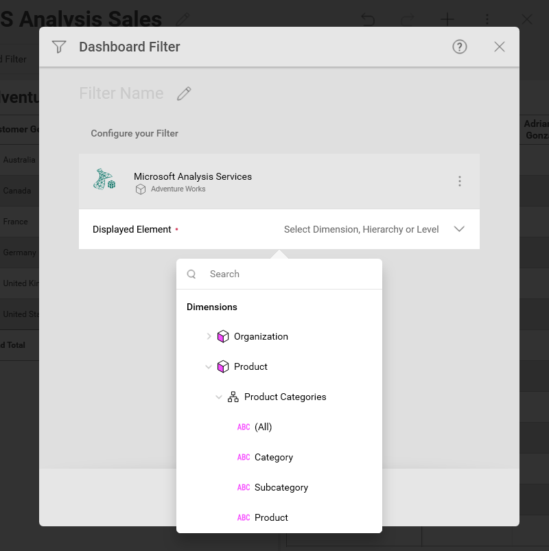

## Microsoft Analysis Services との連携

データソースとしての Microsoft Analysis Services は、以下に関するいくつかの詳細を示しています。

  - [ビジュアライゼーション エディターで Microsoft Analysis データソースを操作する](#visualization-editor);

  - [フィールド設定](#sort-by-caption-setting);

  - [ダッシュボード フィルター](#dashboard-filters).

### ビジュアライゼーション エディターでの作業

Microsoft Analysis Services からの情報でダッシュボードを作成する場合、以下のスクリーンショットのようにフィールドが異なって体系化されます。

以下のように 「フィールド」 見出しがありません。代わりにクエリ フィールドに 2 つのセクションがあります。

1.  **ディメンション** (ピンク色の側面の立方体アイコンで表示): ディメンションは、測定可能なデータを分類するために使用される構造です。

    1.  **階層** - ディメンション内の要素が階層別に編成されている場合、下位レベルの要素から開始して、階層全体または階層の一部を使用できます。
        
        たとえば、「国 → 都道府県→都市」階層で編成された「地理」ディメンションがある場合、この階層の「都道府県 → 都市」部分のみをドラッグして使用できます。

    2.  **名前付きセット** (フォルダーアイコンで示され、「Sets」という名前) - 名前を持つ要素の任意のコレクション (「Top 50 Customers」など)

    3.  **属性** - 要素は単一レベルの階層で編成されます (「性別」、「婚姻状況」などの要素のグループを含む「人口統計」属性など)。

2.  **メジャー** ([123] アイコンで表示): メジャーは数値データで構成されます。

Microsoft Analysis Services データソースのデフォルトのビジュアライゼーション タイプは、ピボットテーブルです。
行列については、ピボット テーブル ビジュアライゼーションを構築するときに、ディメンションデータと値 - メジャー データを使用する必要があります。

ピボット表ビュー:

For more information on dimensions and measures, please visit this
[Technet article](https://docs.microsoft.com/en-us/previous-versions/sql/sql-server-2012/ms174527\(v=sql.110\)).

### キャプション設定で並べ替え

またキャプションで並べ替えるオプションがあり、フィルターの適用をディメンションのラベルまたは対応する値に設定できます。

有効にすると、[キャプションで並べ替え] により、ディメンションがラベルでアルファベット順に並べ替えられます。

有効にするには、**行**または**列**でディメンションを選択します。[昇順] または [降順] を選択してフィールドの並べ替えを有効にし、[キャプションで並べ替え] オプションを表示します。

### ダッシュボード フィルター

SSAS ベースのダッシュボードフィルターを構成する場合、セットアップする 2 つのデータフィールドがあります。

1.  **表示要素** - ディメンション、階層、またはレベルのデータ フィールドを選択して、ダッシュボードフィルター値を表示します。

    

2.  *(オプション)* **メジャーにデータがある場合のみ表示** - メジャーを選択して、ダッシュボードのフィルター値を特定のメジャーのデータを含む値に制限します。

    

たとえば、製品を 表示要素として使用してビジュアライゼーションの販売データをフィルタリングする場合、ダッシュボードフィルターには製品のリスト (バイク、衣服など) が含まれます。

リストから値を選択すると、接続された視覚エフェクトが更新され、選択した製品のデータのみが表示されます。

[メジャーにデータがある場合にのみ表示する]の**インターネット注文** メジャーを追加で選択した場合、このメジャーに関する情報を含まないダッシュボードフィルター値はオプションになりません (つまり、自転車のインターネット注文がない場合、この製品をフィルター値として選択することはできません)。

フィルターの使用方法の詳細については、以下を参照してください。

  - [ダッシュボード フィルターとそのプロパティ](~/jp/filters/dashboard-filters-properties.md)

  - [ダッシュボード フィルターをビジュアライゼーションに接続](~/jp/filters/connecting-dashboard-filters-visualization.md)
