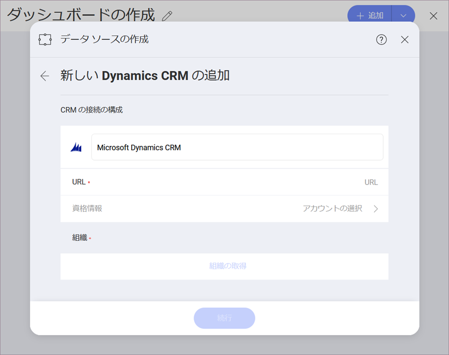

## MMicrosoft Dynamics CRM

Microsoft Dynamics CRM データソースを構成するには、以下の情報が必要です。

1.  **データ ソース名**: データソースは以前のダイアログのアカウントのリストに表示されます。By default, Reveal names it *Microsoft Dynamics CRM*. You can change it to your preference.

2.  **URL**: Dynamics CRM サイトの URL (<http://crm.YourCompany.local> など)。

3.  **資格情報**: *資格情報*を選択した後、Microsoft Dynamics CRM サイトの資格情報を入力するか、既存の資格情報 (適用可能な場合) を選択できます。

      - **名前**: データソース アカウントの名前。以前のダイアログのアカウントのリストに表示されます。

      - *(オプション)* **ドメイン**: ドメイン名 (適用可能な場合)。

      - **ユーザー名**: Dynamics CRM サイトのユーザー アカウント。

      - **パスワード**: Dynamics CRM サイトのパスワード。

準備ができたら、**アカウントの作成**を選択します。**[接続テスト]** を選択すると、アカウントがデータソースに到達しているかどうかを確認できます。
