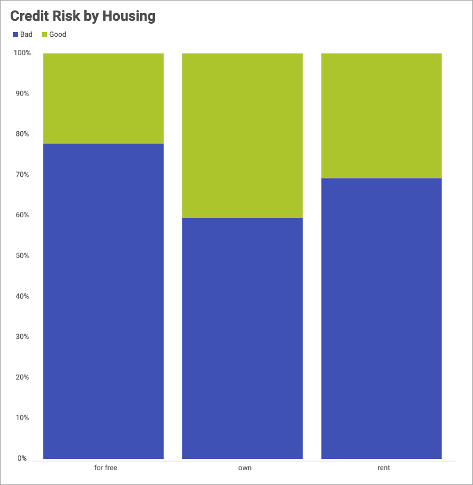
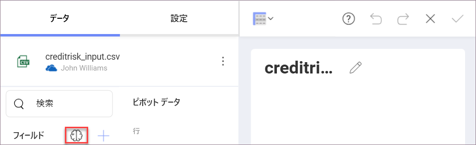
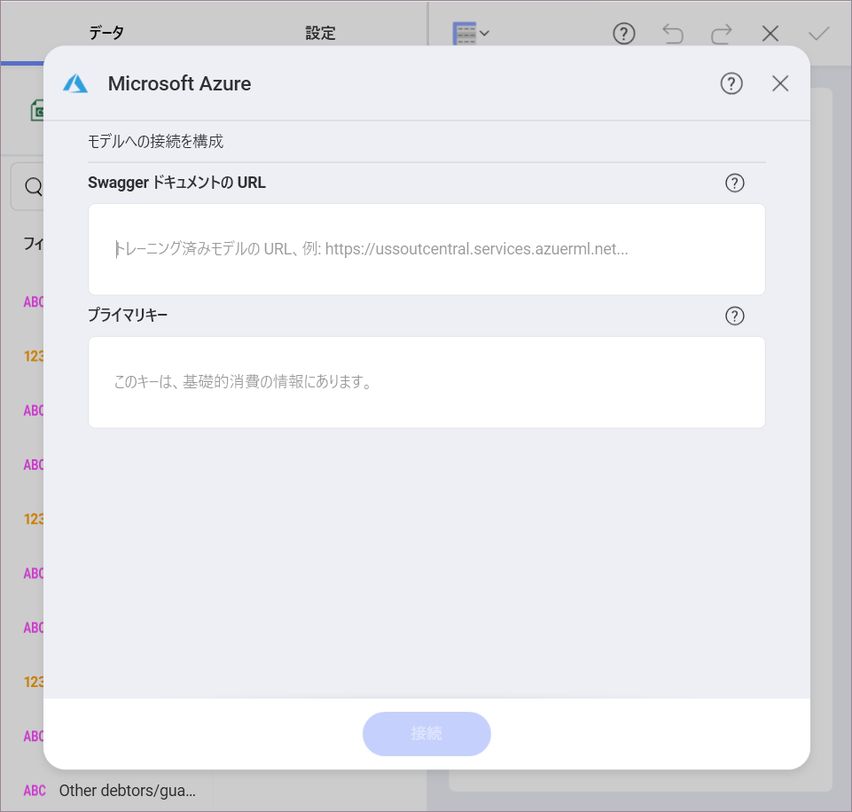
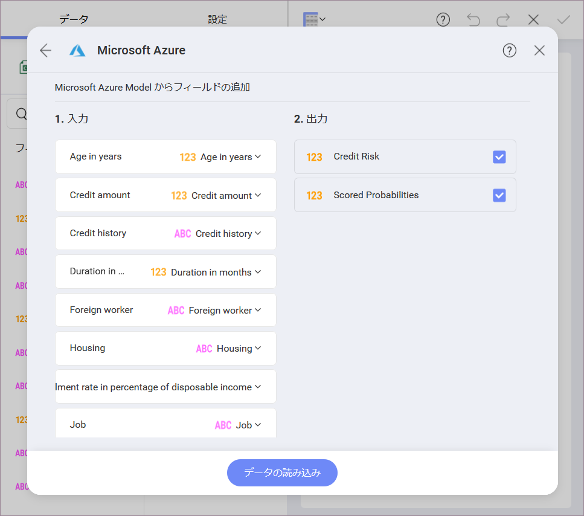
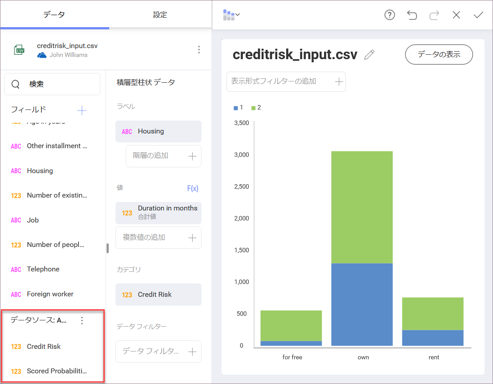

## Reveal の Azure Machine Learning

Reveal で Azure Machine Learning Studio のトレーニング済みモデル データを使用できます。これまで以上に洗練された情報を取得できます。データ ソースを選択し、表示形式を作成し、トレーニング済みの機械学習モデルに接続します。

たとえば、クライアントに関する特定の情報を使用して、銀行のクライアントの信用リスクを予測するようにトレーニングされた機械学習 (Machine Learning) モデルがあるとします。この機械学習モデルを Reveal で使用して、クライアントの住宅タイプが信用リスクにどのように関連するかについての洞察を与える表示形式を構築できます。

### 前提条件

Reveal で Azure Machine Learning を使用するには、表示形式を構築する際に接続するための **Microsoft Azure Machine Learning Studio** のアカウントと、**トレーニング済みの機械学習モデル**が必要です。

### Azure Machine Learning へのアクセス

Azure Machine Learning にアクセスするには、以下の手順を実行します。

1.  任意のデータ ソースに接続します。機械学習モデルが予測するデータに関連する情報を含む必要があります。

2.  **表示形式エディター**で、左側の **[フィールド]** リストの上にある**脳アイコン**をクリック/タップします。次に、**Microsoft Azure** を選択します。

    

### Azure Machine Learning モデルへの接続

Azure で機械学習モデルに接続するには、以下を実行する必要があります。

1.  Azure Machine Learning Model によって公開される Web サービスにアクセスするために、以下の構成ダイアログで要求された値を提供します。

    

    **[Swagger ドキュメントの URL]** と **[API キー]** を検索するには、以下を実行する必要があります。

    a. **Microsoft Azure Machine Learning Studio** に移動します。

    b. 左側のメニューで **[Web Services]** (Web サービス) を選択します。

    c. リストから、Reveal と統合する Web サービス (トレーニング済みモデルで公開) を選択します。

    d. このサービスに指定された **[API key]** (API キー) をコピーします。

    e. 同じサービスの **[Default Endpoint]** (既定のエンドポイント) テーブルから **[REQUEST/RESPONSE]** (要求/応答) を選択します。

    f. 開いた **API ドキュメント ページ**で **API Swagger ドキュメント**の URL をコピーし、Reveal に貼り付けます。

2.  表示されるダイアログで、Reveal のデータを機械学習モデルで予期される入力にマップする必要があります。

    

    上記のダイアログには、以下の列があります:

    a. **[入力]**: 左の列は、出力情報 (例: *Credit Risk*) を計算するためにモデルが必要とするデータの種類を表示します。右側の列で、モデルの左側の列 (例: *Age* など) の要求されたデータと一致するデータセット内のフィールド (例: *Age in years*) を選択します。Reveal は、同じ名前を共有する*入力*リストのすべてのフィールドをモデルの要求されたデータと自動的に一致させます。

    b. **[出力]**: モデルで計算 (予測) する情報を選択します。結果は、表示形式エディターの新しいフィールドとして表示されます (**データ ソース: Azure model** の下)。

    c. **[パラメーター]**: 一部の Azure 機械学習モデルでは、出力を計算するために必要なパラメーターの値を入力する必要があります。この場合、**[入力]** と **[出力]** の間に 3 番目の **[パラメーター]** 列があります。

      

Azure モデルによって返されたフィールドを表示形式エディターの通常のフィールドとして使用できます。
