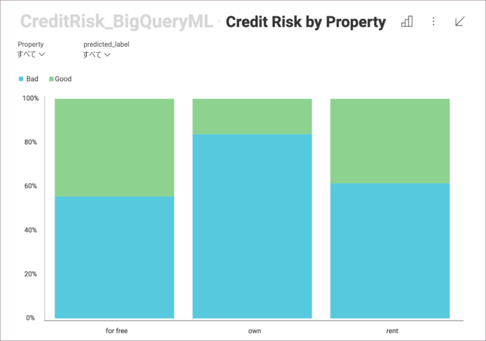

## Reveal の BigQuery Machine Learning

Reveal で BigQuery のトレーニング済みの機械学習モデルを使用できます。これまで以上に洗練された情報を取得できます。BigQuery をデータソースとして選択し、表示形式を作成し、トレーニング済みの機械学習モデルに接続します。

たとえば、クライアントに関する特定の情報を使用して、銀行のクライアントの信用リスクを予測するようにトレーニングされた機械学習 (Machine Learning) モデルがあるとします。この機械学習モデルを Reveal で使用して、クライアントの住宅タイプが信用リスクにどのように関連するかについての洞察を与える表示形式を構築できます。

### 前提条件

Reveal で BigQuery Machine Learning を使用するには、**トレーニング済みの機械学習モデル**がある **BigQuery データソース アカウントに接続する**必要があります。

### BigQuery Machine Learning へのアクセス

BigQuery Machine Learning にアクセスするには、以下の手順を実行します。

1. BigQuery データソースに接続します。機械学習モデルの予測に必要な情報を含むデータセットを選択します。

    BigQuery データソースの詳細については、[Google BigQuery](~/jp/datasources/supported-data-sources/google-bigquery.md) のトピックを参照してください。

2. 表示形式エディターで、左側のフィールド リストの上にある**脳アイコン**をクリック/タップします。

    

### 機械学習モデルへの接続

BigQuery 機械学習モデルに接続するには、以下を実行する必要があります。

1. 開いたダイアログでトレーニング済みの BigQuery モデルから選択します。

2. 次のダイアログで、Reveal に読み込まれたデータを機械学習モデルで予期される入力にマップする必要があります。

    例えば、以下の列があります:

    a. **[入力]**: 左側では、出力情報 (例: Duration) を計算するためにモデルが必要とするデータの種類を表示します。右側で、要求されたデータに一致するデータセットのフィールド (例: _Duration_in_months_) を左側で選択する必要があります。Reveal は、同じ名前を共有する読み込まれた BigQuery データセットのすべてのフィールドをモデルの要求されたデータと自動的に一致させます。

    b. **[出力]**: モデルで計算 (予測) する情報を選択します。結果は、表示形式エディターの **データソース: (モデル名)** の下に新しいフィールドとして表示されます。**例:** データソース: credit_risk_model。

    c. (オプション) の **[パラメーター]**: 一部の BigQuery 機械学習モデルでは、出力を計算するために必要なパラメーターの値を入力する必要がある場合があります。この場合、[入力] と [出力] の間に 3 番目の [パラメーター] 列があります。

BigQuery モデルによって返されたフィールドを表示形式エディターの通常のフィールドとして使用できます。
