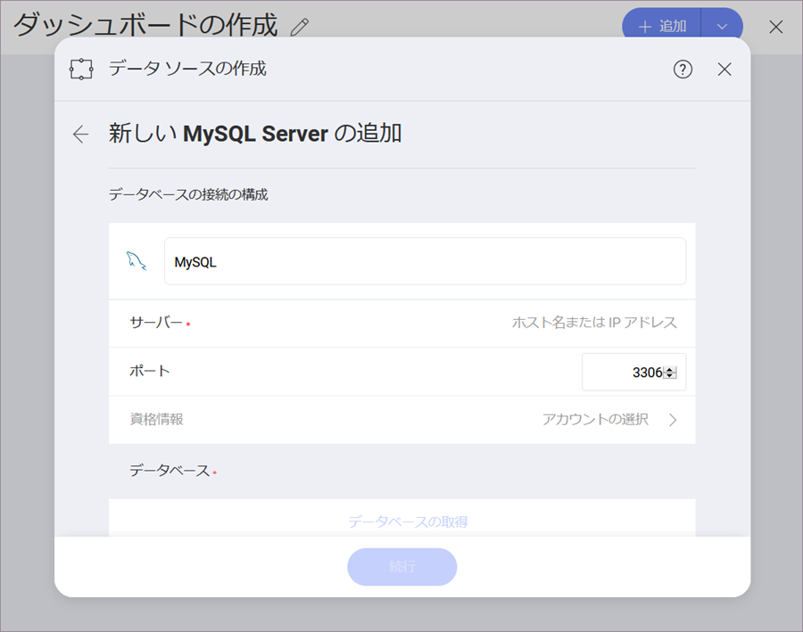

## MySQL

MySQL サーバーデータソースを構成するには、以下の情報が必要です。

1.  **データ ソース名**: データソースは以前のダイアログのアカウントのリストに表示されます。By default, Reveal names the data source *MySQL*. You can change it to your preference.

2. [**サーバー**](#how-to-find-server): コンピューター名またはサーバーを実行しているコンピューターに割り当てられた IP アドレス。

3.  **ポート**: 該当する場合、サーバー ポートの詳細。情報が入力されない場合、Reveal はデフォルトでヒント テキスト (3306) のポートに接続します。

4.  **資格情報**: *資格情報*を選択した後、MySQL サーバーの資格情報を入力するか、既存の資格情報 (適用可能な場合) を選択できます。

      - **名前**: データソース アカウントの名前。以前のダイアログのアカウントのリストに表示されます。

      - *(オプション)* **ドメイン**: ドメイン名 (適用可能な場合)。

      - **ユーザー名**: MySQL サーバーのユーザー アカウント

      - **パスワード**: MySQL サーバーのパスワード

    準備ができたら、**アカウントの作成**を選択します。**[接続テスト]**を選択すると、アカウントがデータソースに到達しているかどうかを確認できます。

### サーバー情報を見つける方法

以下の手順でサーバーも確認できます。コマンドはサーバーで実行する必要があることに注意してください。

| WINDOWS                                                                                                         | LINUX                                                                                                         | MAC                                                                  |
| --------------------------------------------------------------------------------------------------------------- | ------------------------------------------------------------------------------------------------------------- | -------------------------------------------------------------------- |
| 1\. ファイル エクスプローラーを開きます。                                                                                     | 1\. ターミナルを開きます                                                                                          | 1\. システム環境設定を開きます                                         |
| 2\. マイコンピューターを右クリックしてプロパティを表示します。                                                                   | 2\. **$hostname** と入力します。                                                                                     | 2\. 共有セクションへ移動します。                                 |
| ホスト名は、「コンピューター名、ドメイン、ワークグループ設定」の下にコンピューター名として表示されます。 | ホスト名と DNS ドメイン名が表示されます。Reval では**ホスト名**のみを含めることに注意してください。 | ホスト名は、上部の「コンピューター名」の下に表示されます |

以下の手順で *IP アドレス*も確認できます。コマンドはサーバーで実行する必要があることに注意してください。

| WINDOWS                              | LINUX                             | MAC                                                           |
| ------------------------------------ | --------------------------------- | ------------------------------------------------------------- |
| 1\. コマンド プロンプトを開きます。           | 1\. ターミナルを開きます。              | 1\. ネットワーク アプリケーションを起動します。                                  |
| 2\. **ipconfig** と入力します。             | 2\. **$ /bin/ifconfig** と入力します。   | 2\. 接続を選択します。                                   |
| **IPv4 アドレス** はあなたの IP アドレスです。 | **Inet addr** はあなたの IP アドレスです。 | **IP アドレス** フィールドに必要な情報が提供されます。 |

### ビューの作業

Reveal を使用すると、テーブル全体から MySQL データを取得できますが、代わりにテーブルまたはテーブルのセットからデータのサブセットを返す特定の[ビュー](https://dev.mysql.com/doc/refman/8.0/en/stored-programs-views.html)を選択することもできます。

上記のサンプルでは、**請求書**ビューに MySQL サーバーの **Products** テーブルのデータの変更バージョンが含まれています。

ビューおよび MySQL の詳細については、[このページ](https://dev.mysql.com/doc/refman/8.0/en/stored-programs-views.html)を参照してください。
