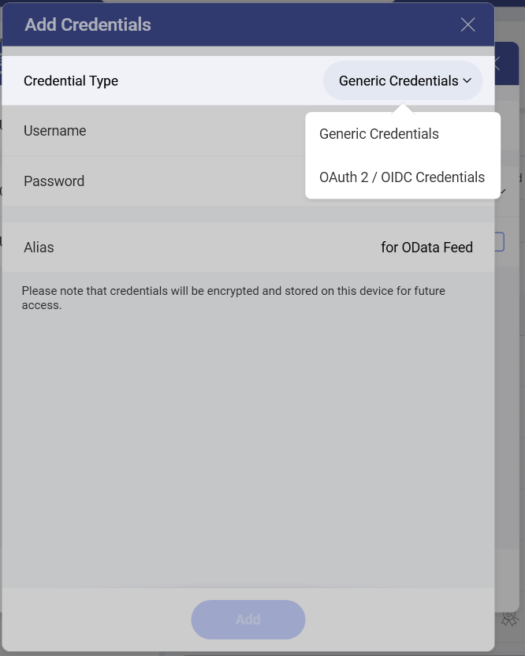
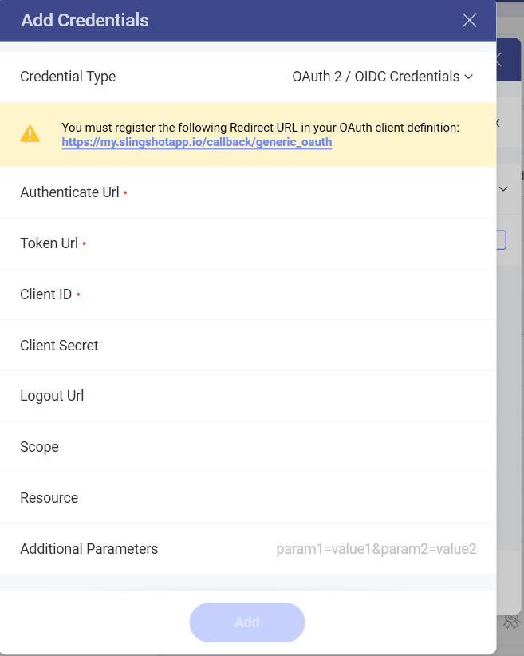

# REST、OData、およびウェブ リソースを使用した OAuth 2 / OIDC ユーザー認証

[OData フィード](supported-data-sources/odata-feed.html)、[REST API](supported-data-sources/rest-api.html)、または[ウェブ リソース](supported-data-sources/web-resource.html)を使用する場合、リソースの一部が保護される場合があります。この場合、OAuth 2 / OIDC アカウントを設定して、これらのリソースへの Reveal アクセスを許可する必要があります。

## OAuth 2 とは?

OAuth 2.0 は、元の Oauth プロトコルに代わるアクセス許可フレームワークです。通常、ユーザーの資格情報を公開せずに特定のリソースへの制限付きアクセスを許可します。OAuth 1.0 と同様に、このプロトコルは Oauth クライアントと呼ばれるある場所 (サードパーティのアプリケーションまたは Web サイト) から別の場所へのアクセスを可能にします。

詳細については、[OAuth 2.0 (英語)](https://oauth.net/2/) を参照してください。

## OIDC とは?

OIDC は OAuth 2.0 プロトコルの上にあるシンプルな ID レイヤーです。OIDC を利用すると、Web サイトまたはアプリケーションは、別のサービスまたはアプリケーション (Google、Office 365 など) のアカウントを使用してユーザーの認証が可能になり、それをもとにコンテンツへのアクセス許可の制御が可能になります。Web サイトまたはアプリケーション側でさまざまなアカウントを保持する必要がなくなります。

詳細については、[OpenID Connect (英語)](https://openid.net/connect/) を参照してください。

## OAuth 2 / OIDC アカウントで保護されたリソースを使用

OAuth 2 / OIDC アカウントでデータ ソースを使用するには、以下の 4 つの手順を実行する必要があります。

1.  **OAuth クライアント (Reveal) をリソース サーバーに登録する** (これは、Microsoft、Google など、使用したい OAuth で保護されたリソースをホストするサーバーです) 。

2.  OAuth2 / OIDC アカウントで使用できる Reveal の 3 つの**データ ソース**の 1 つを選択する - [OData フィード](supported-data-sources/odata-feed.html)、[Rest API](supported-data-sources/rest-api.html)、または[ウェブ リソース](supported-data-sources/web-resource.html)。

3.  リソース サーバーがクライアントに提供した資格情報を使用して、**Reveal で OAuth 2 / OIDC アカウントを設定する**。

4.  データにアクセスして使用するための**権限を Reveal に付与する**。

## OАuth クライアントの登録

**リソース サーバー** (Microsoft、Google など) に移動し、必要な情報を入力して Reveal を Oauth クライアント/アプリケーションとして登録します。通常、アプリケーションの名前とリダイレクト URL が必要です。

>[!NOTE]
>リダイレクト URL: Reveal の *OAuth 2 / OIDC アカウントの詳細画面*にリダイレクト URL が表示されます。

登録が完了すると、リソース サーバーは Reveal で *OAuth 2 アカウント*を構成するために必要な資格情報を生成します。

## データ ソースの選択

1.  Reveal に移動し、**データ ソース** (Odata フィード、Rest API、またはウェブ リソース) **を選択する**。

2.  データが配置されている *URL* を提供します。

3.  **[資格情報]** をクリックまたはタップします。

**[+ 資格情報]** をクリックまたはタップしたら、**[資格情報の種類]** ドロップダウン メニューから **[OAuth 2 / OIDC 資格情報]** を選択できます。

 

## Reveal での OAuth 2 / OIDC アカウントの設定

**OAuth 2 / OIDC アカウントの詳細**画面で、リソース サーバーによって Reveal 用に既に生成された資格情報を入力する必要があります。

以下のフィールドは必須です。

3.  **[トークン Url]**: トークン URLの形式は認証 URL の形式と同様です (例: <https://login.microsoftonline.com/common/oauth2/token>)。

4.  **[クライアント ID]**: クライアント ID はアプリ (Reveal) の識別子です。その形式は、シンボルのランダムな組み合わせです。Reveal を OAuth クライアントとして最初に登録するときにクライアント ID を受け取ります。

その他のフィールドは Reveal で必須としてマークされませんが、OAuth サービスに応じて以下を提供する必要があります。

*  **[クライアント シークレット]**: クライアント シークレットは追加の保護として使用されます。その形式は、シンボルのランダムな組み合わせです。

*  **[スコープ]**: スコープ値は、追加のアクセス レベルを要求するために使用されます。値は特定のサービスに依存します。

*  **[リソース]**: ここで、保護されたデータをホストするサービス (例: <https://infragisticsinc297.sharepoint.com>) に URL を入力する必要があります。

* **追加パラメーター**: 

* データ ソースの**エイリアス**: データ ソース名がアカウントのリストに表示されます。いつでも変更できます。
