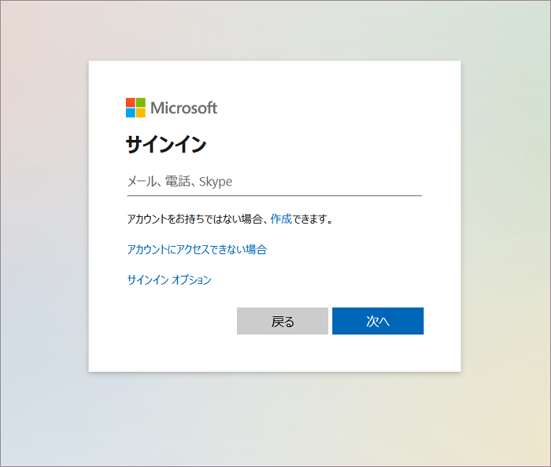
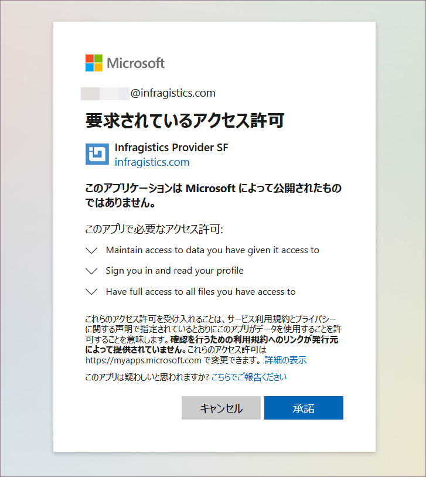

## OneDrive

If you sign in with your Office365 account, you will have your OneDrive automatically added to your data sources. Otherwise, read how to add a new data source in [this topic](creating-new-datasource.md).

To use your OneDrive data, follow the steps below.

1.  Upon selecting your OneDrive, you will see the following prompt:

    

    Enter your **account and password** and select "Sign in".

2.  You will then be notified that you will need to give some **limited permissions** to Reveal so that it can use your OneDrive data.

    

    By clicking *Continue*, you will be redirected to an **authorization prompt**:

    

3.  Select *Allow* to authorize Reveal to use (read and maintain access
    to) your OneDrive files.

You can now use your OneDrive data to build your visualizations and will
not be asked for these permissions again.

### Supported Files

When working within Reveal, you will be able to use a wide variety of
files:

  - **Spreadsheets**: Excel (.xls, .xlsx) or CSV, which you can use
    dynamically within Reveal.

  - **Other files** (including images or document files such as PDFs,
    texts, etc.), which will be displayed in a preview mode only.
