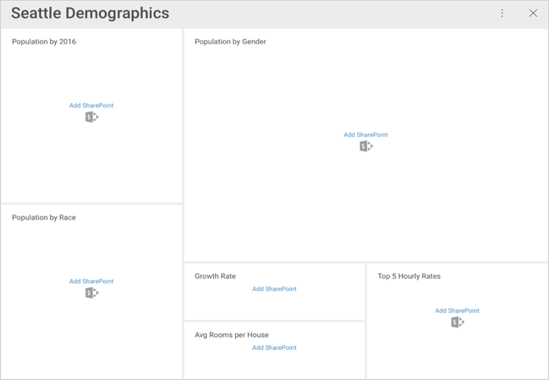
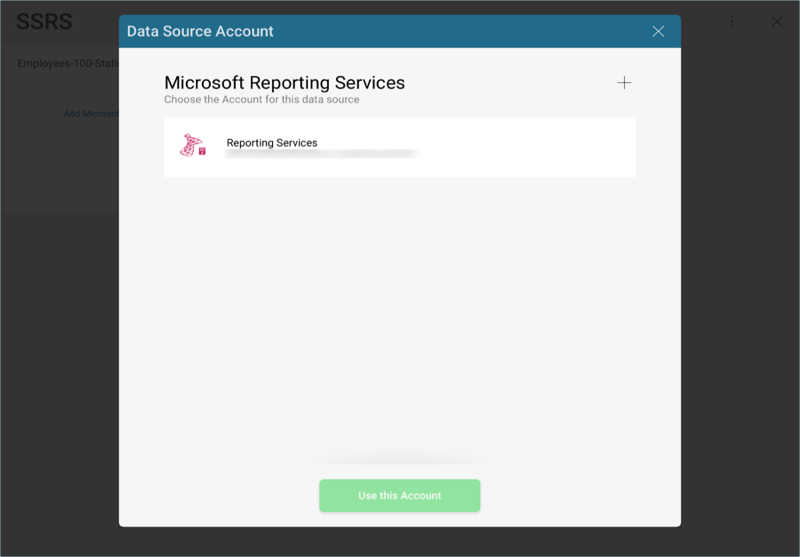
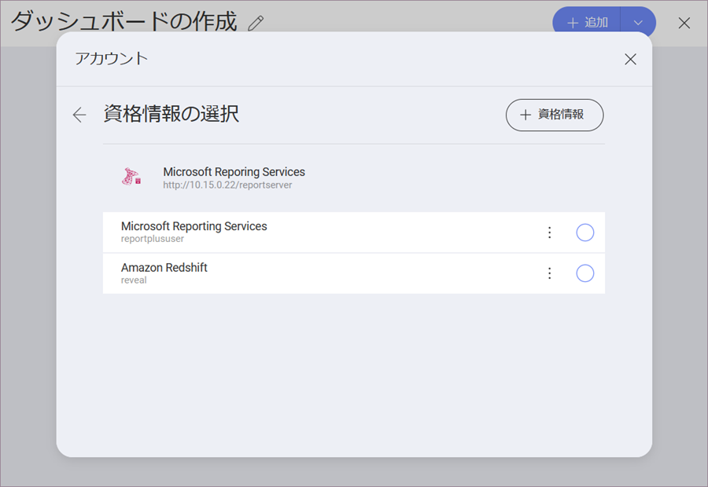

## データ ソース

[機](../../general/feature-matrix.md)のクションにリストされているように、Reveal がさまざまなエンタープライズ データ ソースに接続できることを説明しました。サーバー側に変更がない場合、Reveal 内でデータにアクセスするためのデータ ソースを構成する必要があります。以下のオプションを選択できます。

* **アナリティクス ツール** [Google Analytics](google-analytics.md)。
* *コンテンツ マネージャー* と *クラウド サービス* ([Box](box.md)、[Dropbox](dropbox.md)、[Google Drive](google-drive.md)、[OneDrive](onedrive.md) と [SharePoint Online](sharepoint.md))。
* *カスタマー リレーションシップ マネージャー* ([Microsoft Dynamics CRM](microsoft-dynamics-crm.md) オンプレミスおよびオンライン)。
* *データベース* ([Microsoft SQL Server](Microsoft-SQL-Server.md)、[Microsoft Analysis Services Server](Microsoft-Analysis-Services.md)、[MySQL](MySQL.md)、[PostgreSQL](PostgreSQL.md)、[Oracle](Oracle.md)、[Sybase](Sybase.md))[*](~/en/general/feature-matrix.md#databases-web)
* *その他のデータ ソース* ([OData-Feed](odatafeed.md)、[Web-Resource](web-resource.md)、[JSON ファイル](working-with-json-files.md))。

### 資格情報を入力

既存のダッシュボードを開いた際にデータソース資格情報に追加していない場合、以下のようなメッセージが表示されます。

いずれかのデータ ソースを選択すると、新しいダイアログがポップ アップしてデータ ソースの詳細の入力を促されます。以下の画面のいずれかが表示されます:

1. ウェブベースのクラウドを使用している場合は、**ウェブ ログイン** ダイアログが表示されます。
2. 他のプロバイダーを使用している場合は、[**アカウントの追加**](#adding-account)を促されます。

### アカウントの追加

ウェブベースではないデータ ソースを追加すると、次のダイアログが表示されます:

データ ソースの新しい資格情報を入力するか、[アカウントなし]オプション (認証を必要としないデータ ソース) を選択するか、該当する場合は既存の資格情報を選択します。新しいアカウントを作成するには、右上隅にある [+] ボタンを選択します。

以下の情報を設定できます。

* データソースの*デフォルト名*: データ ソース名は前のダイアログのアカウントのリストに表示されます。デフォルトでは、Reveal はデータソースと同じ名前を付けます。変更するには、**鉛筆**アイコンを選択します。
* (オプション) *ドメイン*: ドメイン名 (適用可能な場合)。
* *ユーザー名*: データ ソースのユーザー アカウント。
* *パスワード*: データ ソース用のパスワード。

準備ができたら、[作成と使用] を選択します。 

