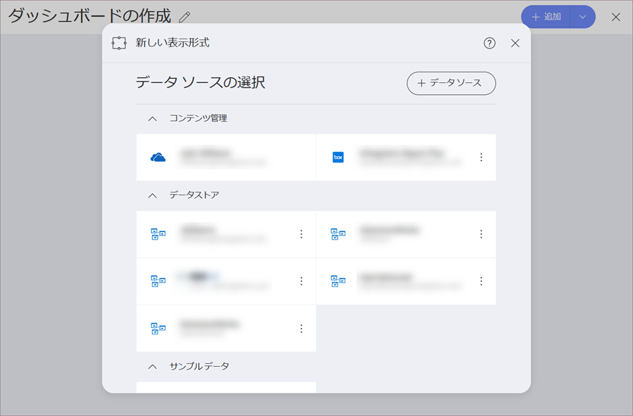
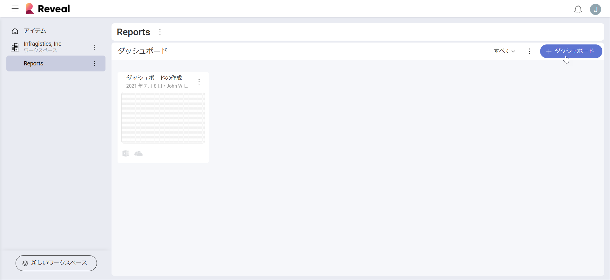
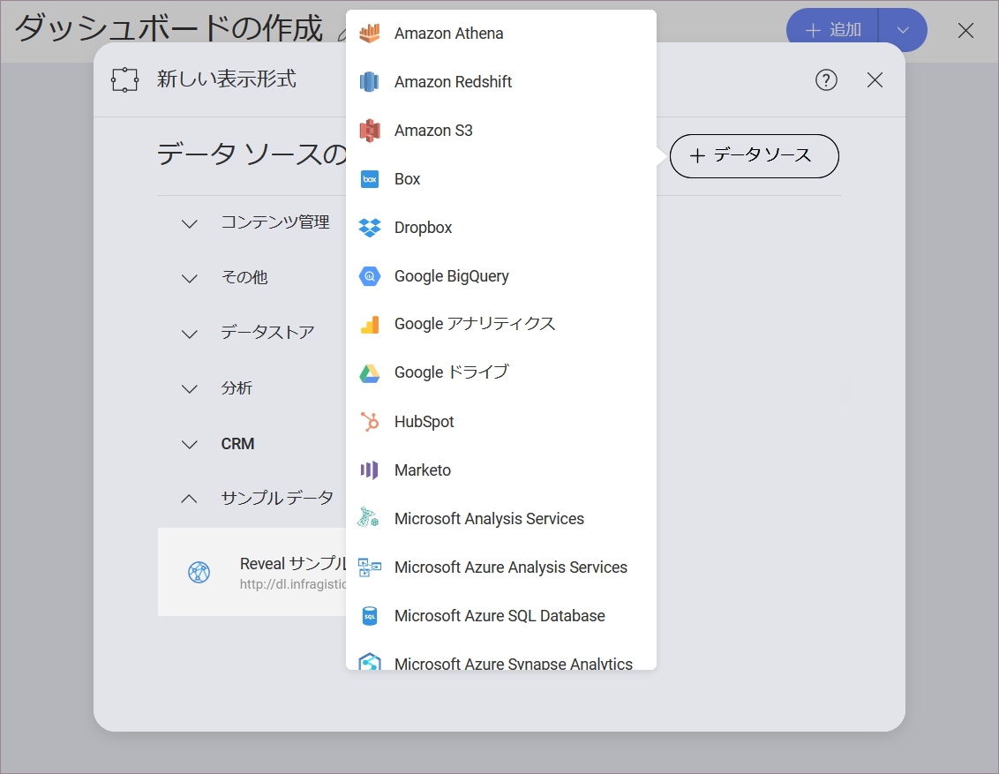

## データ ソース

データ ソースはデータの送信元です。Reveal は、さまざまなエンタープライズ データソースに接続する機会を提供します。分析ツール、コンテンツ マネージャー、クラウド サービス、CRM、データベース、スプレッドシート、および公開用のデータ ソースから選択できます。

次のスクリーンショットは、John Williams がアカウントで接続したさまざまなデータソースを示しています。

### データソースに接続

データソースから情報を取得し、それを表示形式に使用するには、まずデータソースに接続する必要があります。データソースに接続すると、*データ ソースの選択*メニュー (上のスクリーンショットを参照) に保存され、次に必要になったときにすばやく選択できます。

データソースに接続するには、以下の手順を実行します。  

1. *ホーム画面*で、**[+ ダッシュボード]** の青色の分割ボタンをクリックまたはタップします。
   
2. *新しい表示形式*_ダイアログに、最近使用したデータソースのリストが表示されます。新しい接続を作成するには、右側の **[+ データソース]** ボタンを選択します。
   
3. ドロップダウン リストからデータソース プロバイダーを選択します。

データソース プロバイダーを選択すると、データソースを**設定**するように求められます。設定に関しては、選択したデータソースの設定に関する記事をご覧ください (以下のリストを参照)。

   - [Amazon Redshift](~/jp/datasources/supported-data-sources/redshift.html)

   - [Box](~/jp/datasources/supported-data-sourcesbox.html)

   - [Dropbox](~/jp/datasources/supported-data-sources/dropbox.html)

   - [Google Analytics](~/jp/datasources/supported-data-sources/google-analytics.html)

   - [Google BigQuery](~/jp/datasources/supported-data-sources/google-bigquery.html)

   - [Google Drive](~/jp/datasources/supported-data-sources/google-drive.html)
  
   - [Hubspot](~/jp/datasources/supported-data-sources/hubspot.html)
  
   - [Marketo](~/jp/datasources/supported-data-sources/marketo.html)

   - [Microsoft Analysis Services](~/jp/datasources/supported-data-sources/microsoft-analysis-services/configuring-microsoft-analysis-services.html)*
  
   - [Microsoft Azure Analysis Services](~/jp/datasources/supported-data-sources/microsoft-azure-analysis-services.html)

   - [Microsoft Azure SQL Database](~/jp/datasources/supported-data-sources/azure-sql.html)*
  
   - [Microsoft Azure Synapse Analytics](~/jp/datasources/supported-data-sources/microsoft-azure-synapse-analytics.html)

   - [Microsoft Dynamics CRM](~/jp/datasources/supported-data-sources/microsoft-dynamics-crm.html)

   - [Microsoft Reporting Services (SSRS)](~/jp/datasources/supported-data-sources/microsoft-reporting-services.html)

   - [Microsoft SQL Server](~/jp/datasources/supported-data-sources/microsoft-sql-server.html)*

   - [MySQL](~/jp/datasources/supported-data-sources/mysql.html)*

   - [OData Feed](~/jp/datasources/supported-data-sources/odata-feed.html)

   - [OneDrive](~/jp/datasources/supported-data-sources/onedrive.html)

   - [Oracle](~/jp/datasources/supported-data-sources/oracle.html)*

   - [PostgreSQL](~/jp/datasources/supported-data-sources/postgresql.html)*
  
   - [Quickbooks](~/jp/datasources/supported-data-sources/quickbooks.html) 

   - [REST API](~/jp/datasources/supported-data-sources/rest-api.html)

   - [Salesforce](~/jp/datasources/supported-data-sources/salesforce.html)

   - [SharePoint](~/jp/datasources/supported-data-sources/sharepoint.html)

   - [Sybase](~/jp/datasources/supported-data-sources/sybase.html)*

   - [Web リソース](~/jp/datasources/supported-data-sources/web-resource.html)

   - [JSON ファイル](~/jp/datasources/working-files/working-with-json-files.html)

   - [スプレッドシート]((~/jp/datasources/working-files/working-with-spreadsheets.html))

>[NOTE]
> **データベース**は Reveal の Web バージョンでサポートされていません。

### 関連トピック 

- まだ接続していないデータソースからのデータを使用するダッシュボードを受け取りましたか? [ダッシュボードをデータソースに接続](connect-dashboard-to-data-source.html)トピックで開く方法を参照してください。 
- 表示形式の作成途中でデータソースを変更することにしましたか? 表示形式エディターで別のデータソースに接続する方法については、[表示形式に使用するデータソースの変更](changing-data-source-visualization.html)を参照してください。
- 複数のデータソースからのデータを表示形式に使用しますか? [データソースを 1 つの表示形式に統合](data-blending.html)を参照してください。