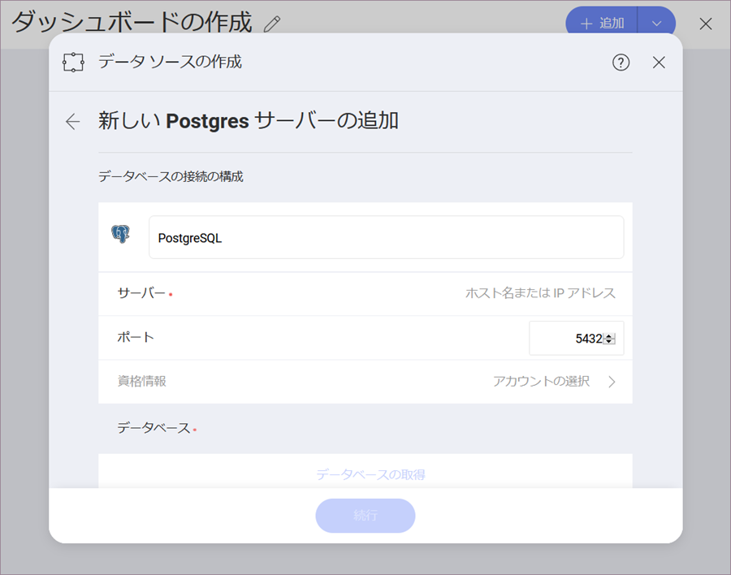
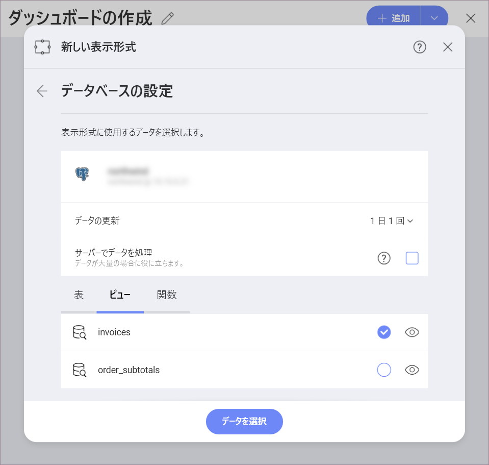
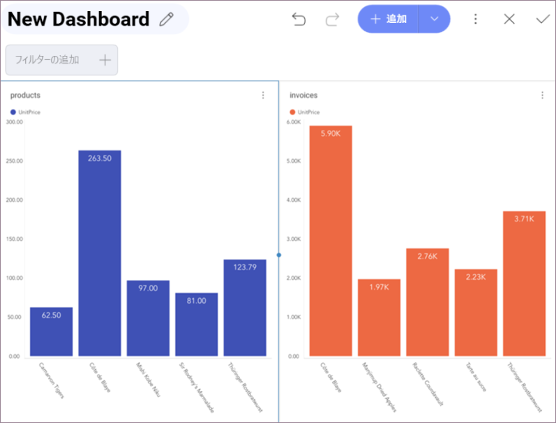

## PostgreSQL

PostgreSQL サーバーデータソースを設定するには、以下の情報が必要です。

1.  データ ソースの**デフォルト名**: データ ソース名は前のダイアログのアカウントのリストに表示されます。デフォルトでは、Reveal は *PostgreSQL* という名前を付けます。好みに合わせて変更できます。

2.  [**サーバー**](#how-to-find-server): : コンピューター名またはサーバーを実行しているコンピューターに割り当てられた IP アドレス。

3.  **ポート**: 該当する場合、サーバー ポートの詳細。情報が入力されない場合、Reveal はデフォルトでヒント テキスト (5432) のポートに接続します。

4.  **資格情報**: *資格情報*を選択した後、PostgreSQL の資格情報を入力するか、既存の資格情報 (適用可能な場合) を選択できます。

      - **名前**: データソース アカウントの名前。以前のダイアログのアカウントのリストに表示されます。

      - *(オプション)* **ドメイン**:  ドメイン名 (適用可能な場合)。

      - **ユーザー名**:  PostgreSQL サーバーのユーザーアカウント。

      - **パスワード**:  PostgreSQL サーバーにアクセスするためのパスワード。

        準備ができたら、**[アカウントの作成]** を選択します。**[接続テスト]** を選択すると、アカウントがデータソースに到達しているかどうかを確認できます。

### サーバー情報を見つける方法

以下の手順でサーバーも確認できます。コマンドはサーバーで実行する必要があることに注意してください。

| WINDOWS                                                                                                         | LINUX                                                                                                         | MAC                                                                  |
| --------------------------------------------------------------------------------------------------------------- | ------------------------------------------------------------------------------------------------------------- | -------------------------------------------------------------------- |
| 1\. ファイル エクスプローラーを開きます。                                                                                     | 1\. ターミナルを開きます。                                                                                          | 1\. システム環境設定を開きます。                                         |
| 2\. [マイ コンピューター] \> [プロパティ] を右クリックします。                                                                   | 2\. **$hostname** を入力します。                                                                                     | 2\. 共有セクションへ移動します。                                 |
| ホスト名は、*コンピューター名、ドメインおよびワークグループの設定* セクションの下に 「コンピューター名」 として表示されます。| ホスト名と DNS ドメイン名が表示されます。Reveal には **ホスト名** のみを含めるようにしてください。| ホスト名は、上部のコンピューター名の下に表示されます。|

以下の手順で *IP アドレス*を確認できます。コマンドはサーバーで実行する必要があることに注意してください。

| WINDOWS                              | LINUX                             | MAC                                                           |
| ------------------------------------ | --------------------------------- | ------------------------------------------------------------- |
| 1\. コマンド プロンプトを開きます。           | 1\. ターミナルを開きます。              | 1\. ネットワーク アプリケーションを起動します。                                  |
| 2\. **ipconfig** を入力します。             | 2\. **$ /bin/ifconfig** を入力します。   | 2\. 接続を選択します。                                   |
| **IPv4 Address** は IP アドレスです。 | **Inet addr** は IP アドレスです。 | **IP アドレス** フィールドに必要な情報が含まれます。 |

### ビューの作業

With Reveal, you can retrieve PostgreSQL data from entire tables, but
you can also select a particular
[view](https://www.postgresql.org/docs/10/views.html) that
returns a subset of data from a table or a set of tables instead.

上記のサンプルの**請求書**ビューには、PostgreSQL サーバーの **Products** テーブルにあるデータの変更バージョンが含まれています。

ビューと PostgreSQL の詳細については、[このウェブサイト](https://www.postgresql.org/docs/10/tutorial-views.html).
