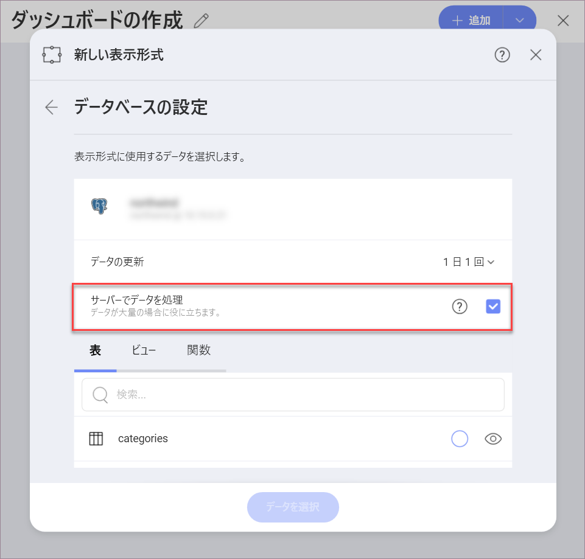
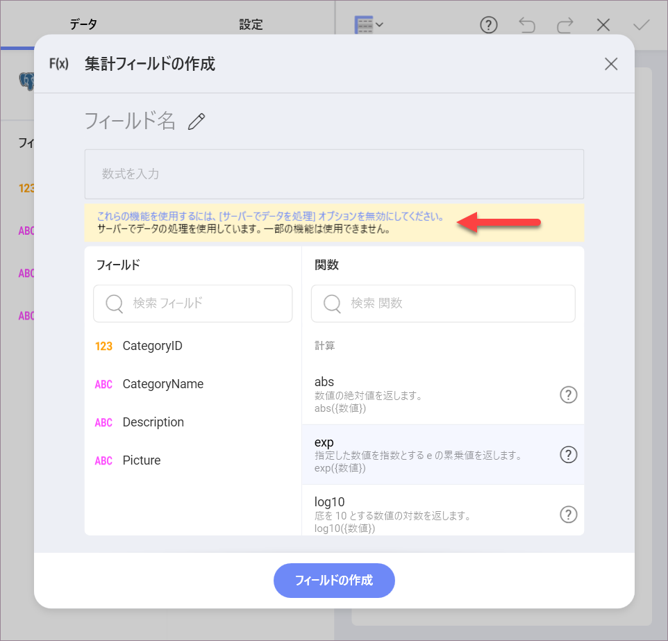

## サーバーでデータの処理

基本的に、データソースに接続すると、サーバー上のすべてのデータがローカルに読み込まれ、ダウンロードされます。このようにして、データセットをソート、フィルタリング、集計、および表示形式に使用することなど、Reveal 内で直接処理できます。

数百万のレコードが含まれるような非常に大きなデータセットを持つデータソースの場合、ローカルで使用するためにデータをダウンロードすることは得策ではありません。その理由で、Reveal では代替アプローチとしてサーバー上で直接データを処理する機能が提供されています。

### サポートされるデータソース

Reveal で利用可能なデータソースの一部では、サーバー上で直接データを処理するアプローチ**のみ**が使用可能です。以下があります: 

* Amazon Redshift
* Google BigQuery
* Microsoft Azure Synapse Analytics  

サーバーでのデータ処理は、次のデータソースに対して**有効**にできるオプションです:

* [MS SQL Server](supported-data-sources/microsoft-sql-server.html)
* [MySQL](supported-data-sources/mysql.html)
* [PostgreSQL](supported-data-sources/postgresql.html)

### サーバー上でデータを処理を有効にする方法は?

**サーバー上でデータを処理**機能を有効にして、それをサポートするデータソース (上記を参照) のいずれかに接続できます。

データソースの初期構成を行う方法の詳細については、上記の箇条書きリストで 3 つのデータソースのいずれかを選択し、設定方法に関する記事をご覧ください。
接続を設定すると、[データベースの設定] 画面が開きます:

**[サーバー上でデータを処理]** がデフォルトで有効になっていることに注意してください。データがサーバー上で処理されるときに、制限されている機能 (以下の**制限**を参照) を使用する必要がある場合は、この機能の横にあるチェックボックスをオフにすることを検討してください。

### 制限

**サーバー上でデータを処理**機能は、全てをローカルにはダウンロード出来ないような、非常に大規模なデータセットで表示形式を構築するのに役立ちます。ただし、この機能により、有効になっているデータソースの使用にいくつかの制限が生じます。

**[サーバー上でデータを処理]** が有効になっている場合、次の機能は表示形式エディターで**サポートされません**。

* [データソースを 1 つの表示形式に統合](data-blending.html)
* [Azure ML モデルの統合](ml-integration/azure-machine-learning-models.html)

表示形式エディターの[事前計算](~/jp/data-visualizations/fields/calculated-fields/overview.html#precalculated[-fields)フィールド機能に制限が適用されます。使用できない関数は、**[計算フィールドの作成]** ダイアログでグレーアウトされます。
このダイアログで、リンクをクリックして、**サーバー上でデータを処理**機能を無効にすることができます。

