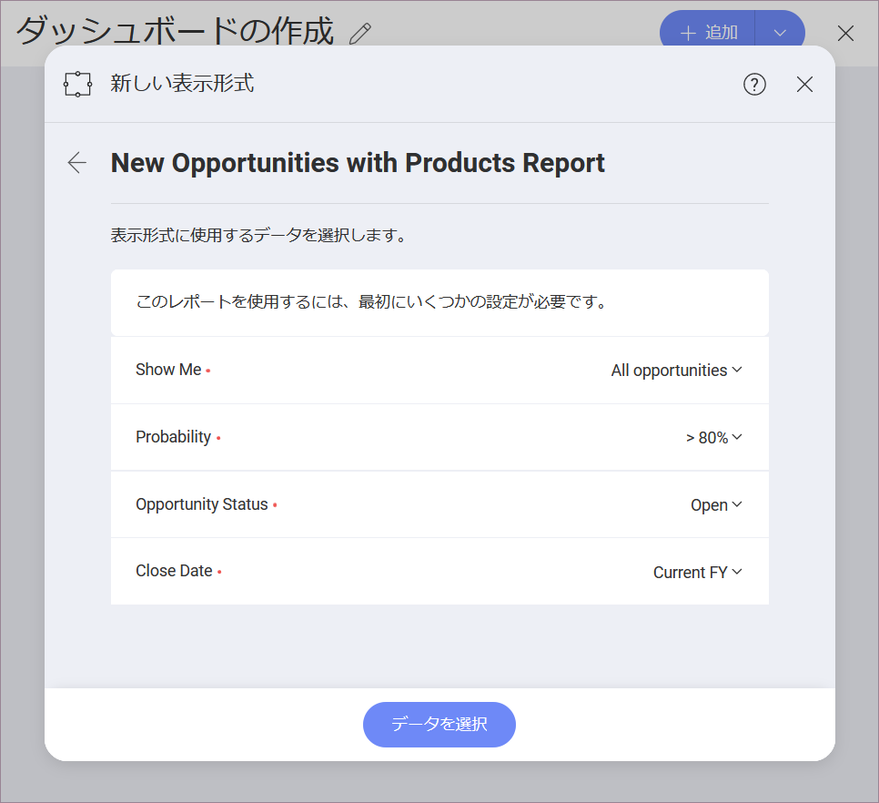

## Salesforce

Salesforce データ ソースを選択すると、以下のログイン プロンプトが表示されます。

ログイン情報を*入力*してサインインをクリックします。

ID 認証が有効な場合は、送信された**確認コード**を入力するプロンプトが表示されます。ID 認証についての情報は、[Salesforce ヘルプ](https://help.salesforce.com/articleView?id=security_activation_about.htm&type=5)をご覧ください。

認証プロンプトが表示されます。*許可*をクリックしてください。

### データの設定

ログイン後、次のダイアログで Salesforce データを設定できます。

ここで、必要な Salesforce オブジェクトを選択できます。

  - *人気のオブジェクト* - このカテゴリでは、ユーザーが最もよく使用する 7 つのオブジェクトをすばやく選択できます。

  - *すべてのオブジェクト* - このカテゴリには、Salesforce アカウントに含まれるオブジェクトの完全なリストが表示されます。提供されている検索を使用して、必要なオブジェクトをすばやく見つけることができます。

#### Using Reports

After selecting which report you want to use in the visualization editor, you need to set the values for the parameters in the dialog that follows:

The parameters you see in the list (_Show me_, _Probability_, etc.) are the filters for your report. Report filters are criteria set to control the data a user sees in their report. In Reveal, the filtered data will be used in your charts in the Visualization editor.

In the dialog above, filters are preconfigured with the default values from Salesforce. Use the dropdown next to each filter to change these values.

You can change the report filters' values later in the Visualization editor by choosing to _edit_ your data source (as shown below):

