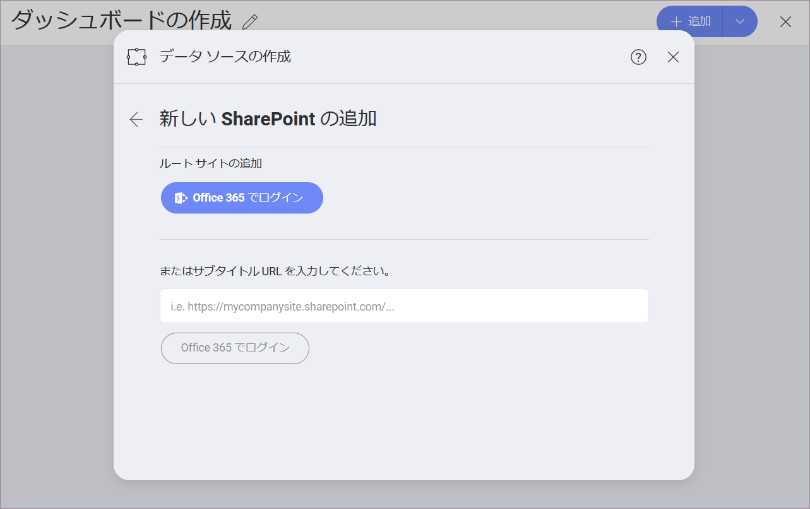

## SharePoint オンライン

SharePoint を選択すると、以下のログイン ダイアログトが表示されます。

ここで、Office365 アカウントでログインし、**SharePoint ルート サイト**に接続できます。

Reveal でデータソースとして SharePoint サブサイトを直接追加する場合は、**サブサイトの URL** を入力することもできます。

### サポートされるファイル

Reveal では、広範な種類のファイルを使用できます。

  - **スプレッドシート**: Excel (.xls, .xlsx) または CSV (Reveal 内で動的に使用できます)。

  - **その他のファイル**: プレビューモードのみで表示されます (画像および PDF やテキストなどのドキュメント ファイルを含む)。
