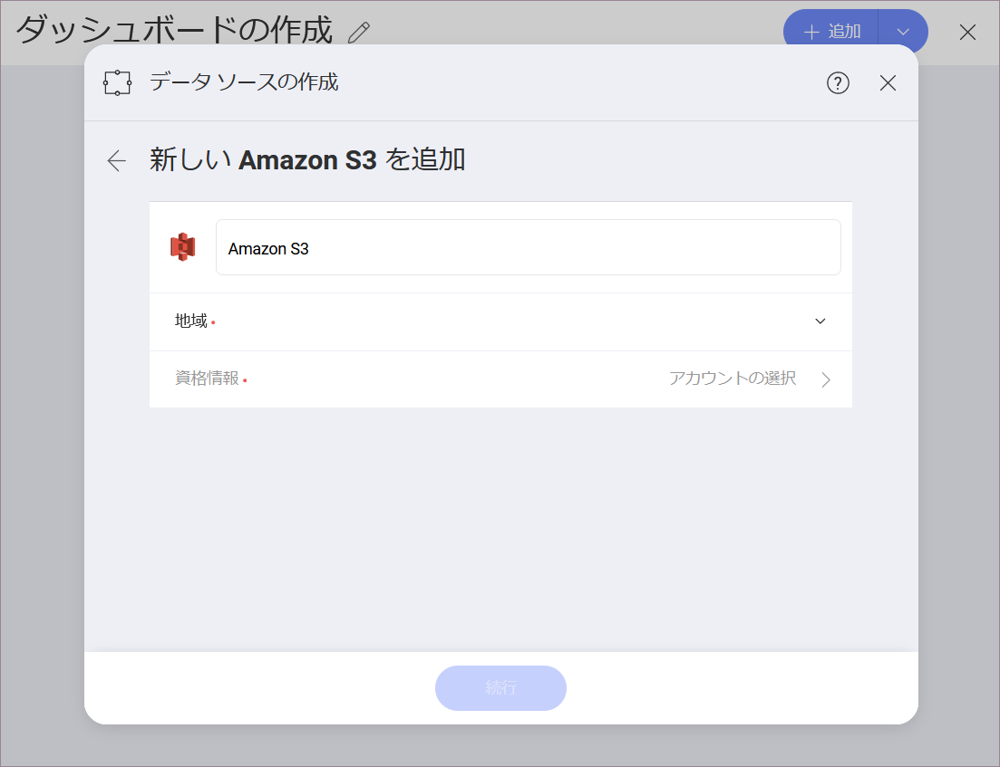

## Amazon S3

Amazon Simple Storage Service (S3) は、拡張性が高く高速なデータ ストレージ サービスです。Amazon S3 をデータ ソースに追加すると、Reveal で S3 から直接データにアクセスして分析できます。

### Amazon S3 への接続 

Amazon S3 データ ソースを設定するには、次の情報を入力する必要があります:

1.  データ ソースの **デフォルト名**: データ ソース名は [データ ソースの選択] ダイアログのアカウントのリストに表示されます。デフォルトでは、Reveal は *Amazon S3* という名前を付けます。好みに合わせて変更できます。
   
2. **[地域]**: Amazon の地域は、ドロップダウンに名前とコードとともに一覧表示されます。必要なデータがある場所を選択してください。

**[資格情報]**: ここでは、ルートまたは IAM ユーザーの資格情報を提供するように求められます。
   
   * [アクセス キー]
   * [シークレット キー]

   資格情報を追加し、[作成して使用] の青いボタンをクリック/タップします。

   AWS 資格情報の詳細については、この [Amazon 記事](https://docs.aws.amazon.com/ja_jp/general/latest/gr/aws-sec-cred-types.html)をご覧ください。

4. 接続に成功すると、前のダイアログに戻り、[続行] の青いボタンが使用可能になります。クリック/タップすると、Amazon S3 でディレクトリとファイルの閲覧を開始できます。

### サポートされるファイル

Reveal では、Amazon S3 のディレクトリの広範な種類のファイルを使用できます。

* **スプレッドシート、JSON ファイルおよび表形式データ** (Excel - .xls、.xlsx、CSV、TSV) を Reveal 内で動的に使用して、チャートの表示形式を作成できます。
* **その他のファイル**はプレビュー モードのみで表示されます (画像および PDF やテキストなどのドキュメント ファイルを含む)。