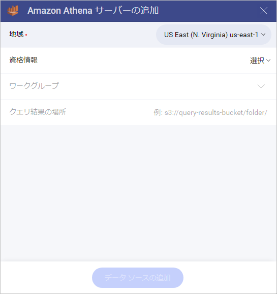
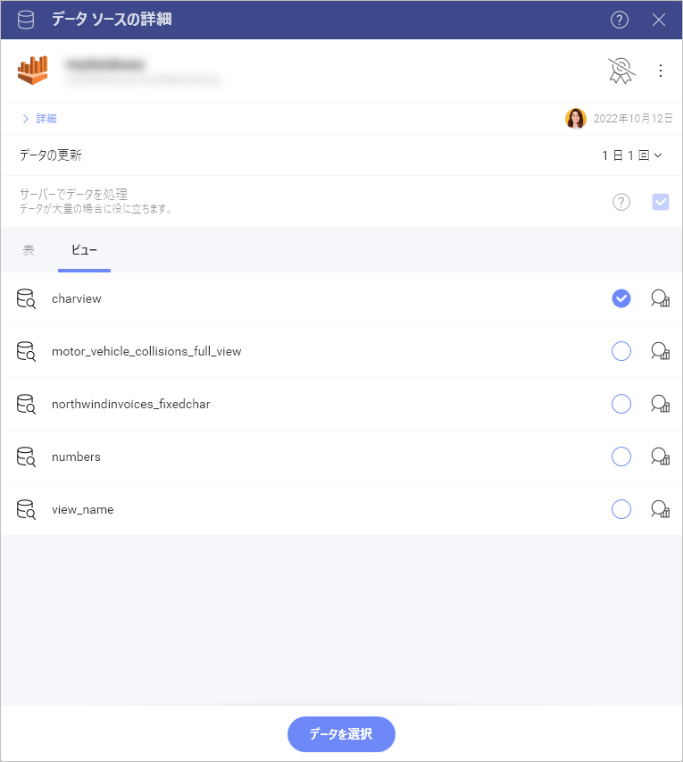
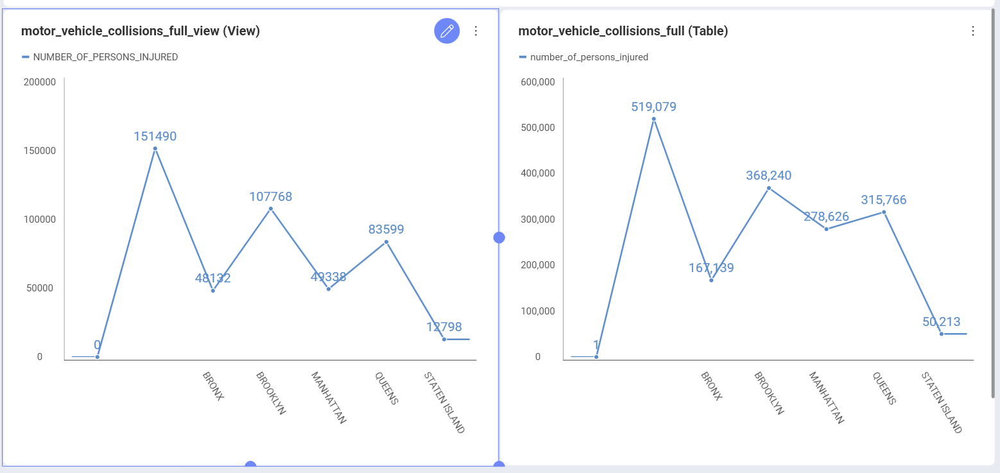

# Amazon Athena 

Reveal の Amazon Athena データ ソースを使用すると、[Amazon S3](amazon-s3.md) に保存されている非構造化データにアクセスしてクエリを実行し、それを表示形式に使用できます。

## Amazon Athena への接続

Amazon Athena のデータ ソースを設定するには、以下の情報が必要です:

1. **[地域]**: Amazon の地域は、ドロップダウンに名前とコードとともに一覧表示されます。必要なデータがある場所を選択してください。

2. **[資格情報]**: ここでは、ルートまたは IAM ユーザーの資格情報を提供するように求められます。
   * [アクセス キー]
   * [シークレット キー]
   * [エイリアス] (オプション)

   資格情報を追加し、[追加] の青いボタンをクリック/タップします。接続に成功すると、前のダイアログに戻り、[ワークグループ] と [クエリ結果の場所] も構成できるようになります。

   AWS 資格情報の詳細については、この [Amazon 記事](https://docs.aws.amazon.com/ja_jp/general/latest/gr/aws-sec-cred-types.html)をご覧ください。
   
3. (オプション) の **[ワークグループ]**:  ドロップダウンからワークグループの 1 つを選択することは*オプション*です。ワークグループを指定しない場合、primary ワークグループ (Athena アカウントのデフォルトのワークグループ) が自動的に選択されます。
4. (オプション) の **[クエリ結果の場所]**:  これは、クエリの結果が保存される *Amazon S3* のディレクトリです。有効な *S3* パスを指定する必要があります (例: *s3://query-results-bucket/folder/*)。このダイアログでパスを明示的に指定しない場合、結果は選択された/デフォルトのワークグループで指定された出力場所に保存されます。ワークグループに出力場所が作成されていない場合、Athena クエリは失敗します。

   >[!NOTE]
   > Reveal でクエリ結果の場所 (QRL) を指定したが、この場所で出力が見つからない場合は、カスタム QRL を使用できないようにする設定について、Athena のワークグループ構成を確認してください。詳細については、Athena のユーザーガイドの[クエリ結果の場所の指定](https://docs.aws.amazon.com/ja_jp/athena/latest/ug/querying.html#query-results-specify-location)を参照してください。

5. **アテネ データ ソース**:  データベースを含むデータ カタログとしても知られています。Athena アカウントに接続した後に表示されるリストから選択できます (手順 1-3 を参照)。

## データの設定

Athena データ ソース接続を構成した後、前のダイアログで選択したデータ ソース (カタログ) からデータベースを選択するように求められます。

データベースを選択した後、その中の*テーブル*または[*ビュー*](https://docs.aws.amazon.com/ja_jp/athena/latest/ug/views.html)から選択できます。

上記のスクリーンショットの **motor_vehicle_collisions_time_full_view** ビューには、Athena の **motor_vehicle_collisions_full** テーブルにあるデータの変更バージョンが含まれています。
以下のスクリーンショットでは、左側の表示形式はビューのデータを使用して構築され、右側の表示形式はテーブルに含まれるデータを使用しています。

