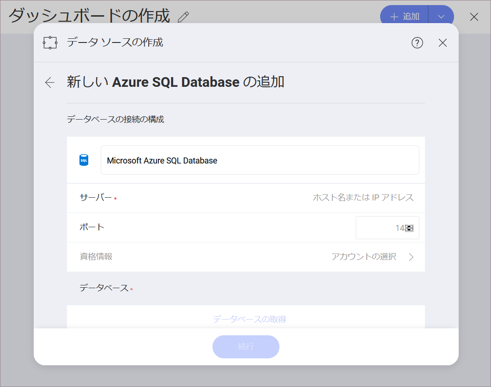

## Azure SQL

>[!NOTE] Azure SQL is not supported in the Web version of Reveal.

Azure SQL データソースを構成するには、以下の情報が必要です。

1.  **データ ソース名**: このフィールドはデータソース リストに表示されます。

2.  **サーバー**: コンピューター名またはサーバーを実行しているコンピューターに割り当てられた IP アドレス。

3.  **ポート**: 該当する場合、サーバー ポートの詳細。情報が入力されない場合、Reveal はデフォルトでヒント テキスト (1433) のポートに接続します。

4.  **資格情報**: [資格情報] を選択した後、Azure SQL の資格情報を入力するか、既存の資格情報 (適用可能な場合) を選択できます。

      - データソースの**デフォルト名**: データ ソース名は前のダイアログのアカウントのリストに表示されます。デフォルトでは、Reveal は *Microsoft Azure SQL Database* という名前を付けます。好みに合わせて変更できます。

      - *(オプション)* **ドメイン**:  ドメイン名 (該当する場合)。

      - **ユーザー名**: Azure SQL のユーザー アカウント。

      - **パスワード**: Azure SQL にアクセスするためのパスワード。

5.  (条件付き) **データベース**: アカウントに接続すると、データベースを選択できるようになります (複数のデータベースがある場合)。

準備ができたら、**[作成と使用]** を選択します。

### 詳細情報

以下の詳細については、

  - サーバー情報を見つける方法

  - ビューの作業

  - ストアド プロシージャの作業

Reveal の両データソースは同様に機能するため、[**SQL Server**](microsoft-sql-server.md#how-to-find-server) を参照してください。