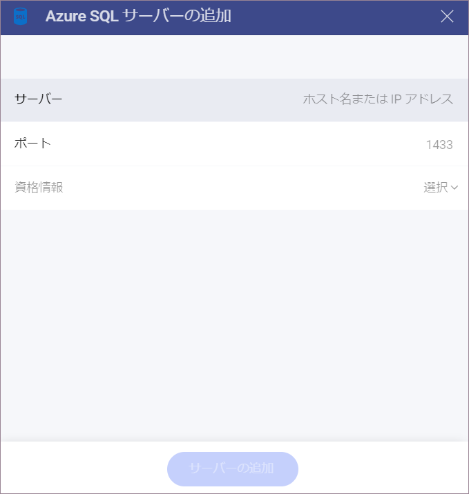

# Azure SQL

> [!NOTE] 
>**Web の制限**。*Reveal Web* アプリでは、公的にアクセス可能な Azure SQL アドレスにのみ接続できます。Azure SQL アドレスが一般公開 (プライベートまたは会社のイントラネットでホストされているなど) に制限されている場合は、*Reveal Desktop*、*iOS*、または *Android* を使用して接続できます。Reveal を実行しているデバイスは、SQL Server アドレスにアクセスできる必要があります。この制限は、*Reveal Embedded* には適用されません。

## Azure SQL への接続

Azure SQL データ ソースを構成するには、以下の情報が必要です。

1.  **[サーバー]**: コンピューター名またはサーバーを実行しているコンピューターに割り当てられた IP アドレス。

2.  **[ポート]**: 該当する場合、サーバー ポートの詳細。情報が入力されない場合、Reveal はデフォルトでヒント テキスト (1433) のポートに接続します。

3.  **[資格情報]**: [資格情報] を選択した後、Azure SQL の資格情報を入力するか、既存の資格情報 (適用可能な場合) を選択できます。

  - **[ユーザー名]**: Azure SQL のユーザー アカウントまたはドメインの名前。

  - **[パスワード]**: Azure SQL にアクセスするためのパスワード。

  - **Alias** of the data source: Your data source name will be displayed in the list of accounts in the previous dialog. By default, Reveal names it *Microsoft Azure SQL Database*. You can change it to your preference.

Once ready, select **Add** and then **Add Server**.

## 詳細情報

以下の詳細については、Reveal の両データ ソースは同様に機能するため、[**SQL Server**](microsoft-sql-server.html#how-to-find-server) を参照してください。

  - サーバー情報を見つける方法

  - ビューの作業

  - 保管されたプロシージャの作業

