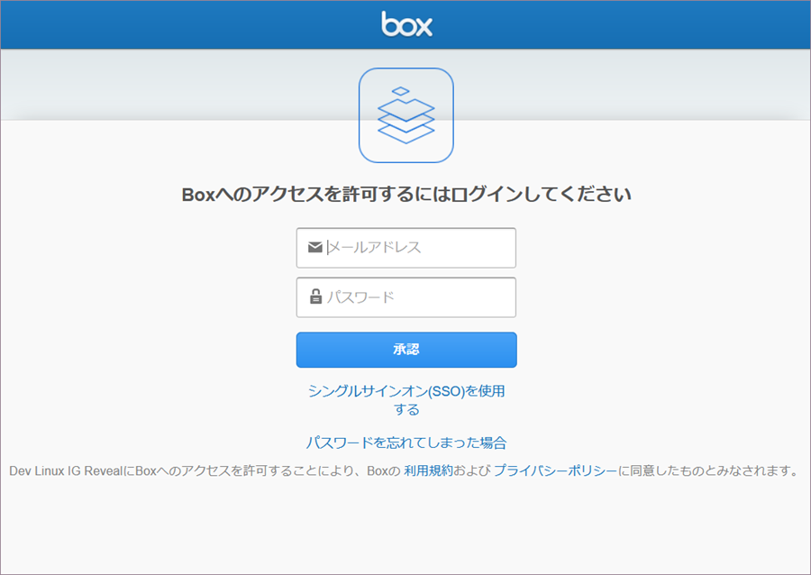

## Box

データソースとして Box を選択すると、以下のログイン プロンプトが表示されます。

ログイン情報を入力し [認証] を選択します。

### サポートされるファイル

Reveal では、広範な種類のファイルを使用できます。

  - **スプレッドシートと表形式データ**: Excel (.xlsls、.xlsx) または CSV、TSV (Reveal 内で動的に使用できます)。

  - **その他のファイル** プレビューモードのみで表示されます (画像および PDF やテキストなどのドキュメント ファイルを含む)。
