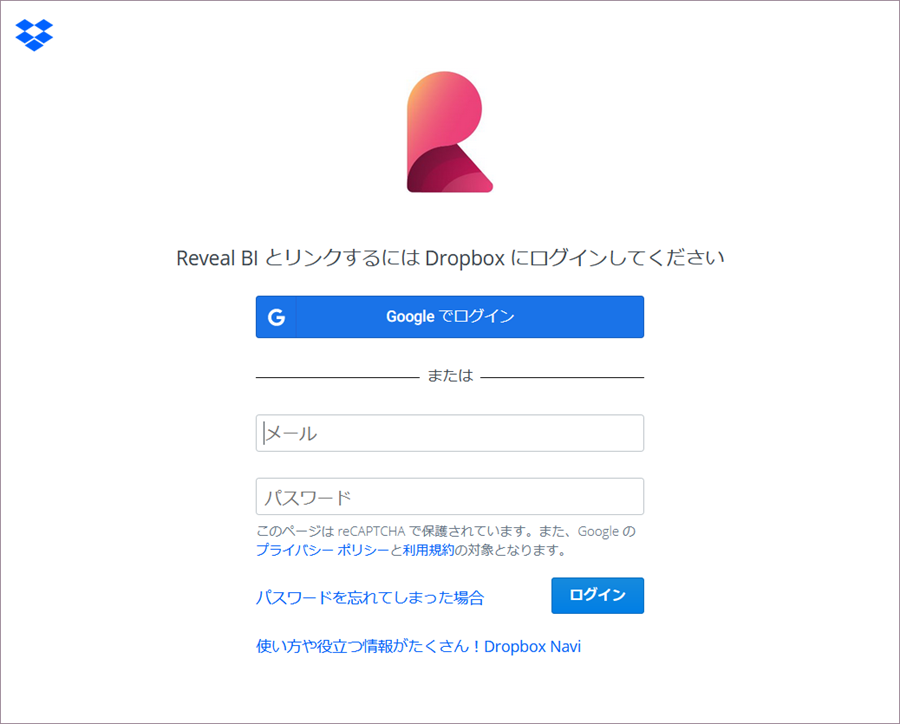

# Dropbox

Dropbox を選択すると、以下のログイン プロンプトが表示されます。

ログイン情報を入力して [ログイン] を選択します。

## サポートされるファイル

Reveal では、広範な種類のファイルを使用できます。

  - **スプレッドシート**: Excel (.xlsls、.xlsx) または CSV (Reveal 内で動的に使用できます)。

  - **その他のファイル**: プレビュー モードのみで表示されます (画像および PDF やテキストなどのドキュメント ファイルを含む)。
