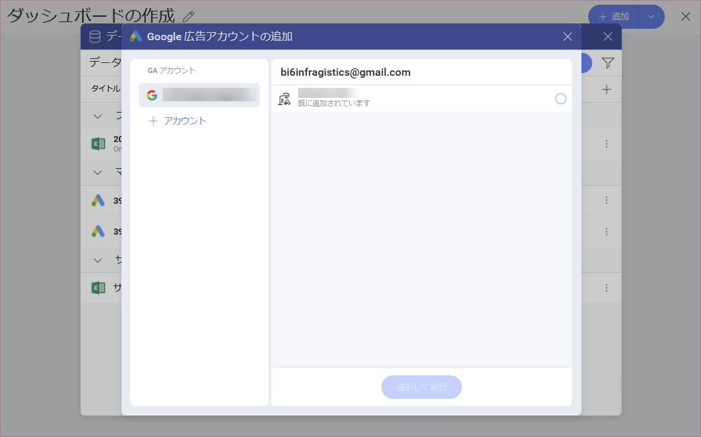
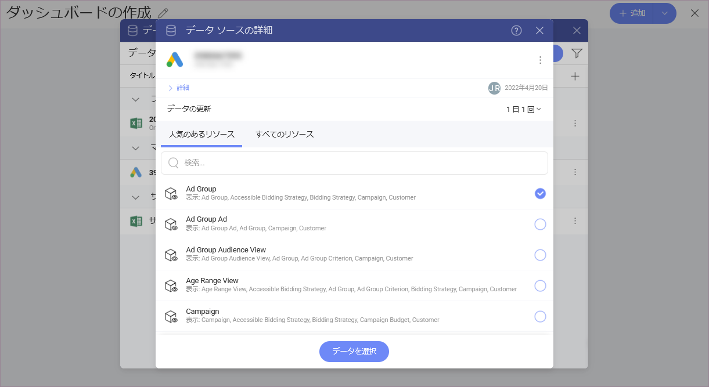
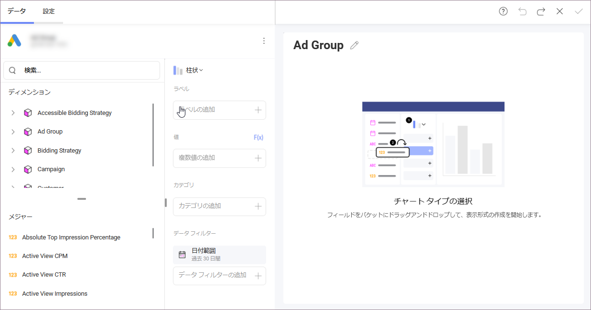

# Google 広告

Google 広告データ ソースを使用すると、Google 広告 (以前の Google Adwords) アカウントからデータ テーブルにアクセスして分析できます。Google 広告データを使用して表示形式を作成し、広告活動の高レベルの理解を構築します。
## Google 広告に接続する

1. データ ソースとして **Google 広告**を選択すると、Google のログイン画面が表示されます。

2. 複数の Google アカウントが表示されている場合は、アクセスする Google 広告データが含まれているアカウントを選択します。 
3. まだサインインしていない場合は、ログイン資格情報を入力します。 

4. 認証プロンプトで、**[許可]** を選択します。

5. Google 広告アカウントを選択します。  

    Google アカウントが複数の Google 広告アカウントに接続されている場合は、次のダイアログで使用するアカウントを選択します。

    

6. リソースを選択します。

    [人気のあるリソース] または [すべてのリソース] の 2 つのリストのいずれかから使用するリソースを選択します。検索を使用して、必要なものをすばやく見つけます。

     

   各リソースの下に説明が表示されます。Google 広告のどのディメンションがこのリソースに含まれているかについての情報を提供します。 

   [データを選択] をクリックして、表示形式エディターに進みます。

## 表示形式エディターでの作業 

Google 広告からの情報を使用してダッシュボードを作成すると、表示形式エディターのフィールドが異なる方法で編成されていることがわかります (下のスクリーンショットを参照)。

**[データ]** ペインの左側に **[フィールド]** の見出しがないことに気付くかもしれません。代わりに、クエリ フィールドに 2 つのセクションがあります。

1. **ディメンション (Segments (セグメント) も含む)**: 

    a. **ディメンション**は、ピンク色の側面の立方体アイコンで表されます。ディメンションには、測定可能なデータの属性が含まれています。たとえば、*Ad Group* キューブの下のディメンション *Name* には、すべての広告グループが表示されます。 

    b. **Segments** は、人々のグループを示す 1 つのアイコンで表されます。セグメントは、*表示形式エディター*に読み込む Google 広告*リソース*ごとに異なります。Reveal では、ディメンションを使用するのと同じ方法で、測定可能なデータまたはデータ フィルターとして Google 広告セグメントを使用できます。  
    セグメントの詳細については、公式の [Google 広告ヘルプ](https://support.google.com/google-ads/answer/2454072?hl=ja#zippy=)をご覧ください。 

2. **メジャー** ([123] アイコンで表示): メジャーは数値データで構成されます。たとえば、[Clicks] メジャーは、広告がクリックされた回数を示します。

### 日付範囲データ フィルター

**データ フィルター** ([データ] ペインの右下を参照) には、デフォルトで [過去 30 日間] に設定されている日付範囲フィルターがあります。つまり、今日を含む過去 30 日間のデータが取得されます。

日付フィルターを削除することはできませんが、カレンダー アイコンをクリックしてデフォルトの日付範囲を変更できます。開始日*と終了日を選択します。または、右上隅の矢印をクリック/タップして (スクリーンショットを参照)、ドロップダウン オプションから日付範囲を選択します。

> [!NOTE] 
> **[今日]** に取得されたデータ。
> 日付範囲オプションから [今日] を選択した場合、日付範囲は午前 12:00:00 に開始し、すべてのデータは現在の時刻まで取得されることに注意してください。これは、Google 広告のデータが継続的に更新されているため、結果が 1 日を通して実行ごとに異なる可能性があることを意味します。  

## パフォーマンスについての考慮

取得しようとしているデータの量によっては、表示形式エディターで Google 広告からデータを読み込むのは時間のかかる作業になる場合があります。特定の操作は、他の操作よりも待機時間に影響を与えます。

### 日付範囲の選択

日付範囲を選択するときは、範囲が大きいほど、データの読み込みにかかる時間が長くなることに注意してください。したがって、最初に範囲を制限し、読み込み時間を評価してから、適切に拡張します。 

大きすぎるデータセットを読み込もうとすると、行/列の制限を超えたことを示すエラーが表示される場合があります。目的に合わせて時間範囲を制限できない場合は、[サポート](https://www.infragistics.com/my-account/submit-support-request/reveal)に連絡して制限を増やしてください。 

### セグメントの追加

Reveal では、表示形式エディターで複数のセグメントを組み合わせることができます。セグメントはより詳細な統計に使用されるため、追加するセグメントが多いほど、取得するデータの行も多くなります。これは読み込み時間に影響を与える可能性があります。 