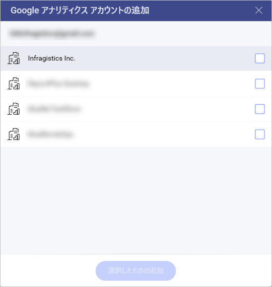
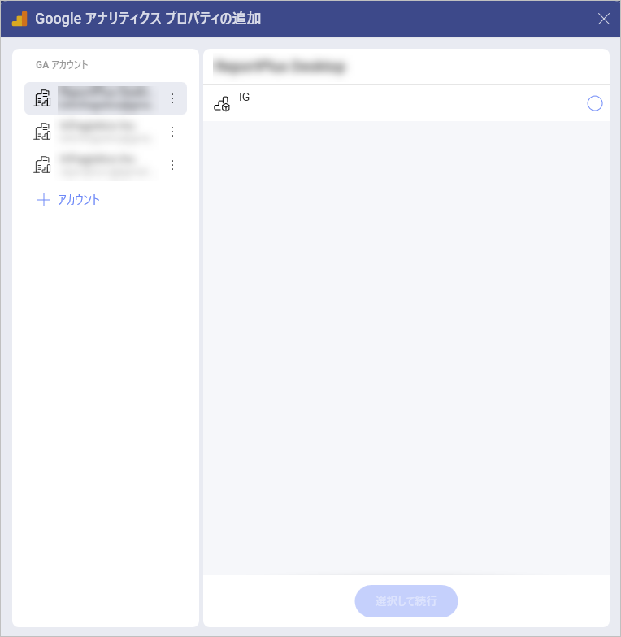
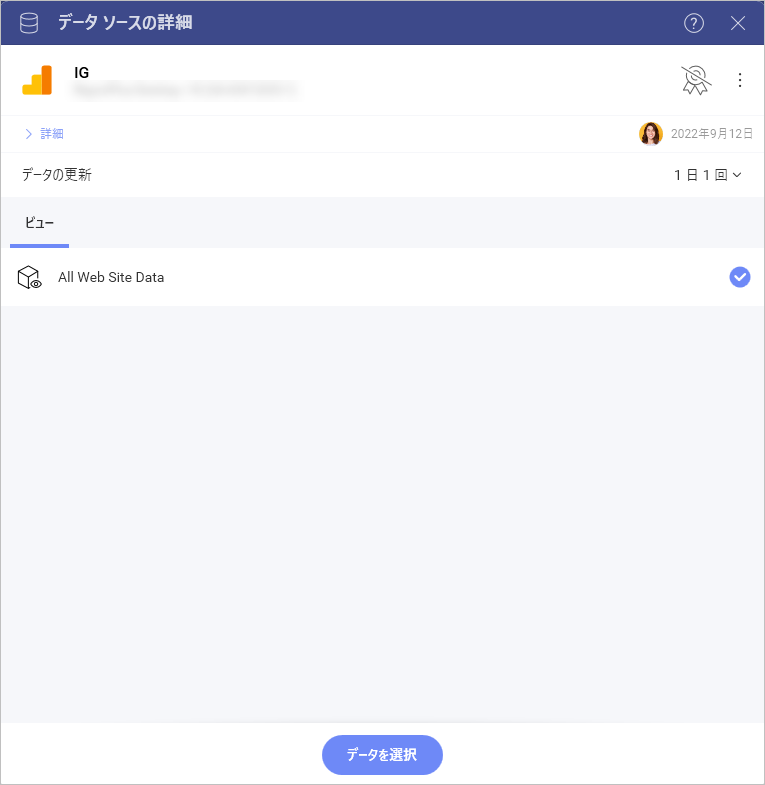
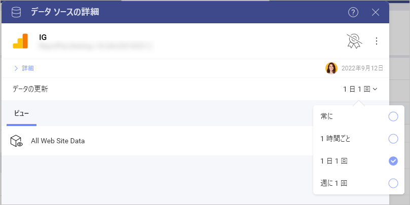
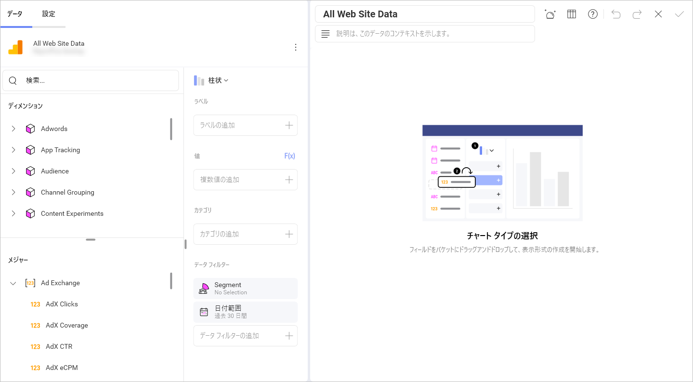
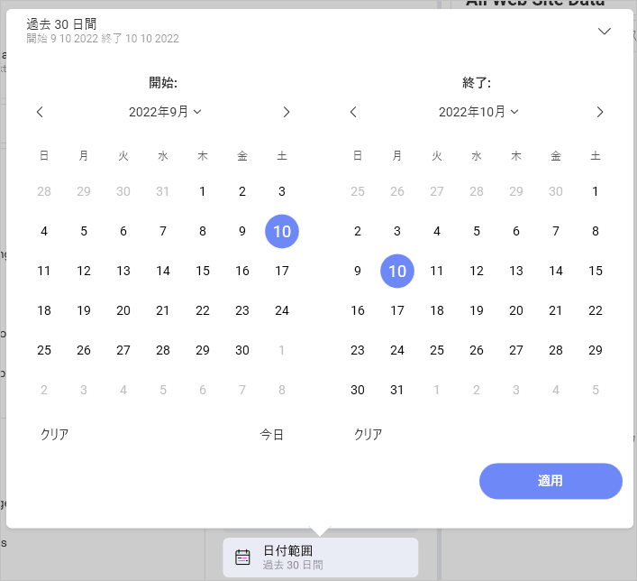
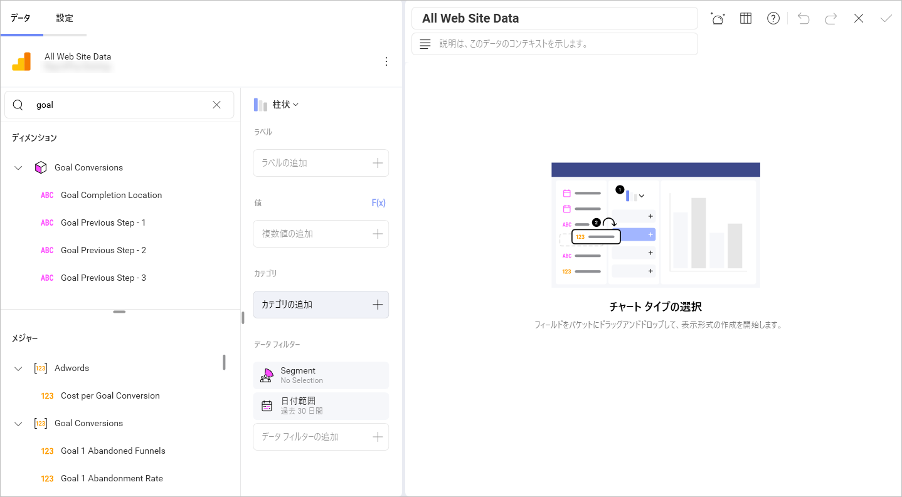

# Google アナリティクス

Google アナリティクスは、ウェブで最も使用されているウェブ分析サービスの 1 つであり、ウェブサイトのトラフィックを追跡して報告します。さらに、Google は、iOS および Android アプリから使用状況データを収集するための SDK も提供しています。

## Google アナリティクス への接続

1.  **ログイン**

    1.  データ ソースとして Google アナリティクスを選択すると、Google のログイン画面が表示されます。

    2.  ログイン情報を入力して **[サインイン]** をクリック/タップします。承認プロンプトが表示されます。**[許可]** をクリック/タップします。

2.  **アカウントを選択する**

    複数の Google アナリティクス アカウントがある場合は、使用するアカウントを選択します。

    

    ログインすると、データ ソースを削除しない限り、他の表示形式の作成時に同じアカウントを使用できます。

3.  **プロパティを選択する**

    使用する Google アナリティクス プロパティを選択します。

    

    Google アナリティクスでは、**プロパティ**はウェブサイト、モバイル アプリ、ブログなどです。

4.  **データベース キューブを選択する**

    使用するデータ キューブを選択します。

    

    データの更新間隔を次のように設定できます:

      - 常に

      - 1 時間に 1 回

      - 1 日に 1 回

      - 週に １ 回
       
       

資格情報が確認されると、Reveal は**表示形式エディター**に移動します。

## 表示形式エディターでの作業

Google Analytics からの情報でダッシュボードを作成する場合、以下のスクリーンショットのようにフィールドが異なって体系化されます。

左側に [フィールド] の見出しはありません。代わりに、クエリ フィールドに 2 つのセクションがあります。

1.  **ディメンション** (ピンク色の側面の立方体アイコンで表示): ディメンションはデータの属性です。たとえば、*Gender* ディメンション (*Audience* キューブの下) は、Web サイトのユーザーの性別を示します。

2.  **メジャー** (123 アイコンで表示): メジャーは数値データで構成されます。たとえば、*AdX Clicks* メジャーは、サイトで AdX 広告がクリックされた回数です。

詳細については、Google Analytics の記事をご覧ください: [ディメンションと指標](https://support.google.com/analytics/answer/1033861?hl=ja)。

>[!NOTE] 
> 一部のディメンションとメジャーは併用できません。有効なディメンションとメジャーの組み合わせのリストについては、Google Developer ウェブサイトの [Dimensions ＆ Metrics Explorer (英語)](https://ga-dev-tools.appspot.com/dimensions-metrics-explorer/) を参照してください。

### データ フィルター

Reveal で Google Analytics データ ソースを使用する場合、2 つのデータ フィルターがあります。

* **セグメント** フィルター。**セグメント フィルター** はあらかじめ定義されています。**システム** セグメントは Google によって定義し、**カスタム** セグメントは Google Analytics のウェブサイトのユーザーによって定義します。
データをフィルターするセグメントは 1 つのみ選択できます。
* **日付範囲**。データをフィルターするには、カレンダーで特定の日付範囲を選択します。右上の矢印をクリックして、日付範囲プリセットの 1 つを選択することもできます。

  

>[!NOTE] 
>デフォルトの日付範囲は過去 30 日間です。つまり、今日を含む**過去 30 日間**のデータが取得されます。

### Google アナリティクスの目標を使用する

Google アナリティクスで定義された*目標*を*表示形式エディター*で使用できます。*目標*は、**ディメンション**と**メジャー**の両方のデータ型のメトリックの一部としてリストされます。

上記の例でわかるように、Reveal での Google アナリティクスの*目標*のタイトルには、次の 1 つ以上が含まれています:

  - 1 から 20 までの**数値 ID**。

  - 最初の**ラベル** - これは、特定の目標に設定した目標の名前です。例えば、*目標 19* の*ダウンロード完了*。

  - 最後の目標**タイプ** - 例えば、*完了*、*放棄されたファネル*など。

目標の詳細については、Google アナリティクスの[ヘルプ ページ (英語)](https://support.google.com/analytics/answer/1012040?hl=en) をご覧ください。
