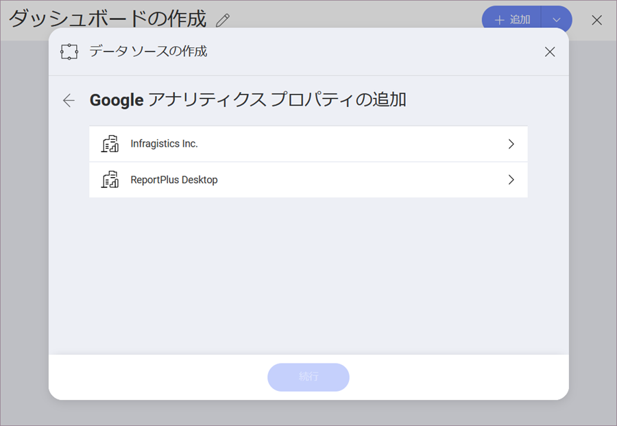
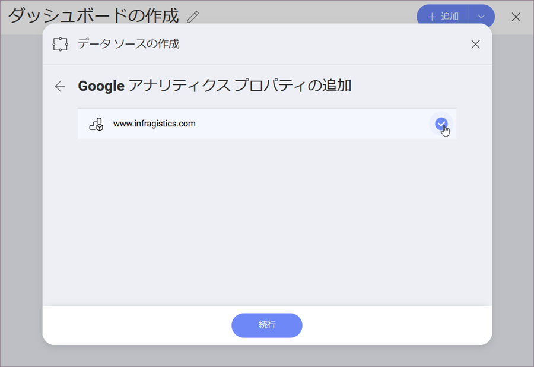
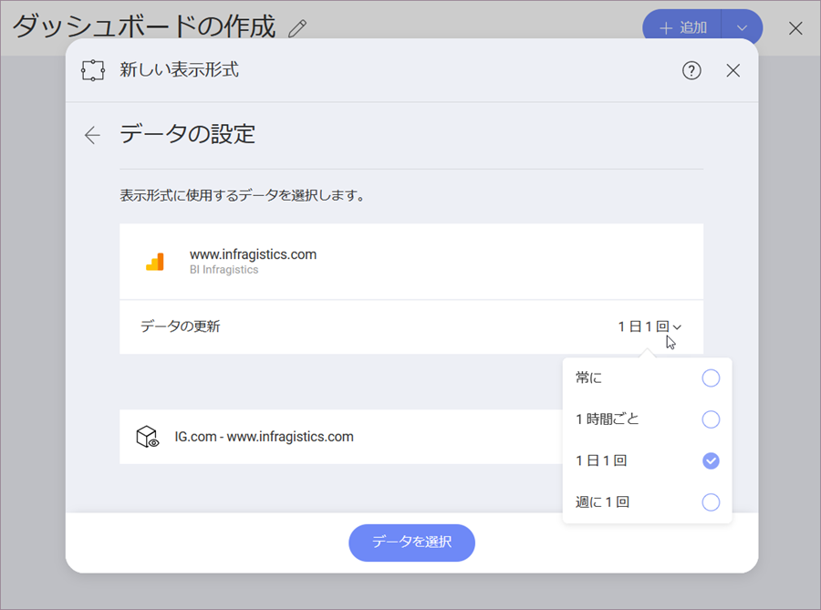
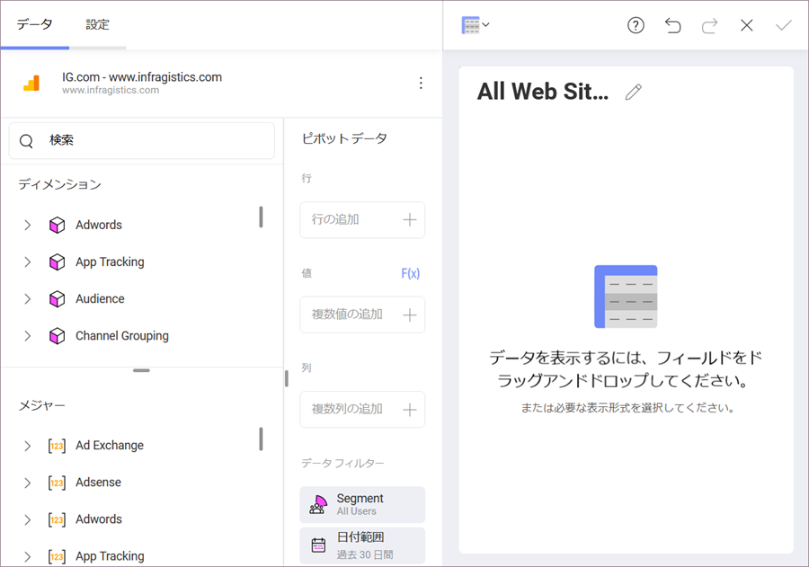
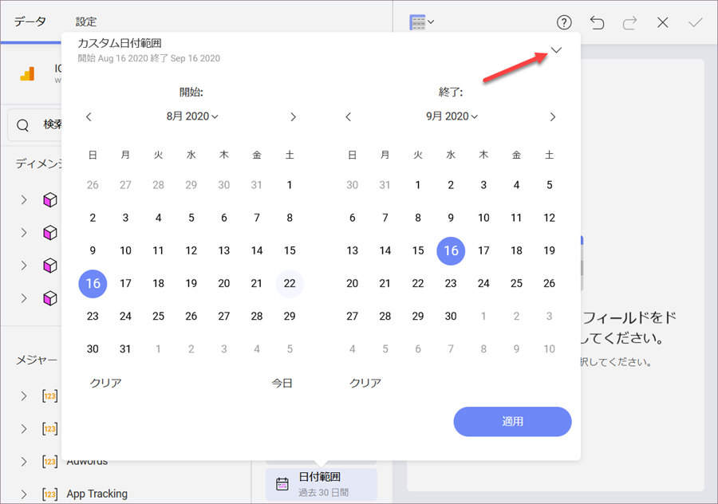
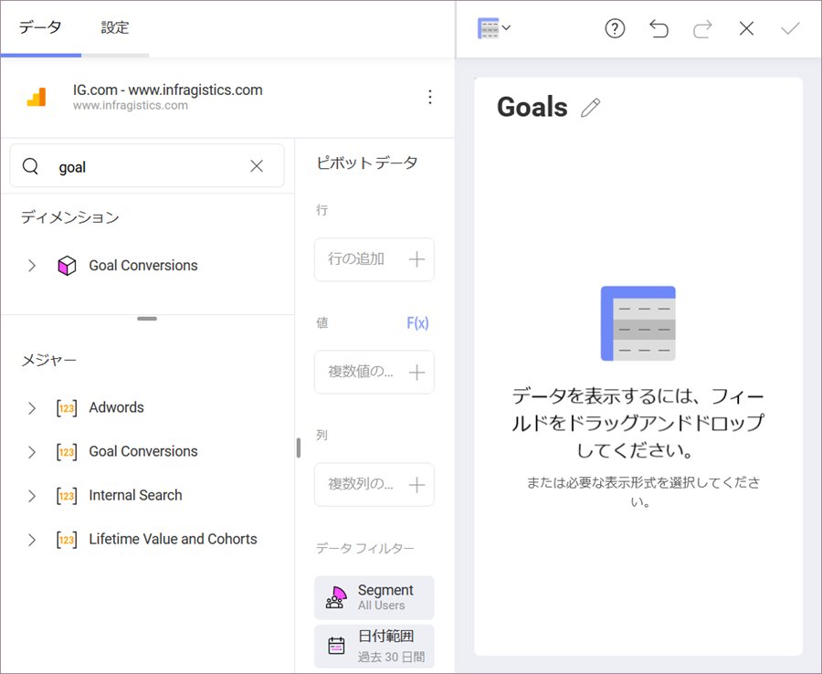

## Google アナリティクス

Google アナリティクスは、ウェブで最も使用されているウェブ分析サービスの 1 つであり、ウェブサイトのトラフィックを追跡して報告します。さらに、Google は、iOS および Android アプリから使用状況データを収集するための SDK も提供しています。

### Google アナリティクス データソースの構成

1.  **ログイン**

    1.  データ ソースとして Google アナリティクスを選択すると、Google のログイン画面が表示されます。

    2.  ログイン情報を入力して [サインイン] をクリック/タップします。承認プロンプトが表示されます。[許可] をクリック/タップします。

2.  **アカウントを選択**

    複数の Google アナリティクス アカウントがある場合は、使用するアカウントを選択します。

    

    ログインすると、データ ソースを削除しない限り、他の表示形式の作成時に同じアカウントを使用できます。

3.  **プロパティを選択**

    使用する Google アナリティクス プロパティを選択します。

    

    Google アナリティクスでは、**プロパティ**はウェブサイト、モバイル アプリ、ブログなどです。

4.  **データベース キューブを選択**

    使用するデータ キューブを選択します。

    

    このダイアログでは、データの更新間隔を次のように設定できます:

      - 常に

      - 1 時間に 1 回

      - 1 日に 1 回

      - 週に １ 回

資格情報が確認されると、Reveal は表示形式エディターに移動します。

### Working in the Visualizations Editor

When you create a dashboard with information coming from Google Analytics, you will see fields organized differently (see screenshot below).

You may notice that there is no "Fields" heading on the left. Instead, there are two sections in their own query field:

1.  **Dimensions** (depicted by a cube icon with a pink side): Dimensions are attributes of your data. For example, the dimension _Gender_ (under the _Audience_ cube) indicates the gender of your web site's audience.

2.  **Measures** (depicted by *123* icon): Measures consist of numeric data. For example, the measure _AdX Clicks_ is the number of times AdX ads were clicked on the site.

If you need to learn more, check this Google Analytics article: [Dimensions and metrics](https://support.google.com/analytics/answer/1033861?hl=en). 

>[!NOTE] 
> Some dimensions and measures cannot be used together. For a list of valid dimensions-measures combinations, refer to the [Dimensions & Metrics Explorer](https://ga-dev-tools.appspot.com/dimensions-metrics-explorer/) on the Google Developer website.

#### Data Filters

There are two *Data Filters* when using the GA data source in Reveal. 

* **Segment** filter. The *Segment filters* are predefined. *System* Segments are defined by Google, and *Custom* Segments are defined by the user on the Google Analytics website. You can choose only one segment to filter your data. 
* **Date Range**. Select a specific date range in the calendar to filter your data. You can also choose one of the preset date ranges by clicking the arrow in the upper right corner: 

  

  >[!NOTE] Default date range is _Last 30 days_. This means data will be retrieved for the last 30-day period, including today. 

#### Google アナリティクスの目標を使用する

Google アナリティクスで定義された*目標*を*表示形式エディター*で使用できます。*目標*は、**ディメンション**と**メジャー**の両方のデータ型のメトリックの一部としてリストされます。

上記の例でわかるように、Reveal での Google アナリティクスの*目標*のタイトルには、次の 1 つ以上が含まれています:

  - 1 から 20 までの**数値 ID**。

  - 最初の**ラベル** - これは、特定の目標に設定した目標の名前です。例えば、*目標 19* の*ダウンロード完了*。

  - 最後の目標**タイプ** - 例えば、*完了*、*放棄されたファネル*など。

目標の詳細については、Google アナリティクスの[ヘルプ ページ](https://support.google.com/analytics/answer/1012040?hl=en)をご覧ください。
