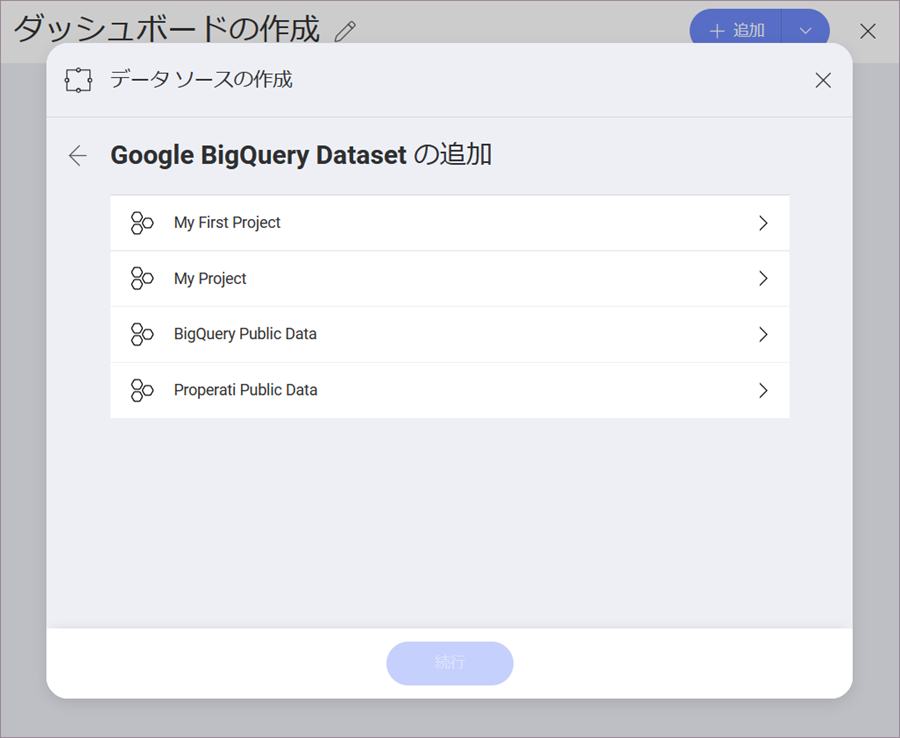
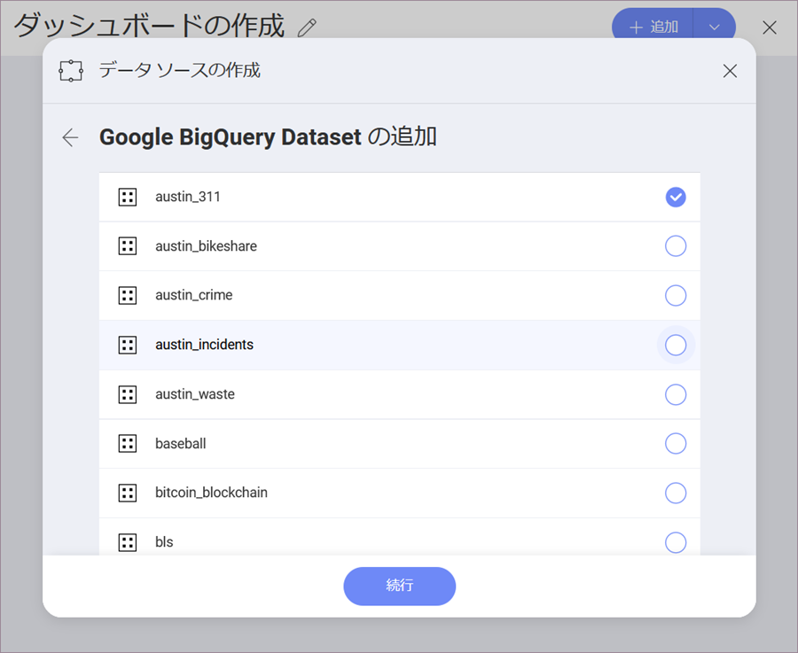
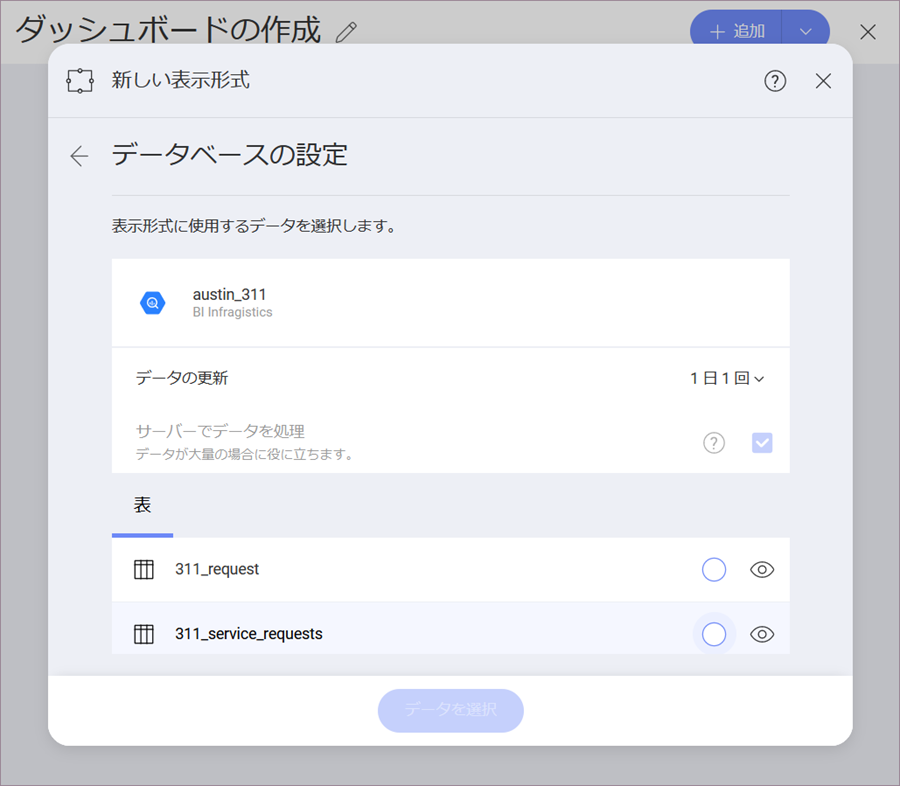

## Google BigQuery

Google BigQuery データ ソースは、Reveal 内でビッグ データを処理する際の速度を大幅に向上させます。これにより、速度低下することなく、何百万ものレコードを含むデータセットを表示形式に使用できます。

### Google BigQuery データソースの構成

Google BigQuery を選択すると、**Google アカウント**に接続するように求められます。

Google アカウントを追加すると、BigQuery データセットにアクセスできるようになります。それらを表示形式に使用するには:

1.  *[新しいデータソース]* ダイアログで**プロジェクトを選択します**。

    

    >[!NOTE]    
    **BigQuery の一般公開データセットを使ったデモ プロジェクト**。
    上のスクリーンショットの 2 つの公開 データ プロジェクトは、Reveal チームによって構成されたデモ プロジェクトです。BigQuery データセットを持たないユーザーは表示形式エディターでこのデータ ソースを操作して、ビッグ データがどのように迅速に処理されているかを確認できます。

2.  データ セットの横にある空の円をマークして、**データセットを選択します**。

    

3.  データセットから**表を選択します**。右側の*目のアイコン*を使用して、データをプレビューします。

    

これで、Google BigQuery から取得したデータを使用して表示形式の構築を開始できる、*表示形式エディター*に移動します。

### 表示形式エディターでの制限事項

Reveal でビッグ データを操作する場合、数百万のレコードを持つデータ ソースを処理するための特定のアプローチにより、表示形式エディターにはいくつかの制限があります。

#### 計算フィールドで使用できる関数の制限

現在、BigQuery のデータを使用する*計算フィールド*で、使用できる**関数**の数は限られています。

- [日付](~/jp/data-visualizations/fields/calculated-fields/date.md) - date; time.

- [ロジック](~/jp/data-visualizations/fields/calculated-fields/logic.md) - false; true; if; not.

- [数学](~/jp/data-visualizations/fields/calculated-fields/math.md) - abs; exp; log; log10; mod; rand; sign; sqrt; trunc.

- [文字列](~/jp/data-visualizations/fields/calculated-fields/string.md) - find; len; trim; lower; mid; upper.

#### データ ブレンディングの制限

現在、Google BigQuery データ ソースからのデータを使用する場合、データ ブレンディング ([1 つの表示形式でデータ ソースを組み合わせる](~/jp/datasources/data-blending.md)) は**使用できません**。
