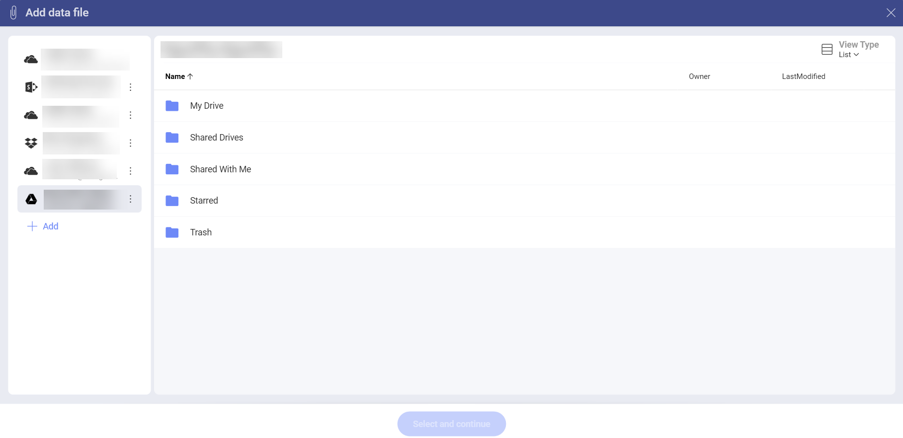
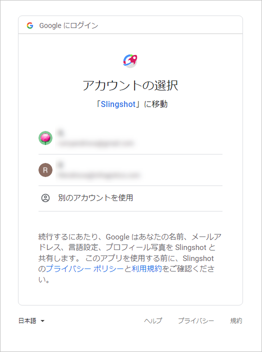
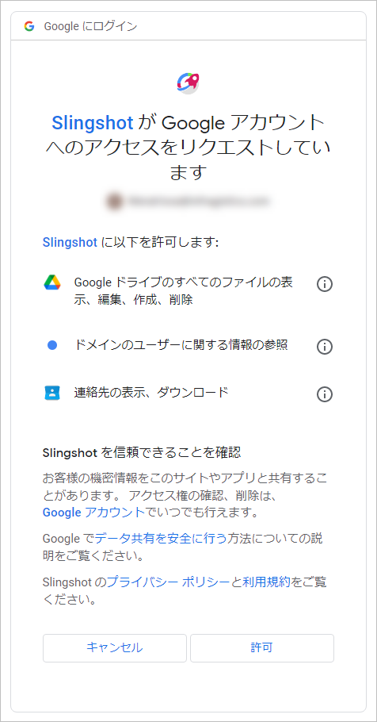

# Google ドライブ

Google アカウントでログインしている場合は、Google ドライブがデータ ソースに自動的に追加されます。

Google ドライブのデータを使用するには、以下の手順に従ってください。

1.  Google ドライブ (またはその中のフォルダー) を選択すると、アカウントを選択してアプリに接続するよう求められます。**ログイン情報**を入力するか、アカウントを選択して [次へ] を選択します。

    
    
2. **認証プロンプト**が表示されます。**[Allow] (許可)** を選択してプロセスを終了できます。

   

これで、Google ドライブのデータを使用して表示形式を構築できるようになり、これらの権限を再度求められることはありません。

## サポートされるファイル

Reveal では、広範な種類のファイルを使用できます。

  - **スプレッドシートと表形式データ**: Excel (.xlsls、.xlsx)、CSV または TSV (Reveal 内で動的に使用できます)。

  - **その他のファイル**: プレビュー モードのみで表示されます (画像および PDF やテキストなどのドキュメント ファイルを含む)。
